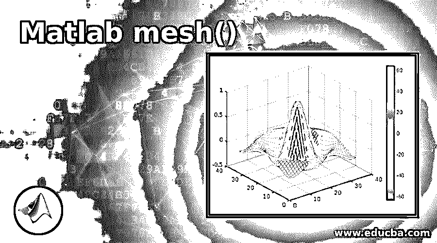
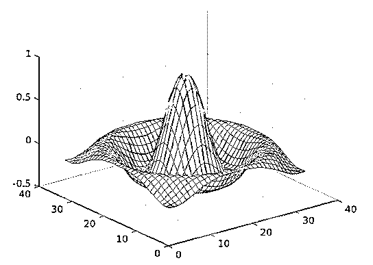
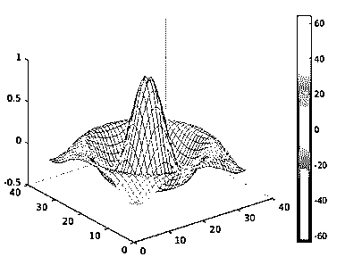
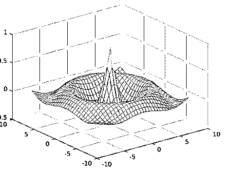
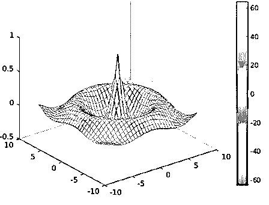
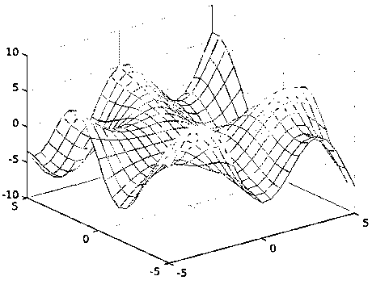
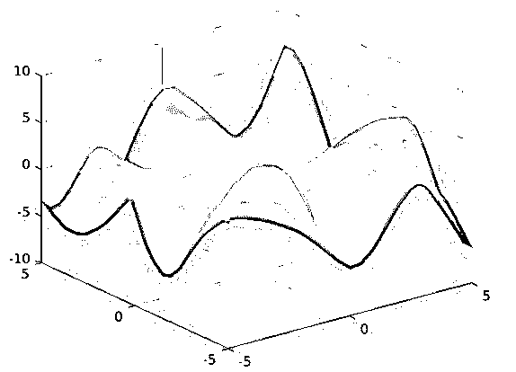
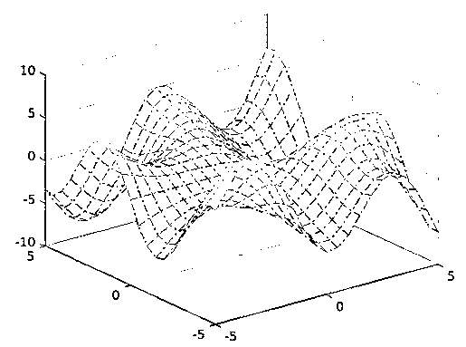

# Matlab 网格()

> 原文：<https://www.educba.com/matlab-mesh/>

## Matlab 网格介绍()

Matlab 内置函数 mesh()是一个 3D 绘图函数，用于根据输入矩阵中的值创建三维表面图。从 mesh()生成的图是一个表面图形对象，本质上是线框参数化的。该函数将输入矩阵值映射到颜色值，生成颜色图。图的高度取决于输入矩阵值，高于可由 X，Y 坐标输入定义的 x-y 平面。绘图的颜色取决于表面高度。

**语法:**

<small>Hadoop、数据科学、统计学&其他</small>

根据提供给函数调用的输入参数，该 3D 表面绘图函数可以用不同的语法来实现。

下表描述了不同的语法及其各自的输入参数:

| **语法** | **描述** |
| **网格(Z)** | 它用于生成三维表面图，其 x，y 坐标由输入矩阵“Z”的列和行索引决定。 |
| **网格(Z，C)** | 它用于生成输入矩阵“Z”的 3D 表面图，其边缘颜色设置为“C”。 |
| **网格(X，Y，Z)** | 它用于生成 3D 表面图，其高度由输入矩阵“Z”中的值决定，x-y 平面由 X 和 y 设置。 |
| **网格(X，Y，X，C)** | 用于在 x-y 平面上生成 3D 表面图，由 X 和 Y 设置，边缘颜色为“C”。 |
| **网格(ax，_ _ _ _ _ _ _)** | 它用于生成带有新轴“ax”的 3D 表面图。 |
| **网格(__，名称，值)** | 它用于使用名称-值对参数格式设置地块的曲面特性。 |
| **Cs =网格(___)** | 它用于存储从图表表面对象中的函数 mesh()生成的 3D 绘图。生成地块后，该对象可用于修改曲面对象特性。 |

### Matlab 网格示例()

下面是提到的例子:

#### 示例 1–使用网格(Z)

以下代码片段用于生成输入矩阵“I”的 3D 图，该矩阵是 x 坐标“P”和 y 坐标“R”的函数，将“I”作为 mesh()函数调用的单个输入参数。

**代码:**

`[P,Q] = meshgrid(-8:.5:8);
R = sqrt(P.^2 + Q.^2);
I = sin(R)./R;
mesh(I)`

**输出**:

根据输入矩阵中的数据值，使用默认颜色值生成图。

#### 示例 2–使用网格(Z，C)

下面的命令集被定义为改变在定义输入参数“C”的前一个函数中生成的相同绘图的颜色。

**代码:**

`[P,Q] = meshgrid(-8:.5:8);
R = sqrt(P.^2 + Q.^2);
I = sin(R)./R;
C = P.*Q;
mesh(I,C)
colorbar`

**输出:**

颜色值由输入参数“C”设置，该参数被设计为 x，y 坐标“P”和“Q”的函数。

#### 示例 3–使用网格(X，Y，Z)

以下代码从 mesh()函数生成 3D 表面图，该函数接受 3 个输入参数，即输入矩阵“Z”、x，y 坐标输入“P”和“Q”。

**代码:**

`[P,Q] = meshgrid(-8:.5:8);
R = sqrt(P.^2 + Q.^2) + eps;
Z = cos(R)./(R+1.2);
mesh(P,Q,Z)`

**输出:**

#### 示例 4–使用网格(X，Y，Z，C)

下面的命令集被定义为改变在定义输入参数“C”的前一个函数中生成的相同绘图的颜色。

**代码:**

`[P,Q] = meshgrid(-8:.5:8);
R = sqrt(P.^2 + Q.^2) + eps;
Z = cos(R)./(R+1.2);
C = P.*Q;
mesh(P,Q,Z,C)
colorbar`

**输出:**

颜色值由输入参数“C”设置，该参数被设计为 x，y 坐标“P”和“Q”的函数。

#### 示例 5–使用网格(__，名称，值)

Matlab 支持在 mesh()函数中使用名称-值配对格式来改变生成图的显示。在函数调用中，属性对中作为名称给出的属性用作为值给出的数据进行设置。

下表给出了一些可以修改以自定义绘图的属性:

| **属性** | **描述** |
| EdgeColor | 该属性用于决定绘图边缘线的颜色。可能的值有无、平面、interp、RGB 三元组、颜色名称等。 |
| LineStyle | 它用于设置 3D 表面图表示的线型。可能的值有'-'(实线)、'-'(虚线)、':'(虚线)等。 |
| FaceColor(面颜色) | 该属性自定义绘图中的表面颜色。可能的值有平面、插值、RGB 三元组、纹理贴图、十六进制颜色代码等。 |
| FaceAlpha | 它决定了地块表面的透明度。可能的值是 0 到 1 之间的任何值。 |
| 面部照明 | 该属性用于决定灯光对象在绘图面上的效果。可能的值有 flat、gouraud、none 等。 |

##### 形容词（adjective 的缩写）面α= 0.6

通过将 FaceAlpha 设置为 0.6，可以获得地块面的透明度。

**代码:**

`[P,Q] = meshgrid(-5:.5:5);
R = Q.*cos(P) - P.*sin(Q);
mesh(P,Q,R,'FaceAlpha','0.6')`

**输出:**

##### b.面α= 0.8

**代码:**

`[P,Q] = meshgrid(-5:.5:5);
R = Q.*cos(P) - P.*sin(Q);
mesh(P,Q,R,'FaceAlpha','0.8')`

当 FaceAlpha 的值从 0.6 更新到 0.8 时，地块面的透明度会发生变化。

**输出:**

##### 碳（carbon 的缩写）面颜色=平面

**代码:**

`[P,Q] = meshgrid(-5:.5:5);
R = Q.*cos(P) - P.*sin(Q);
mesh(P,Q,R,'FaceColor','flat')`

**输出:**

根据 CData 属性中的值，生成的图中每个面具有不同的颜色。

#### 示例 6–使用 Cs=mesh(___)

以下代码从存储在图表表面对象“cs”中的函数返回表面对象。通过“cs”对象调用属性来修改 EdgeColor 和 LineStyle 的值，从而改变绘图的显示。

**代码:**

`[P,Q] = meshgrid(-5:.5:5);
R = Q.*cos(P) - P.*sin(Q);
cs=mesh(P,Q,R);
cs.EdgeColor='interp';
cs.LineStyle='-.'`

**输出**:

根据 CData 属性中的值，生成的图用带有插值颜色的边来表示，线条按照样式格式“-.”显示.

**补充说明:**

*   Matlab 关于使用 mesh()函数生成图的默认行为是，它根据输入矩阵的最小值和最大值计算颜色限制。通过由 Matlab 执行的线性变换过程，中间值被映射到当前颜色图。
*   在生成表面图的过程中，隐藏面消除的模拟由“hidden”命令执行，着色模型的模拟由“shading”命令控制。

### 推荐文章

这是一个 Matlab 网格的指南()。这里我们讨论 Matlab mesh()的介绍，用例子来更好的理解。您也可以看看以下文章，了解更多信息–

