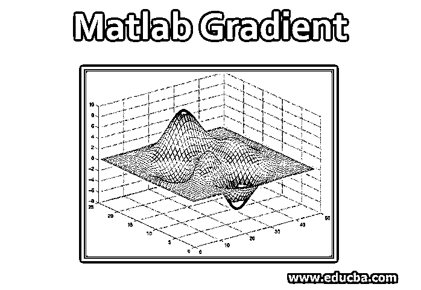

# Matlab 梯度

> 原文：<https://www.educba.com/matlab-gradient/>

## Matlab 梯度介绍

一般来说，梯度被定义为任何特征的斜率。在数学中，它被定义为任何函数的偏导数。它是所有偏导数的集合，这些偏导数被定义为向量中函数的一部分。由它产生的场被称为梯度场，它可以是二维或三维的。x、y 和 z 方向的合成梯度分别给出了 x、y 和 z 方向的变化率。在这个主题中，我们将学习 Matlab 梯度。

### 用语法在 Matlab 中处理梯度

在 Matlab 中，我们用数值梯度来表示函数的导数。使用渐变时使用的函数用“渐变”表示。我们可以在 Matlab 中使用梯度函数来执行一些操作。请找到以下可用于执行各种操作的语法:

<small>Hadoop、数据科学、统计学&其他</small>

*   **X= gradient[a]:** 该函数返回一维梯度，其本质上是关于作为输入的向量‘a’的数值。这里 X 是一阶导数 da/dx 形式的输出，其中差在 X 方向。
*   **[X，Y] = gradient[a]:** 该函数返回二维梯度，其本质上是相对于作为输入的向量“a”的数值。这里，X 和 Y 是一阶导数 da/dx 和 da/dy 形式的输出，其中差值分别位于 X 和 Y 方向。
*   X，Y，Z…N] =gradient(a): 该语法返回输入数组中存在的组件数量的数字梯度。
*   **[___] = gradient (a，h):** 此语法返回带有输入参数‘h’中提到的间隔点数的渐变，可用于任何方向。
*   **[__] =渐变(a，hb，hc，hd，he…hn):** 该语法返回 a 中给定的每个维度中的 n 个间隔点。

### Matlab 梯度示例

以下是 Matlab 梯度的例子

#### 示例#1

计算矢量的梯度。

A = 11:15

11   12  13  14  15

**输出**

x =梯度(a)

Eleven thousand one hundred and eleven

*   在上面的例子中，函数计算给定数字的梯度。函数中使用的输入参数可以是向量、矩阵或多维数组，函数可以处理的数据类型有单精度、双精度。它还支持在 Matlab 中使用复数。语法中的“h”用于定义各个方向上的点之间的间距，该间距本质上是均匀的，并且被表示为标量。
*   该函数可以处理的数据类型有单精度、双精度。它还支持在 Matlab 中使用复数。“hb”、“hc”、“hd”表示每个方向上的点之间的唯一间距，它们在本质上可以是标量或矢量。我们在声明函数时指定的输入参数的数量，应该总是与所用数组的维数相匹配。
*   如果输入本质上是标量，那么这意味着点之间使用的间距在相应的维度上是恒定的。如果输入实际上是向量，那么它用相应的维度表示坐标，向量的长度应该总是与所使用的维度大小相匹配。接受的数据类型本质上是单精度和双精度的。它还支持使用复数。
*   梯度函数返回的输出参数与所用的输入参数具有相同的性质，称为数值梯度。x 表示第二维度(列)中的梯度，Y 表示第一维度(行)中的梯度，其余输出遵循相同的方向。如果我们想多次使用梯度函数，那么我们可以使用“diff”函数，而不是多次调用它。

#### 实施例 2

计算函数 ae^a2−b2 的梯度并绘制等高线

a =-1:0.3:1；

b = a’；

c = a . * exp(-a.^2–b.^2)；

**输出**

[pa, pb] = gradient(c)

轮廓(a，b，c)

如果输入参数是一个函数，我们也可以使用梯度函数。它由以下语法给出:

**gradient (a，y):** 给出输入自变量中定义的函数相对于 y 中提到的向量的梯度向量，如果输入中没有提到向量‘y’，那么它根据函数中提到的变量找到标量梯度函数。向量中使用的变量有一个顺序，它是由 symvar 指定的。

输入参数可以是表达式或函数，本质上可以是标量。y 是向量，相对于它我们可以找到梯度向量。如果 y 为空，则返回一个空的渐变对象。函数的梯度向量是关于定义的函数的所有一阶偏导数的集合。

#### 实施例 3

计算函数的梯度，如下所示:

符号 a b c

f = 2 * b * c * sin(a)+3 * a * sin(c)* cos(b)；

梯度(f，[a，b，c])

**输出**

3*cos(b)*sin(c) + 2*b*c*cos(a)

2 * c * sin(a)–3 * a * sin(b)* sin(c)

2*b*sin(a) + 3*a*cos(b)*cos(c)

Matlab 中有各种与渐变相关的属性，例如，可以通过向输入参数提供所需的值来调整渐变的颜色和透明度。由于没有具体的限制，可以对任意数量的变量计算数值梯度。通过确定函数中使用的不同值的偏导数，可以对每个方向计算它。如果我们给定两点之间的间距，那么梯度就相应地近似于差值。

### 结论

在许多应用中，使用梯度，就像在数学和物理领域中使用梯度一样，以使用算法找到最大值和最小值点。使用梯度的算法是梯度下降算法，该算法也用于机器学习和数据科学中，以在将其应用于模型之前优化各种参数，从而获得更好的精度。它也用于回归技术，因为与其他技术相比，使用这种技术的计算相对更快。

### 推荐文章

这是一个 Matlab 梯度指南。在这里，我们讨论了 Matlab 中的梯度工作以及语法和例子。您也可以看看以下文章，了解更多信息–

1.  [Matlab 特性](https://www.educba.com/matlab-features/)
2.  [Matlab 中的颜色](https://www.educba.com/colors-in-matlab/)
3.  [Matlab 和运算符](https://www.educba.com/matlab-and-operator/)
4.  [Matlab 编译器](https://www.educba.com/matlab-compiler/)
5.  [Matlab 反函数完全指南](https://www.educba.com/matlab-inverse-function/)
6.  [使用 Matlab Comet()的步骤](https://www.educba.com/matlab-comet/)
7.  [如何使用 Matlab？](https://www.educba.com/how-to-use-matlab/)
8.  [Java 中的矢量|示例](https://www.educba.com/vector-in-java/)

