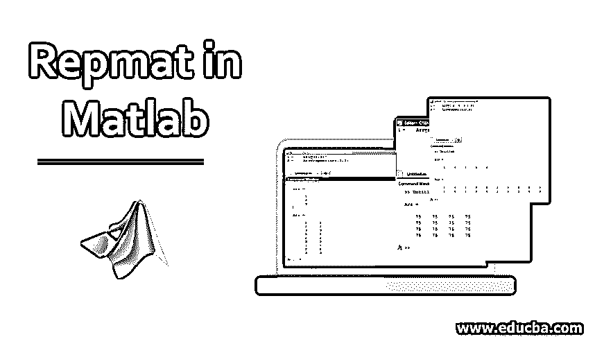
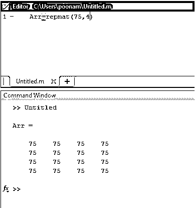
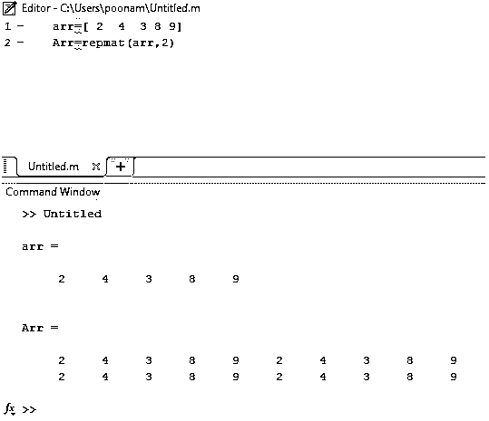
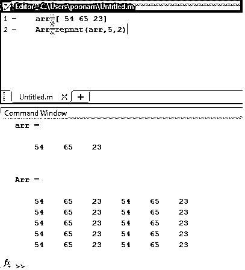
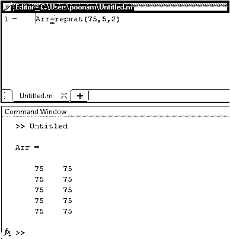
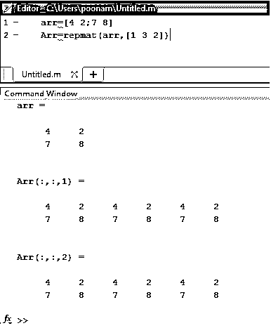
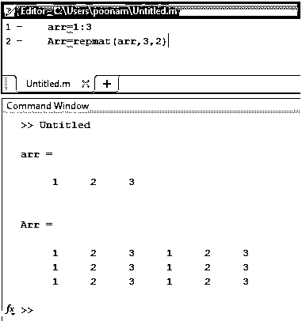
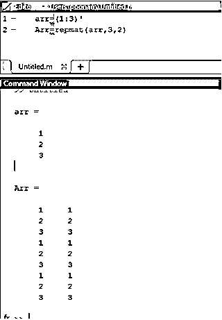

# Matlab 中的 Repmat

> 原文：<https://www.educba.com/repmat-in-matlab/>

## Repmat Matlab 简介

Matlab 中的 Repmat 是 Matlab 中用于数组操作的命令之一。这个命令以原始数组的数组重复的形式给出输出。这里的数组是一些元素、数据、信息等的集合。在 Matlab 中，数组用方括号表示。我们可以在数组中添加任意数量的元素。该阵列可以是一维或多维的。如果数组是多维的，那么它被称为矩阵。如果我们希望在 Matlab 中创建一个矩阵，那么我们需要用(**'；'来分隔元素**)内阵。

### 什么是 Repmat Matlab？

Repmat 命令在输出中重复数组的元素。重复依赖于参数列表，因此每次我们都需要在 repmat 命令后的括号内声明参数。根据参数表编写 repmat 函数有多种方法。

<small>Hadoop、数据科学、统计学&其他</small>

#### 1.雷普马特(75.4)

根据参数的不同，Repmat 函数如下所示:

**语法:**

`repmat(number, no of rows and column)`

该命令产生具有相同行数和列数的方框矩阵，这里的数字是“75 ”,行数和列数是 4。下面给出了 Matlab 代码和实现；

| **Matlab 编辑器** | **Matlab 命令窗口(输出)** |
| Arr = repmat(75 , 4 ) | >> UntitledArr =75    75    75    75

75    75    75    75

75    75    75    75

75    75    75    75

 |

##### 示例 1: Matlab 实现

#### 2.雷普马特

**语法:**

`repmat (array name, number of rows and columns)`

在这种类型中，arr 是任何数组的名称。这里我们声明了数组的元素，我们可以在数组中添加任何元素。该命令产生两行两列的输出。Matlab 代码和输出脚本如下表所示。

| **Matlab 编辑器** | **Matlab 命令窗口(输出)** |
| arr = [ 2  4  3 8 9]Arr =repmat(arr，2) | arr =2     4     3     8     9Arr =2     4     3     8     9     2     4     3     8     92     4     3     8     9     2     4     3     8     9 |

##### 示例 2: Matlab 实现

#### 3.雷普马特(排列，5，2)

**语法:**

`repmat (array name, no of rows, no of columns)`

##### 例 3: Matlab 实现

在前面的例子中，矩阵的维数是有限的，但是在这个例子中，我们可以分别给出行数和列数。这里的行数是 5，列数是 2。Matlab 代码和输出如下表所示。

| **Matlab 编辑器** | **Matlab 命令窗口(输出)** |
| arr = [ 54 65 23]Arr = repmat(arr，5，2) | arr =54    65    23Arr =54    65    23    54    65    2354    65    23    54    65    2354    65    23    54    65    2354    65    23    54    65    2354    65    23    54    65    23 |

| **Matlab 编辑器** | **Matlab 命令窗口(输出)** |
| Arr = repmat(75，5，2) | Arr =75    7575    7575    7575    7575    75 |

#### 4.雷普马特(arr，[1 3 2])

**语法:**

`repmat(arr,[no of rows, no of the column, no of blocks])`

##### 例 4: Matlab 实现

如果我们想要输出块多次，那么我们可以使用这个命令。这里 arr 是数组的名称，1 是行数，3 是列数，2 是输出矩阵的重复。

| **Matlab 编辑器** | **Matlab 命令窗口(输出)** |
| arr = [ 4 2 ; 7 8 ]Arr = repmat(arr，[1 3 2]) | arr =4     27     8Arr(:，:，1)= 14     2     4     2     4     27     8     7     8     7     8Arr(:，:，2)= 14     2     4     2     4     27     8     7     8     7     8 |

#### 5.arr=1:3& arr=( 1:3)'

**语法:**

`array name = (range) and array name = (range) ’`

##### 示例 5:水平和垂直实施

在这种类型中，输入的是一系列数字。1:3 以水平方式表示从 1 到 3 (1，2，3)的数字。以及(1:3)’以垂直方式表示从 1 到 3 (1，2，3)的数字。Matlab 代码和输出如下表所示。

| **Matlab 编辑器** | **Matlab 命令窗口(输出)** |
| arr = 1:3Arr = repmat(arr，3，2) | >> Untitledarr =1     2     3Arr =1     2     3     1     2     3

1     2     3     1     2     3

1     2     3     1     2     3

 |
| arr=(1:3)’Arr=repmat(arr，3，2) | Arr=OneTwoThreeArr =1     12     23     31     12     23     31     12     23     3 |

##### 水平垂直

##### 垂直实施

### 结论

数组操作中使用了各种命令。Repmat 是用来创建数组和矩阵的重要函数之一。除了创造，它也用于操纵和数学运算。这是最简单的方法之一，因为仅仅通过声明参数，我们就可以形成和操作数组和矩阵。

### 推荐文章

这是一个在 Matlab 中使用 Repmat 的指南。在这里，我们讨论介绍，什么是 Repmat Matlab 以及不同的例子，实现了输出。您也可以浏览我们的其他相关文章，了解更多信息——

1.  [Python 命令](https://www.educba.com/python-commands/)
2.  [Matlab 特性](https://www.educba.com/matlab-features/)
3.  [Matlab 中的颜色](https://www.educba.com/colors-in-matlab/)
4.  [Matlab 中的 If 语句](https://www.educba.com/if-statement-in-matlab/)
5.  [Matlab 反函数示例](https://www.educba.com/matlab-inverse-function/)
6.  [学习 Matlab Comet()](https://www.educba.com/matlab-comet/) 的步骤和方法

