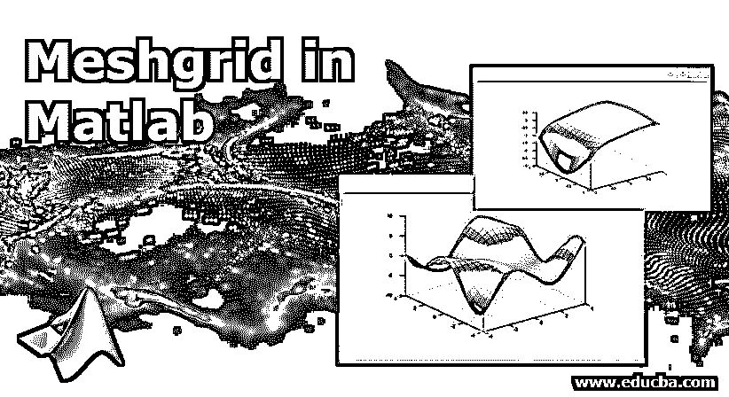
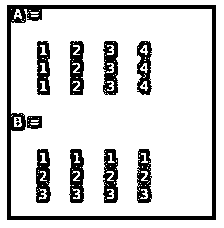
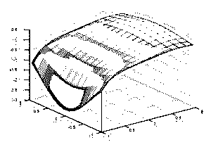
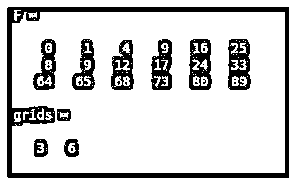
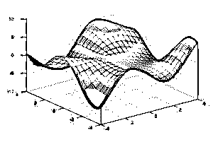

# Matlab 中的网格

> 原文：<https://www.educba.com/meshgrid-in-matlab/>

## Matlab 中的 Meshgrid 介绍

Meshgrid 用于从表示矩阵中索引的给定数组创建矩形结构。我们还可以从具有不同属性的指定函数或数组中创建网格曲面图，以自定义该图。它们可以在二维和三维空间中绘制。它们被用于许多领域，如地理和设计部门，有着巨大的应用。网格图与 Matlab 中的其他图具有相似的属性。

### Meshgrid 在 Matlab 中的工作

Meshgrid 主要用在 [Matlab 和 Python](https://www.educba.com/python-vs-matlab/) 中。Matlab 中有各种不同的语法来表示各自的网格。

<small>Hadoop、数据科学、统计学&其他</small>

**语法:**

`[A, B] =meshgrid (a, b)`

这用于创建一个二维网格，其中包含 a 和 b 中给定向量中提到的相应坐标。生成的网格将具有 b 行的长度和列的长度。

`[A, B] =meshgrid (a)`

这将返回与上一个相同的网格，称为正方形网格，其行的长度乘以列的长度。

`[A, B, C] =meshgrid (a, b, c)`

这用于使用 a、b 和 c 中提到的坐标创建一个三维网格。生成的网格的尺寸将分别为长度 b 乘以长度 a 乘以长度 c。

`[A, B, C] =meshgrid (a)`

这将返回带有坐标的三维网格，网格的大小将为 a 乘 a。

### Matlab 中网格实例

请查找以下示例，这些示例将帮助您清楚地了解 MeshGrid 的工作原理:

#### 示例#1

**代码:**

`a = 1:4;
b = 1:3;
[A,B] = meshgrid(a,b)`

**输出:**

#### 实施例 2

以-1 到 1 之间的给定间隔绘制二维网格。

**代码:**

`a = -1:0.15:1;
b = a;
[A,B] = meshgrid(a);
F = A.*exp(-A.^3-B.^2);
surf(A,B,F)`

**输出:**

用于绘制网格的坐标是矢量，可接受的数据类型有 single、double、int8、int32、int16、uint8、uint16、uint32、uint64、int64。结果网格或输出网格可以是在它们各自的 x、y 和 z 坐标中的二维或三维阵列。可以使用 Matlab 中的 mesh 函数创建网格图，它们具有与网格图不同的属性。请在下面找到它们:

*   可以通过更改图的边缘颜色来自定义网格图，边缘颜色可以是平面、RGB 值或 interp 值。边缘颜色的默认值为[0，0，0]。如果它被称为平面，那么所有的边都有不同的颜色，就像属性中提到的那样。我们还可以给出 RGB 三元组值，它表示红色、绿色和蓝色的强度级别。
*   根据强度等级，会有不同的颜色。我们也可以通过指定不同的值来改变网格的表面颜色。它可以是 flat、interp、texturemap 和 RGB 三元组值，与边缘颜色的属性相同，但这里的默认值是 flat。如果属性值为 interp，则在生成的网格面上使用插值着色。
*   我们还可以改变网格结果图中的线条形状。它们可以是虚线、实线、点划线或虚线。我们还可以改变图中每个面的透明度。它们可以是 interval、flat、interp、texturemap，默认值为 1。如果该属性的值是 flat，那么每个面都有一个不同的透明度值，如 AlphaData 属性中提到的值所示。
*   类似地，如果该属性的值为 interp，则根据 AlphaData 属性设置的值，每个面将有一个插值的透明度级别。如果面颜色属性在[0，1]的范围内，那么所有表面的透明度值相等。如果该值为 1，则该面完全透明，如果该值为零，则该面不透明，0 到 1 之间的值被视为半透明。
*   我们也可以用“面光照”属性改变所有面的光照。它们可以是各种值，如 flat、gouraud 和 none。如果面光照是平的，那么所有的面都会有均匀的光照。类似地，如果属性的值是 gouraud，那么所有的面将有不同的光照，没有光照则没有光照。

#### 示例 **#3**

**代码:**

`a = 0:1:5;
b = 0:2:5;
[A,B] = meshgrid(a,b);
F = A.^2 + B.^3
grids=size(F)`

**输出:**

#### 实施例 4

**代码:**

`[A,B] = meshgrid(-4:.4:4);
C = B.*sin(A) - A.*cos(B);
F = mesh(A,B,C,'Facecolor','interp')
surf(A,B,C)`

**输出:**

如果不需要，我们也可以使用 Matlab 中的隐藏函数隐藏网格图中的线。要改变面部使用的各种颜色的阴影，我们可以使用阴影功能。为了用不同的颜色绘制三维图形，我们可以使用 surf 函数。

### 结论

MeshGrid 是 Matlab 中最重要的函数之一，主要用于在 Matlab 中创建各种图，如曲面图、极坐标图和网格图。它们用于各种地理位置的地图、设计和计算流体动力学。因此，学习在 Matlab 中使用 MeshGrid 对于处理各种图形是很重要的。

### 推荐文章

这是 Matlab 中 Meshgrid 的指南。这里我们分别讨论 Meshgrid 的基本概念、工作原理以及 Matlab 中的实例。您也可以看看以下文章，了解更多信息–

1.  [Matlab 中的曲面图](https://www.educba.com/surface-plot-in-matlab/)
2.  [Matlab 中的 3D 绘图](https://www.educba.com/3d-plots-in-matlab/)
3.  [Matlab 中的自然日志](https://www.educba.com/natural-log-in-matlab/)
4.  [MATLAB 绘图函数](https://www.educba.com/matlab-plot-function/)
5.  [Matlab 中的 fminsearch 完全指南](https://www.educba.com/fminsearch-in-matlab/)

