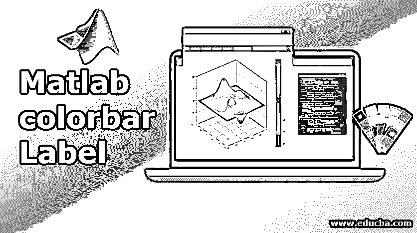
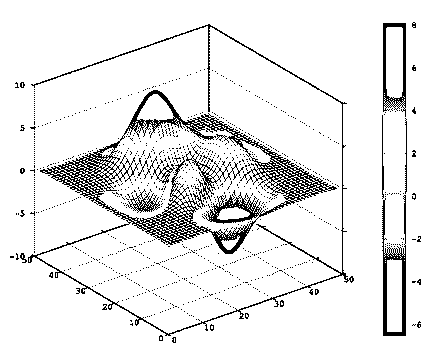
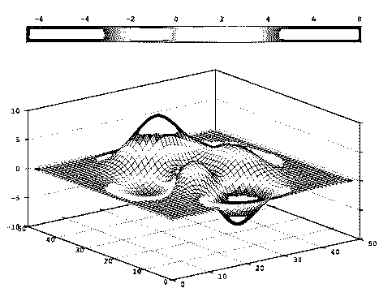
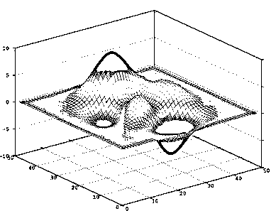

# Matlab 彩条标签

> 原文：<https://www.educba.com/matlab-colorbar-label/>

## Matlab 彩条标签介绍

用图表形式描绘出解释结论或推论的方法。彩条标签是 Matlab 图形部分的一个重要方面。我们可以根据以各种形式显示的数据给我们的绘图添加颜色。它们可以帮助我们区分各种形式的数据和图形。在将彩条标签添加到图中后，我们可以更改它的各种特性，如厚度、位置等。我们可以根据业务需求为最重要和最不重要的功能分配特定的颜色。

### 使用 Matlab 彩条标签

它们在各种图中用于区分数据集的不同特征。默认情况下，颜色条标签的位置总是在给定轴的右侧，但是可以通过更改图的“位置”属性来调整。

<small>Hadoop、数据科学、统计学&其他</small>

*   **c=colorbar** :用于给任何图一个垂直的 colorbar 标签。它指定映射到颜色栏中每种颜色的数据值。
*   **c=colorbar(条的位置)**:当我们想要指定 colorbar 的位置时，使用这个语法。默认情况下，它显示在图的右侧。
*   **c = colorbar(_ _ _ _ _ _ _，属性名称，指定属性的值)**:我们可以通过给所需属性赋值来改变各种特性或属性，从而定制 color bar 标签的外观。不是每个情节都支持彩条的自定义。
*   **c=colorbar (target axes，__)** :当我们想要在给定的目标轴或指定的图表中指定 colorbar 标签时，使用此语法。这可以在语法的第一个参数中定义。
*   **c=colorbar('off')** :当我们想要删除当前轴或给定图中出现的所有 colorbar 标签时，可以使用该命令。
*   **c=colorbar ('target axes '，' off')** :当我们想要删除语法第一个参数中给定的指定轴中存在的 colorbar 标签时使用。我们还可以在目标值中指定任何 colorbar 对象。

### Matlab 彩条标签示例

请查找以下示例，这些示例显示了在 Matlab 中使用颜色条标签的各种绘图:

#### 示例 1–在表面图中使用彩条标签

**代码:**

`s=surf(peaks)
c=colorbar`

**输出**:

在上面的示例中，颜色条标签显示在图的右侧，它将图中显示的数据值与颜色图中显示的颜色相匹配。颜色显示在数据值的范围内。

#### 示例# 2–在作为图表输入的位置绘制彩条标签

**代码:**

`s=surf(peaks)
c=colorbar("northoutside")`

**输出**:

在上面的示例中，颜色条标签显示在图的上方，因为我们在代码中将其称为“northoutside ”,如果将其称为“southoutside ”,则颜色条将出现在图的底部。我们还可以反转颜色条标签中的方向值。默认情况下，较小的值显示在条形的底部，较大的值显示在顶部。因此，我们可以使用使用属性的名称和值的语法，并像 colorbar 一样相应地使用它(“方向”、“反向”)。在 Matlab 中，还有许多其他属性可以用来定制 colorbar 标签。如例 2 所示，我们可以改变颜色条标签在图中的位置。

有各种位置值可以赋予属性，例如:

*   **north** :这将在图表轴的顶部绘制颜色条标签。彩条的方向实际上是水平的。
*   **northoutside** :这将在图表顶部绘制颜色条标签，它将在绘图之外。彩条的方向实际上是水平的。
*   **south** :这将在图表轴的底部绘制颜色条标签。彩条的方向实际上是水平的。
*   **southoutside** :这将在图表底部绘制颜色条标签，并且它将在绘图之外。彩条的方向实际上是水平的。
*   **east** :这将在图表轴的右侧绘制颜色条标签。彩条的方向实际上是垂直的。
*   **eastoutside** :这将在图表右侧绘制颜色条标签，并且它将在绘图之外。彩条的方向实际上是垂直的。这是使用颜色条绘制图时使用的默认位置
*   **west** :这将在图表轴的左侧绘制颜色条标签。彩条的方向实际上是垂直的。
*   **westoutside** :这将在图表的左侧绘制颜色条标签，并且它将在绘图之外。彩条的方向实际上是垂直的。
*   我们也可以通过以向量的形式给出数值来给出图中的刻度位置。接受的数据类型是 single 和 double，向量中显示的值不需要等距。如果我们不想要任何刻度线，那么我们可以指定一个空向量，如[]。我们还可以通过将 tick mode 属性设置为 auto 或 manual 来分配它。如果设置为“自动”,它将自动选择刻度值；如果设置为“手动”,则我们必须使用“刻度”手动分配值。
*   我们还可以设置绘图所需的最小和最大刻度值。它可以用两个元素的向量来定义。

#### 示例# 3–从图中删除彩条标签

**代码**:

`s=surf(peaks)
c=colorbar
c=colorbar('off')`

**输出:**

### 结论

Matlab 中的彩条标签可用于所有绘图，如曲面图或等高线图。有各种与它相关联的属性，这些属性被定制来改变 colorbar 标签的外观。

### 推荐文章

这是一个 Matlab 颜色条标签指南。在这里，我们讨论了 Matlab 色条标签的介绍，工作和例子。您也可以看看以下文章，了解更多信息–

1.  [Matlab 中的平方根](https://www.educba.com/square-root-in-matlab/)
2.  [Matlab 中的数组](https://www.educba.com/arrays-in-matlab/)
3.  [Matlab 创建函数](https://www.educba.com/matlab-create-function/)
4.  [Matlab 逻辑运算符](https://www.educba.com/matlab-logical-operators/)

