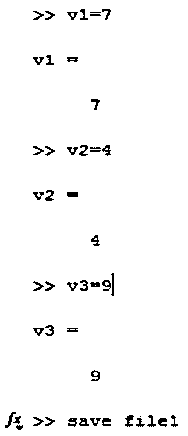
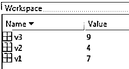
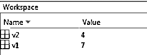
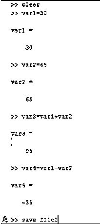
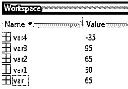
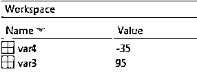

# Matlab 保存变量

> 原文：<https://www.educba.com/matlab-save-variable/>

## Matlab 保存变量简介

Matlab 保存变量中有两个操作是对文件变量的操作。一个是保存功能，另一个是加载功能。保存功能用于将当前工作变量保存到特定文件。load 函数用于将当前工作变量加载到一个特定的文件中。为了处理保存函数和加载函数，我们总是需要考虑工作区列。工作区以 excel 表格的形式显示总变量列表以及值。每次当我们执行程序时，workspace 都会自动更新。

**语法:**

<small>Hadoop、数据科学、统计学&其他</small>

*   **保存文件名:**当所有的当前变量都需要保存在一个特定的文件中时，使用这个语法。(保存文件 1)，这里 save 是函数，file1 是文件名。
*   **保存文件名变量名:**当有限或特定的变量需要存储在文件中时，使用此语法。(save file1 v1，v2)，这里 save 是函数，file1 是文件名，v1，v2 是变量。
*   **加载文件名:**当需要将现有文件中的所有当前变量加载到一个文件中时，使用该语法。(load file1)，这里 load 是函数，file1 是文件名。
*   **加载文件名变量名:**当需要在文件中加载有限或特定的变量时，使用该语法。(load file1 v1，v2)，这里 load 是函数，file1 是文件名，v1，v2 是变量

### Matlab 中保存变量是如何工作的？

Matlab 中有两种保存变量的方法。一种方法是使用“保存工作空间”选项卡，另一种方法是使用“保存”命令。将变量保存在文件中的 first 方法非常简单，首先我们需要声明变量，然后需要给变量赋值。赋值后，我们需要创建一个文件来保存变量。默认情况下，它将保存文件中的所有变量。

使用默认变量保存函数的步骤:

1.  声明和分配变量(v1，v2，v3)
2.  单击保存工作区选项卡
3.  或者使用保存命令(保存文件名:保存文件 1)

使用变量保存功能的步骤:

1.  声明和分配变量(v1，v2，v3)
2.  单击保存工作区选项卡
3.  或者使用保存命令并提及变量名(保存文件名变量 1，变量 2:保存文件 1 v1，v2)

用默认变量加载函数的步骤:

1.  清除工作空间
2.  使用加载功能(加载文件 1)

用变量加载函数的步骤:

1.  清除工作空间
2.  使用 load 函数并提及变量名(load file 1 v1，v2)

### Matlab 保存变量的例子

以下是一些例子:

#### 示例#1

让我们考虑一个具有变量 v1、v2 和 v3 的例子，其中 v1 的值是 7，v2 是 4，v3 是 9。

**代码:**

`>> v1 = 7
>> v2 = 4
>> v3 = 9
> save file 1`

**输出:**

**代码:**

`> clear
> load file1`

**输出:**

**代码:**

`>> clear
>> load file1 v1 v2
>>`

**输出:**

#### 实施例 2

让我们考虑具有变量 var1、var 2、var 3 和 var 4 第二个例子。这里，var 1 和 var 2 是输入变量，var3 和 var 4 是输出变量。

**代号:**
`>> clear
>> var1 = 30
>> var2 = 65
>> var3 = var1 + var2
>> var4 = var1 - var2
>> save file2`

**输出:**

**代码:**

`>> clear
>> load file2`

**输出:**

**代码:**

`>> clear
>> load file2 var3 var4
>>`

**输出:**

### 结论

函数“保存”和“加载”是 Matlab 中处理文件中变量的非常重要的函数。在保存功能的帮助下，我们将变量值和数据永久保存在机器中，这样我们可以在编程过程中的任何时候在任何程序中使用这些值。

### 推荐文章

这是一个 Matlab 保存变量的指南。在这里，我们讨论了介绍，如何保存变量在 Matlab 中的工作，以及例子。您也可以浏览我们的其他相关文章，了解更多信息——

1.  [Matlab 中的自然日志](https://www.educba.com/natural-log-in-matlab/)
2.  [Matlab 中的数组](https://www.educba.com/arrays-in-matlab/)
3.  [Matlab 彩条标签|如何工作？|示例](https://www.educba.com/matlab-colorbar-label/)
4.  [Matlab 计数|例题|如何工作？](https://www.educba.com/matlab-count/)
5.  [Matlab 中 fminsearch 的例子](https://www.educba.com/fminsearch-in-matlab/)

