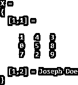
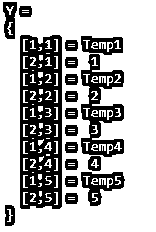
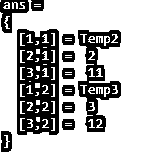

# Matlab 单元阵列

> 原文：<https://www.educba.com/matlab-cell-array/>

## Matlab 单元阵列介绍

数组用于存储包含任何相关信息的数据。在 Matlab 中，数组以行和列的形式存储。使用数组中的元素可以执行各种类型的函数和操作。单元格数组是 Matlab 中的数组类型，其中的元素被放入各自的单元格中。它们可以是不同大小的文本、列表、数字数组的形式。使用单元数组的主要优点是我们可以存储不同数据类型和大小的元素。

### Matlab 中单元格数组是如何工作的？

在 Matlab 中，单元格数组可以用单元格函数来表示。我们也可以将数组的类型声明为一个单元格数组，然后将值赋给它。请查找以下在处理单元数组时使用的语法:

<small>Hadoop、数据科学、统计学&其他</small>

*   **Y=cell(x):** 返回 x 乘 x 维空矩阵形式的数组。
*   **Y=cell(size):** 该函数返回输入参数中提到的给定大小的数组。例如，cell([3，4])返回一个 3 乘 4 维的数组。
*   **Y=cell(size1，size2…sizen):** 此函数返回输入参数中提到的给定大小的数组，每个大小表示其中每个维度的大小。
*   **Y=cell(object):** 此语法转换任何 Java 数组、字符串或对象数组，。Net 系统转换成 Matlab 单元格数组。

像 size 这样的输入参数必须是整数值。如果给定的大小为 0，那么它将产生一个空的单元格数组，如果给定的大小为任何负值，那么它将被视为 0。接受的数据类型有单精度、双精度、int8、int32、int16、int64、uint8、uint16、int32 和 uint64。如果我们有不同数据类型的信息，并且它们有不同的大小，那么我们可以使用单元格数组。

数组索引用于引用单元数组中的不同元素。它们不需要任何接触性存储位置来存储各自阵列中存在的数据。数组中出现的每个单元和标题都需要传染性内存分配。如果我们逐渐增加数组中单元的数量或元素的数量，那么它将是一个非常大的数组，在存储它的时候，我们将得到“内存不足”的错误。

### Matlab 单元阵列示例

让我们看一些 Matlab 细胞阵列的例子如下:

#### 示例#1

理解单元数组中元素的存储。

**代码:**

`X{1,1} = [1 2 3; 0 4 7; 8 3 4];
X{1,2} = 'Joseph Doe';
X`

**输出:**

#### 实施例 2

创建与现有数组大小相同的空单元数组。

**代码:**

`X = [8 9; 4 1; 5 3];
siz = size(X);
Y = cell(siz)`

**输出:**

#### 实施例 3

**代码:**

`X = cell(3, 5);
Y = {'Temp1', 'Temp2', 'Temp3', 'Temp4', 'Temp5'; 1 2 3 4 5}`

**输出:**

有两种方法可以访问数组中的元素。请在下面找到它们:

*   我们可以通过使用()括号提到元素的索引来访问这些值。
*   我们可以通过使用{}括号提及元素的索引来访问这些值，括号用于标识各个单元格中的数据。

#### 实施例 4

使用数组索引方法访问单元格数组中的元素。

**代码:**

`X = cell(3, 5);
Y = {'Temp1', 'Temp2', 'Temp3', 'Temp4', 'Temp5'; 1 2 3 4 5;10,11,12,13,14}
Y(1:3,2:3)`

**输出:**

我们可以通过使用 Matlab 中的 iscell()函数来判断声明的数组是否是单元格数组。它根据输入参数中数组的类型返回逻辑值 1 或 0。如果数组是单元数组，则返回逻辑 1(真)，如果不是，则返回逻辑 0(假)。请查找解释上述概念的以下示例:

#### 实施例 5

**代码:**

`X = cell(3, 5);
Y = {'Temp1', 'Temp2', 'Temp3', 'Temp4', 'Temp5'; 1 2 3 4 5;10,11,12,13,14}
check=iscell(Y)`

**输出:**

让我们看看下面的转换，可以在 Matlab 中把任何类型转换成单元格数组:

*   如果单元格中包含子数组，那么我们可以使用 Matlab 中的“mat2cell”函数将它们转换成单元格数组。它将输入数组分成更小的数组部分，然后将其转换为单元数组，得到的数组可以包含不同大小的元素。
*   如果数组中的单元格大小一致，那么可以使用 Matlab 中的“num2cell”函数将它们转换为单元格数组。它分割输入数组中存在的元素，并按照输入参数中提到的方式确定维数。语法中的 dimension 参数可以是标量，也可以是整数的组合，表示每个单元中包含的维度。维度应该是正整数，并且应该在 1 到输入数组维度的范围内。
*   输入数组可以是任意类型的多维数组，输入数组接受的数据类型有 single、double、int8、int32、int16、int64、uint8、uint16、uint32、uint64、logical、char、string、categorical、datetime、cell、duration 等。作为单元数组的结果数组取决于输入数组的大小和维度。
*   我们还可以使用 Matlab 中的“struct2cell”函数将结构转换为单元格数组。结构中存在的元素被复制到结果数组中，该数组是一个单元数组，但不包含标头名称。如果我们想显示标题名称，那么我们可以使用“字段名称”功能。

### 结论

单元格数组在 Matlab 中被广泛使用，因为它可以存储属于各种数据类型的元素，并且可以具有不同的维度。由于这种应用，有许多业务需求要求使用单元格数组，这也可以通过在 Matlab 中将任何对象转换为单元格数组来实现。

### 推荐文章

这是一个 Matlab 细胞阵列指南。在这里，我们讨论了 Matlab 单元阵列的介绍和工作，以及示例和代码实现。你也可以看看下面的文章来了解更多-

1.  [使用 Matlab 的测井图](https://www.educba.com/log-plot-matlab/)
2.  [方法 1–Javascript concat 方法](https://www.educba.com/javascript-merge-arrays/)
3.  [JavaScript 字符串长度示例](https://www.educba.com/javascript-string-length/)
4.  [JavaScript 拆分字符串](https://www.educba.com/javascript-split-string/)
5.  [Matlab 计数|示例](https://www.educba.com/matlab-count/)
6.  [Matlab 中的 fminsearch 完全指南](https://www.educba.com/fminsearch-in-matlab/)

