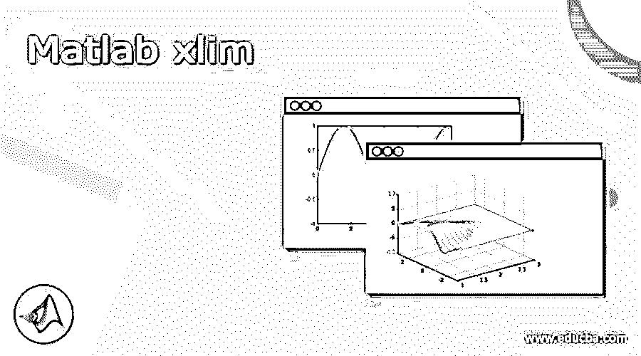
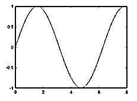
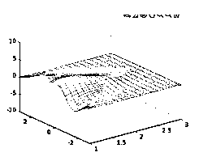
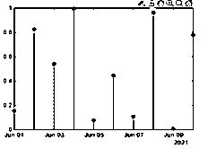
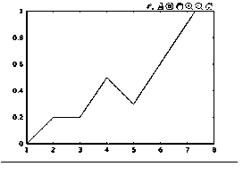
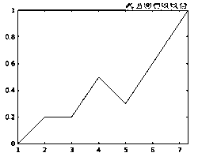

# Matlab xlim

> 原文：<https://www.educba.com/matlab-xlim/>

## Matlab xlim 的定义

Matlab 为用户提供不同类型的功能；xlim 是 Matlab 提供的函数之一。通过使用 xlim()函数，我们可以为当前轴或条设置 x 轴的界限，或者我们可以说是任何类型的图表。当我们需要指定轴的限制时，我们需要根据我们的要求传递最小值和最大值。xlim()函数中最重要的一点是，xlim()函数中的最大值应该大于 xlim()函数中的最小值。对于 xlim()函数的实现，我们有两种选择，如自动或手动限制；我们可以选择任何人。

**语法:**

<small>Hadoop、数据科学、统计学&其他</small>

`xlim(specified limit)
xlim(xlim minimum value, xlim maximum value)`

**解释**

xlim()函数有多种语法可用；这里，我们只定义两种语法。

在第一种语法中，我们使用带有指定限制参数的 xlim()函数，如下所示。通过使用指定的参数，我们可以为当前工作图表或轴设置 x 轴限制。

在第二个语法中，我们只是简化了第一个语法，这意味着在两个参数的帮助下，我们可以根据需要设置限制。在这个语法中，我们定义了两个参数，比如 xlim 最小值和 xlim 最大值。xlim 的最大值总是大于 xlim 的最小值。

### xlim 在 Matlab 中是如何工作的？

现在让我们看看 xlim 在 Matlab 中是如何工作的，如下所示。

基本上，有两种方法可以在 Matlab 中实现 xlim()函数，如下所示。

1.自动 xlim()选择:

在这种方法中，我们通过使用自动方式为当前轴或图表指定限制。在这个方法中，我们需要指定紧填充的自动方法。之后，我们需要启用自动限制选择。这种方法的工作原理是根据提供的数据选择极限。

2.手动 xlim()选择:

在这种方法中，我们可以手动设置当前图表或轴的 xlim。这里我们需要用用户提供的当前值来冻结 x 轴限值。

现在让我们看看如何在 xlim()函数中指定目标轴或图表，如下所示。

对于目标的选择，我们使用 xlim 方法；在这种方法中，我们指定目标坐标轴或图表，而不是当前坐标轴或图表。在这种方法中，首先，我们需要根据用户要求设置输出模式(自动或手动)的目标值。

现在让我们看看如何设置 x 轴的极限，如下所示。

我们可以通过设置 xlim()函数来绘制一条线，我们需要向 xlim()函数传递两个值，一个是最小值，一个是最大值。

现在让我们看看如何使用半自动的 xlim()函数，如下所示。

在此方法中，仅选择 x 值，并且该值应大于 0。这里 Matlab 自动选择最大极限。

设置 xlim()的日期:

首先，创建带有日期和 x 轴的图表，并设置从日期到最后日期的日期限制。

现在让我们看看如何指定紧密的 xlim():

当我们需要自动调整 x 轴时，我们需要使用正确的方法来指定 x 坐标的范围。

xlim 的输入参数:

Xlim()函数或者我们可以调用方法，对于 xlim()函数我们需要两个输入参数，即 xmin 和 xmax 值。在 xlim()中，我们可以在 Matlab 计算另一个极限的同时指定一个极限；对于自动计算，我们需要使用带有 inf 的紧方法。

### 例子

现在让我们看看 xlim 的不同例子如下。

`a = linspace(0,15);
b = sin(a);
plot(a,b)
xlim([0 8])`

**解释**

在上面的例子中，我们使用 linspace()函数来绘制直线。这是 xlim()的一个非常简单的例子。在上面的例子中，我们用最小值和最大值指定 xlim()函数，如上例所示。我们用截图说明的上述语句的最终结果如下。

现在，让我们看看如何为半自动操作实现 xlim，如下所示。

`[X,Y,Z] = peaks;
mesh(X,Y,Z)
xlim([1 inf])`

**解释**

在上面的例子中，我们使用 peaks 函数来实现图形函数，如 surf、mesh 和 color 等。这里；，我们使用如图所示的网格图形功能。之后，我们将 xlim()函数的最小极限设置为 1，同时，Matlab 使用 inf 计算另一个最大极限。我们用截图说明的上述语句的最终结果如下。

让我们看一个带有日期的轴的例子，如下所示。

`d = datetime(2021,06,1) + caldays(0:10);
x = rand(11,1);
stem(d,x,'filled')
startd = datetime(2021,06,1);
endd = datetime(2021,06,10);
xlim([startd endd])`

**解释**

在上面的例子中，我们试图用一个日期来设置 x 轴的界限。在这里，我们指定开始和结束日期，这意味着创建如上例所示的 stem 图表的日期范围。我们用截图说明的上述语句的最终结果如下。

让我们看看 xlim 紧函数的例子，如下所示。

首先，我们需要使用以下点绘制图表，如下所示。

图([1 2 3 4 5 7.3]，[0 0.2 0.2 0.5 0.3 1])

执行上述语句后，我们得到下面的图表，如下面的截图所示。

现在执行 xlim tight 语句，然后我们得到如下结果。

这样，我们就可以根据自己的需要，在 Matlab 的 xlim 的帮助下执行不同的操作。

### 结论

我们希望你能从这篇文章中学习 Matlab xlim。从上面的文章中，我们学习了 xlim 的基本语法，也看到了 xlim 的不同例子。从这篇文章中，我们了解了如何以及何时使用 Matlab xlim。

### 推荐文章

这是一个 Matlab xlim 的指南。这里我们讨论 xlim 的定义，语法，如何在 Matlab 中工作？代码实现示例。您也可以看看以下文章，了解更多信息–

1.  [Matlab vpa](https://www.educba.com/matlab-vpa/)
2.  [Matlab 布尔型](https://www.educba.com/matlab-boolean/)
3.  [Matlab 对](https://www.educba.com/matlab-mod/)的影响
4.  [Matlab 块注释](https://www.educba.com/matlab-block-comment/)

