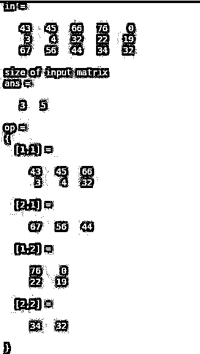
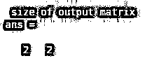
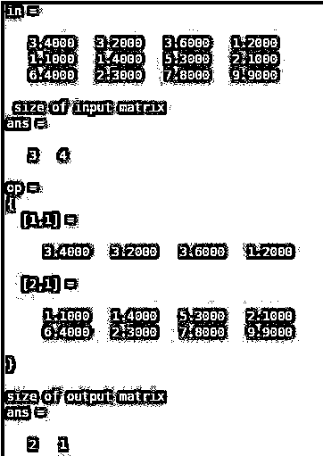

# Matlab 2 cell

> 原文：<https://www.educba.com/mat2cell-matlab/>

## Matlab 中 Mat2cell 介绍

Matlab 中的“mat2cell”函数将数组或向量或多维矩阵转换成更小的单元数组或向量或多维矩阵。这个概念背后的基本原理是将矩阵转换成单元。它只转换矩阵的维度和格式，而不改变元素，这意味着在这个函数中没有数据丢失。该功能可以以两种方式执行，一种方式是提供行分布，另一种方式是提供行和列分布。通过使用这个函数，我们改变了矩阵的维数，但是我们可以通过使用 mat2cell 函数再次恢复我们的原始数据或元素。

### 句法

下面是 Mat2cell Matlab 的语法:

<small>Hadoop、数据科学、统计学&其他</small>

`Op = mat2cell (in, [ 4 3 ] )
Output variable name = mat2cell (input variable name, [ rows of first matrix rows of second matrix ]`

运筹学

`Op = mat2cell (in , [ 3 2 ] , [ 2 3 ] )
Output variable name = mat2cell ( input variable name , [ first sub - matrix dimensions second sub - matrix dimensions ]`

### Mat2cell Matlab 如何工作？

Mat2cell 函数需要一些参数来对输入进行操作。在第一种方法中，我们需要向函数提供矩阵的行分布。假设输入中有 4 行，那么输出的行分布将是[ 1 3 ]或[ 2 2 ]或[ 3 1 ]或[40]或[04]。在第二种方法中，我们需要提供单元阵列尺寸。假设输入矩阵中有 3 行 4 列，那么输入矩阵的维数将是 3 乘 4。那么分布是这样的[2 ^ 1][2 ^ 2]。分布应该是子矩阵维数的相加。本例中还处理了其他分布，如[ 3 1 ][ 1 2 ]或[ 1 2 ] [ 3 1 ]。

### 实现 Mat2cell Matlab 的例子

下面是提到的例子:

#### 示例#1

让我们假设一个具有三行三列的输入矩阵，这里输入矩阵被分配给变量‘in’，输出矩阵被分配给变量‘op’。在这个例子中，我们使用了多维度方法。第一个矩阵维度是[2 ^ 1]，第二个维度是[1 ^ 2]。

**代码:**

`clc ;
clear all ;
in = [ 5 43 2 ; 4 5 33 ; 4 56 7 ] op = mat2cell( in ,[ 2 1 ],[ 1 2 ] )`

**输出:**

#### 实施例 2

在这个例子中，我们假设一个 3 行 5 列的矩阵，这意味着输入矩阵的大小是 3 乘 5，这里输入矩阵被分配给变量‘in’，输出矩阵被分配给变量‘op’。我们使用子矩阵维数方法将输入矩阵转换为单元矩阵。子矩阵的维数为[2 ^ 1]和[3 ^ 2]，因此满足行和列相加的准则，即二加三等于五，一加二等于三。我们还通过使用尺寸函数来观察结果。输入矩阵的大小是[3×5]，输出矩阵的大小是[2×2]

**代码:**

`clc ;
clear all ;
in = [ 43 45 66 76 0 ; 3 4 32 22 19 ; 67 56 44 34 32 ] display ( 'size of input matrix ' )
size ( in )
op = mat2cell ( in , [ 2 1 ] , [ 3 2 ] )
display ( ' size of output matrix ' )
size( op )`

**输出:**

#### 实施例 3

在本例中，我们可以看到另一种分配方法，即仅行分配，这里输入矩阵被分配给变量“In”，输出矩阵被分配给变量“op”。让我们假设一个四行三列的输入矩阵，这意味着输入矩阵的大小是 3 乘 4。我们应用了行分布的 mat2 单元函数[ 1 2 ]。行分布[ 1 2 ]意味着将有两个单元矩阵，第一个矩阵将有一行四列，第二个矩阵将有两行四列。这种方法仅更改维度行，而维度列保持不变。

**代码:**

`clc ;
clear all ;
in = [ 3.4 3.2 3.6 1.2 ; 1.1 1.4 5.3 2.1 ; 6.4 2.3 7.8 9.9 ] display ( ' size of input matrix ' )
size ( in )
op = mat2cell ( in , [ 1 2 ])
display ( 'size of output matrix' )
size ( op )`

**输出:**

### 结论

mat2cell '函数是调整多维矩阵维数的一个非常有效的命令。它将多维矩阵转换为单元矩阵，而不影响输入矩阵的数据或元素。我们可以使用任何类型的输入来使用这个函数，比如数组、向量或多维矩阵。类似地，我们可以使用函数 cell2 mat 将单元格矩阵或数组转换成矩阵。Cell2mat 函数的作用与 mat2cell 函数完全相反。

### 推荐文章

这是一个 Mat2cell Matlab 的指南。这里我们讨论一下 Mat2cell Matlab 的介绍，语法，它是如何工作的，例子。您也可以浏览我们的其他相关文章，了解更多信息——

1.  [Matlab 细胞阵列](https://www.educba.com/matlab-cell-array/)
2.  [MATLAB 中的数据类型](https://www.educba.com/data-types-in-matlab/)
3.  [Matlab loglog()](https://www.educba.com/matlab-loglog/)
4.  [Matlab 中的阶乘](https://www.educba.com/factorial-in-matlab/)

