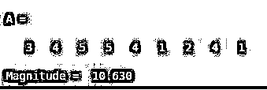
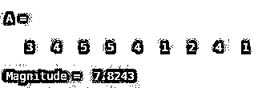
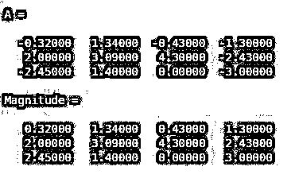

# 幅度 Matlab

> 原文：<https://www.educba.com/magnitude-matlab/>

## Matlab 中的幅值介绍

MATLAB 是一个交互式的编程环境，用于科学计算。它广泛应用于许多需要解决问题、数据分析、算法开发和实验的技术领域。特定学科的软件广泛使用 MATLAB 编写。在这篇文章中，我们将学习如何在 MATLAB 中计算一个向量或向量数组的大小。在 MATLAB 中，主要有两个函数可以用来计算幅度。要使用的正确函数取决于我们拥有的输入类型和我们期望的输出。

### Matlab 中计算大小的函数

让我们借助不同的例子来逐一理解如何使用这一点:

<small>Hadoop、数据科学、统计学&其他</small>

#### 1.范数函数

**代码:**

`norm (A)`

**解释:** norm (A)用于计算输入‘A’的 2-norm 或换句话说，矢量幅度。默认情况下，该函数计算 2-范数，如果我们有不同的要求，绕过参数中所需的范数，则可以更改 2-范数。

#### 2.abs 功能

**代码:**

`Magnitude = abs (A)`

**解释:** abs (A)将返回输入数组‘A’中每个元素的绝对值或大小。如果输入‘A’是复数，那么 abs 函数将返回到复数幅度。请记住，复数 X + Yi 的复数幅度是(X^2 + Y^2).)的平方根

### 实现幅值 Matlab 的例子

下面是提到的例子:

#### 示例#1

在第一个示例中，我们将使用默认值(即 2 范数)来计算矢量幅度。

**代码:**

`A = [3 4 5, 5 4 1, 2 4 1] Magnitude = norm (A)`

**输出:**

#### 实施例 2

现在让我们使用范数函数来计算 3 r d 范数向量幅度。

**代码:**

`A = [3 4 5, 5 4 1, 2 4 1] Magnitude = norm (A, 3)`

**输出:**

#### 实施例 3

在第一个例子中，我们将获取一个正值和负值的数组，并看看计算大小的代码是什么样子的。

**代码:**

`A = [-0.32   1.34   -0.43   -1.3;   2  3.09   4.3   -2.43;   -2.45   1.4   0   -3] Magnitude = abs (A)`

**输出:**

#### 实施例 4

在本例中，我们将看到使用 abs 函数计算复数幅度的代码在 MATLAB 中的样子。

**代码:**

`A = 8 + 6i
Magnitude = abs (A)`

**输出:**

### 结论

MATLAB 为我们提供了“norm”和“abs”函数来计算向量、向量数组或复数的大小。我们可以根据我们的输入使用适当的函数。

### 推荐文章

这是一个 Matlab 量级指南。在这里，我们讨论一个 Matlab 的大小，函数的介绍，与编程的例子。您也可以浏览我们的其他相关文章，了解更多信息——

1.  [Matlab 叉积](https://www.educba.com/matlab-cross-product/)
2.  [MATLAB 中的热图](https://www.educba.com/heatmap-in-matlab/)
3.  [Matlab loglog()](https://www.educba.com/matlab-loglog/)
4.  [条形图 Matlab](https://www.educba.com/bar-plot-matlab/)

