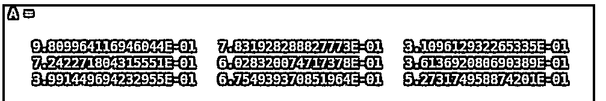
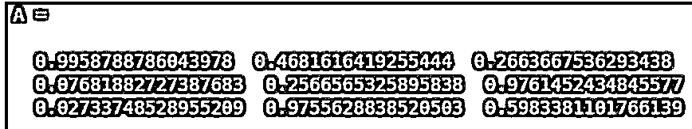

# 格式长 Matlab

> 原文：<https://www.educba.com/format-long-matlab/>

## 格式长 Matlab 简介

在各种基于计算机的语言中使用格式函数来获得所需格式的输出。在 Matlab 中，format 函数用于将命令窗口中获得的输出设置为所需的格式。格式函数有各种类型或风格，如短、长、十六进制等。

**语法:**

<small>Hadoop、数据科学、统计学&其他</small>

`format type`

`format`

**描述:**

*   格式类型用于更改 Matlab 命令窗口中输出的显示格式，并将其设置为“类型”给定的显示格式
*   如果我们没有传递任何“类型”，那么默认情况下，format 函数会将输出的显示格式设置为“短”类型。

**长型有以下变化:**

*   **long:** 小数点后显示 15 位数字。
*   **longEng:** 15 位数字和一个 3 的倍数的指数。
*   **鳄龙:**科学记数法显示 15 位数字。
*   **longG:** 它以科学记数法或固定十进制格式显示输出，这取决于哪种格式更紧凑。

### Matlab 长格式示例

下面是提到的例子:

#### 示例#1

在本例中，我们将 2 个整数相除，并使用 format 函数获得长格式的输出。

我们将遵循以下 2 个步骤:

*   使用类型为“long”的格式函数。
*   执行两个整数的除法。

**语法:**

`format long`

[Passing the type as ‘long’ to the format function]

X = 1/3

[Initializing a variable and passing division of 2 integers into it] [Mathematically, the value of1/3 is 0.3333….. which goes on till infinity. Now since we have used long as our type, our output will be restricted to 15 digits]

**代码:**

`format long
X = 1/3`

**输出:**

正如我们所看到的，我们获得了 15 位数的输出，因为我们使用了“long”作为 format 函数的类型。

#### 实施例 2

现在让我们看看在 Matlab 中使用 longEng 类型的 format 函数的代码。

在这个例子中，为了更好地理解，我们将采用与上面相同的例子。

我们将遵循以下 2 个步骤:

*   对 longEng 类型使用 format 函数。
*   执行两个整数的除法。

**语法:**

`format longEng`

[Passing the type as ‘longEng’ to the format function]

X = 1/3

[Initializing a variable and passing division of 2 integers into it] [Mathematically, the 1/3 is 0.3333….. which goes on till infinity. Now since we have used longEng as our type, our output will be restricted to 15 digits, 3 before decimal, 12 after that. Also, we will get an exponential which is multiple of three]

**代码:**

`format longEng
X = 1/3`

**输出:**

**

** 

正如我们所看到的，我们已经获得了十进制符号前 3 位和后 12 位的输出，因为我们使用了“longEng”作为 format 函数的类型。

#### 实施例 3

现在让我们看看在 Matlab 中使用鳄龙类型的格式函数的代码。

在这个例子中，我们将采用一个随机数数组，并使用鳄龙类型来格式化输出。

我们将遵循以下 2 个步骤:

*   将类型作为“鳄龙”传递给格式函数。
*   创建随机数的输入数组。

**语法:**

`format longE`

[Passing the type as ‘longE’ to the format function]

A =兰特(3)

[Creating the array of random numbers] [longE will give us the output in scientific notation and with 15 digits after decimal]

**代码:**

`format longE
A = rand (3)`

**输出:**

正如我们所看到的，我们已经获得了科学记数法和小数点后 15 位数字的输出，因为我们使用“鳄龙”作为格式函数的类型。

#### 实施例 4

现在让我们看看在 Matlab 中使用 longG 类型的 format 函数的代码。

在这个例子中，我们将使用与上面相同的数组，并使用 longG 类型来格式化输出。

我们将遵循以下 2 个步骤:

*   将类型作为“longG”传递给格式函数。
*   创建随机数的输入数组。

**语法:**

`format longG`

[Passing the type as ‘longG’ to the format function]

A =兰特(3)

[Creating the array of random numbers] [longG will display the output in either scientific notation or in fixed decimal format, depending upon which format is more compact]

**代码:**

`format longG
A = rand (3)`

**输出:**

### 结论

在 Matlab 中可以使用 format 函数来得到我们想要的格式的输出，如果我们希望我们的输出是 15 位数左右，可以使用 Long 格式。

### 推荐文章

这是一个格式化长 Matlab 的指南。为了更好地理解，我们在这里分别用例子来讨论对格式 long Matlab 的介绍。您也可以看看以下文章，了解更多信息–

1.  [Matlab 中的阶乘](https://www.educba.com/factorial-in-matlab/)
2.  [Matlab rref](https://www.educba.com/matlab-rref/)
3.  [Matlab 图](https://www.educba.com/matlab-figure/)
4.  [MATLAB 缸()](https://www.educba.com/matlab-cylinder/)

