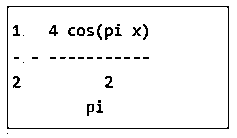
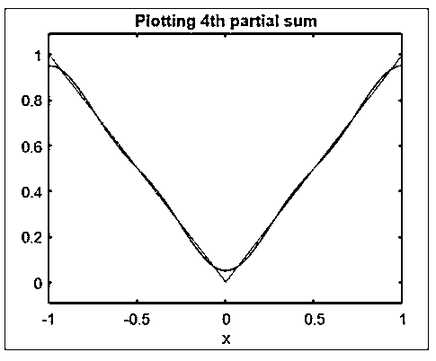
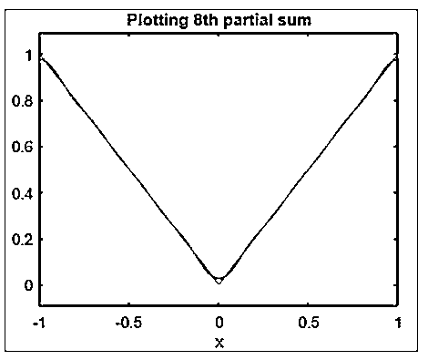
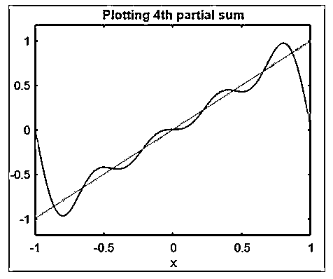

# 傅里叶级数 Matlab

> 原文：<https://www.educba.com/fourier-series-matlab/>

## 傅立叶级数 Matlab 简介

以下文章提供了傅立叶级数 Matlab 的概要。Matlab 是一个用于科学计算的交互式编程环境。它广泛应用于许多需要解决问题、数据分析、算法开发和实验的技术领域。特定学科的软件大量使用 Matlab 编写。傅立叶级数在数学中用于使用正弦和余弦波或函数创建新的函数。傅立叶级数的概念是由傅立叶男爵提出的。Baron 发现，我们可以用一系列正弦和余弦波来表示周期函数，这些正弦和余弦波是相互调和的。

如果一个函数是周期的，并且满足以下两个条件，那么这个函数的傅立叶级数就存在。

<small>Hadoop、数据科学、统计学&其他</small>

*   f(x)可以在[-π，π]范围内绝对积分(这意味着狄利克雷积分将是有限的)。
*   f(x)是单值的、分段单调的和分段连续的。

### Matlab 中傅里叶级数的语法

1.首先，我们将计算傅立叶级数的正弦和余弦系数，以及傅立叶级数的部分和。对于一个表达式‘f’，我们可以在区间[-P，P]中计算‘n’个和。

**语法:**

`syms z n P x
[initializing the variables] evalin (symengine, 'assume (z, Type :: Integer)');
[Initializing ‘z’ as an integer variable] a = @ (f, x, z, P) int (f * cos (z * pi * x / P) / P, x, -P, P);
[Calculating the ‘zth’ Fourier cosine coefficient] b = @ (f, x, z, P) int (f * sin (z * pi * x / P) / P, x, -P, P);
[Calculating the ‘zth’ Fourier sine coefficient] fs = @ (f, x, n, P) a (f, x, 0, P) / 2 + ...
symsum (a (f, x, Z, P) * cos (z *pi * x / P) + b (f, x, z, P) * sin (z * pi * x / P), z, 1, n);
[Formula to calculate the nth partial sum]`

对于这个例子，我们将计算一个绝对函数的 2 和部分和。

`f = abs (x)
[absolute function] pretty (fs (f, x, 2, 1))
[Taking 2nd partial sum; Pretty is used to print x in simple text format]`

[Notice the argument ‘2’ in the above code, representing 2nd partial sum]

**代码:**

`syms z n P x
evalin (symengine, 'assume (z, Type :: Integer)');
a = @ (f, x, z, P) int (f * cos (z * pi * x / P) / P, x, -P, P);
b = @ (f, x, z, P) int (f * sin (z * pi * x / P) / P, x, -P, P);
fs = @ (f, x, n, P) a (f, x, 0, P) / 2 + ...
symsum (a (f, x, z, P) * cos (z *pi * x / P) + b (f, x, z, P) * sin (z * pi * x / P), z, 1, n);
f = abs (x)
pretty (fs (f, x, 2, 1))`

**输出:**

2.接下来，我们将绘制 n = 4 的部分和。我们的图也将显示输入绝对函数。

**语法:**

`ezplot (fs (f, x, 4, 1), -1, 1)
[Plotting the 4th partial sum for Fourier series] hold on
ezplot (f, -1, 1)
[Plotting the absolute function] hold off
title ('Plotting 4th partial sum')
[Defining the title for the plot]`

**代码:**

`ezplot (fs (f, x, 4, 1), -1, 1)
hold on
ezplot (f, -1, 1)
hold off
title ('Plotting 4th partial sum')`

**输出:**

**

** 

如我们所见，我们有输入绝对函数和傅立叶级数第 4 个部分和的图。

3.接下来，我们将绘制傅立叶级数的第 8 个部分和。

**语法:**

`ezplot (fs (f, x, 8, 1), -1, 1)
[Plotting the 8thpartial sum for Fourier series] hold on
ezplot (f, -1, 1)
[Plotting the absolute function] hold off
title ('Plotting 8th partial sum')
[Defining the title for the plot]`

**代码:**

`ezplot (fs (f, x, 8, 1), -1, 1)
hold on
ezplot (f, -1, 1)
hold off
title ('Plotting 8th partial sum')`

**输出:**

如我们所见，我们有输入绝对函数和傅立叶级数的第 8 个部分和的图。

4.接下来，让我们将一个直线函数作为我们的输入，并绘制它的第 4 个部分和

**语法:**

`syms x z P n
[initializing the variables] evalin (symengine, 'assume (z, Type :: Integer)');
[Initializing ‘z’ as an integer variable] a = @ (f, x, z, P) int (f * cos (z * pi * x / P) / P, x,- P, P);
[Calculating the ‘zth’ Fourier cosine coefficient] b = @ (f, x, z, P) int (f * sin (z * pi * x / P) / P, x, -P, P);
[Calculating the ‘zth’ Fourier sine coefficient] fs = @ (f, x, n, P) a (f, x, 0, P) / 2 + ...
symsum (a (f, x, z, P) * cos (z * pi * x / P) + b (f, x, z, P) * sin (z * pi * x / P), z, 1, n);
[Formula to calculate the nth partial sum] f = x
[Input straight line function] ezplot (fs (f, x, 4, 1), -1, 1)
[Plotting the 4th partial sum for Fourier series] hold on
ezplot (f, -1, 1)
[Plotting the straight line function] hold off
title ('Plotting 4thpartial sum')
[Defining the title for the plot]`

**代码:**

`syms x z P n
evalin (symengine, 'assume (z, Type :: Integer)');
a = @ (f, x, z, P) int (f * cos (z * pi * x / P) / P, x,- P, P);
b = @ (f, x, z, P) int (f * sin (z * pi * x / P) / P, x, -P, P);
fs = @ (f, x, n, P) a (f, x, 0, P) / 2 + ...
symsum (a (f, x, z, P) * cos (z * pi * x / P) + b (f, x, z, P) * sin (z * pi * x / P), z, 1, n);
f = x
ezplot (fs (f, x, 4, 1), -1, 1)
hold on
ezplot (f, -1, 1)
hold off
title ('Plotting 4thpartial sum')`

**输出:**

如我们所见，我们有输入直线函数和傅里叶级数的第 4 个部分和的图。

### 结论

傅立叶级数在数学中用于使用正弦波和余弦波创建新的函数。在 Matlab 中，我们可以找到傅立叶系数，并使用提到的技术绘制傅立叶级数的部分和。

### 推荐文章

这是一个傅立叶级数 Matlab 指南。这里我们讨论 matlab 中傅立叶级数的介绍，各自的语法和详细的解释。您也可以看看以下文章，了解更多信息–

1.  [Matlab pcolor()](https://www.educba.com/matlab-pcolor/)
2.  [颤 Matlab](https://www.educba.com/quiver-matlab/)
3.  [Matlab 绘图圆](https://www.educba.com/matlab-plot-circle/)
4.  [Matlab stem()](https://www.educba.com/matlab-stem/)

