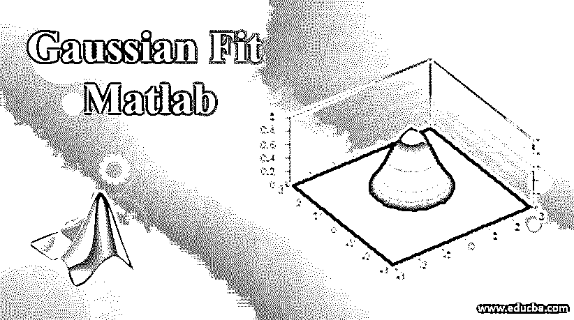
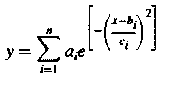
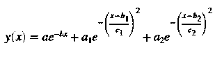

# 高斯拟合 Matlab

> 原文：<https://www.educba.com/gaussian-fit-matlab/>

## 高斯拟合 Matlab 简介

高斯拟合或高斯分布被定义为一种连续拟合，它以这样一种方式计算二项式事件的分布，即分布上的值给出的概率为 1。分布中涉及的参数有[平均值和标准偏差](https://www.educba.com/standard-deviation-vs-mean/)。这种分布呈钟形曲线，是卡尔·弗里德里希·高斯发现的。现实生活中有许多应用遵循具有钟形拟合曲线的高斯分布，如测量血压、身高、智商分数等。

### Matlab 中的高斯拟合函数

在 Matlab 中，我们还可以对不同的数据集和输入使用高斯拟合。该公式定义如下:

<small>Hadoop、数据科学、统计学&其他</small>

其中 a 被定义为振幅，

*   **b** 是质心位置。
*   **n** 是峰值的总数，在 1 到 8 的范围内。
*   **c** 为峰的宽度。

在 Matlab 中有多种应用高斯拟合模型的方法，如下所示:

### 利用 Matlab 中的“拟合”函数进行高斯拟合

使用的输入参数是高斯库模型，使用的函数是“fit”和“fittype”。模型类型可以被给定为“高斯”,其项数可以从 1 变化到 8。请查找 Matlab 中用于高斯拟合的以下语法:

`Fi=fit (x, y,” gauss3”)`

使用曲线拟合应用程序进行高斯拟合:

*   点击 cftool，打开曲线拟合应用。或者，我们也可以从应用程序选项卡中单击曲线拟合。
*   之后，我们需要选择曲线拟合数据，即 X 数据和 Y 数据。默认情况下，模型的曲线拟合是多项式，我们必须将其更改为高斯拟合。
*   将模型类型更改为高斯后，选择高斯拟合中需要使用的项数，它可以在 1 到 8 之间变化。我们可以在结果窗格中看到不同的系数值、拟合优度和模型的几个项。
*   如果我们想要指定系数初始值、约束边界或改变算法的设置，那么可以在“拟合选项选项卡”中完成。基于加载的数据集，它还将计算可以在高斯模型中使用的起始点，可以根据需要手动改变这些起始点。

我们还可以使用具有指数空间或非线性模型的高斯拟合。它们符合下面的等式:

其中 a，a1，a2 定义为峰值的振幅。

*   b，b1，b2 定义为峰值的质心。
*   c，c1，c2 定义为峰的宽度。

上述方程是非线性方程，导出的系数是指数函数的一部分。请找到以下用于将高斯拟合应用于非线性模型的程序:

*   我们必须在需要应用高斯拟合的地方加载所需的数据集。点击 cftool，打开曲线拟合应用。或者，我们也可以从应用程序选项卡中单击曲线拟合。
*   加载的工作空间将包含两个变量，其中一个是预测值或独立变量值的向量(xpeak ),另一个是响应或因变量值的向量(ypeak)。之后，您可以为所需的 X 数据选择 xpeak，为所需的 Y 数据选择 ypeak。这里使用的配合名称是“Gauss2exp1”。
*   完成上述步骤后，我们必须为模型选择自定义方程，并输入带有所需项和输入的方程。目前，拟合非常差，因为它包含所有没有边界的默认系数，并且起始点也是默认选择的。
*   通常，选择模型的起点很容易，因为这里使用的系数很简单，不需要任何复杂的解释，指数背景也定义得很好。类似地，提及所需模型的所有系数和约束。在上述方程中定义的参数，如峰的振幅(a，a1，a2)和峰的宽度(c，c1，c2)本质上不能是负的。所有这些参数都可以在“拟合选项”选项卡中更改，我们必须在该选项卡中设置上述参数的下限，如大于 0 的峰振幅和峰宽。

### 高斯拟合的应用

*   高斯拟合在科学和工程领域用于定义线发射光谱和化学浓度。
*   它用于数据科学和商业分析领域。在应用某些模型之前，高斯拟合或重要标准或假设中有一个钟形曲线。如果数据不是钟形的，那么我们可以对参数应用各种变换技术，然后应用模型。
*   高斯拟合也用于统计学领域，以定义信号和图像处理系统中的正态分布、高斯滤波器的度量。它们也用于求解不同的热和扩散方程。

### 结论

高斯拟合是统计和分析领域中的一个重要课题，其中拟合通常是以标准偏差作为重要参数的钟形曲线。在对数据集应用任何建模技术之前，应该记住高斯拟合的许多属性。

### 推荐文章

这是高斯拟合的 Matlab 指南。在这里，我们讨论了在 Matlab 中高斯拟合的介绍和工作，以及应用和功能。您也可以看看以下文章，了解更多信息–

1.  [Matlab 图例功能指南](https://www.educba.com/matlab-legend/)
2.  [Matlab 中嵌套循环是如何工作的？](https://www.educba.com/nested-loop-in-matlab/)
3.  [Matlab 中单元格数组是如何工作的？](https://www.educba.com/matlab-cell-array/)
4.  [Matlab 中的 dlm read](https://www.educba.com/dlmread-in-matlab/)
5.  [Matlab 中的 fmin search |示例](https://www.educba.com/fminsearch-in-matlab/)

