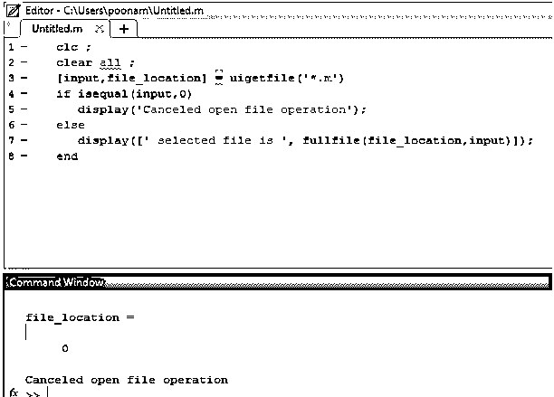
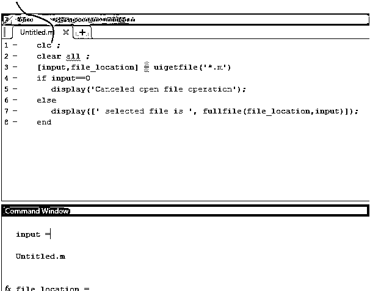
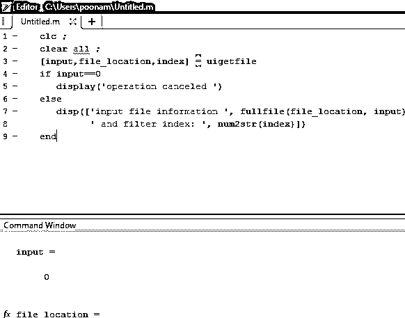
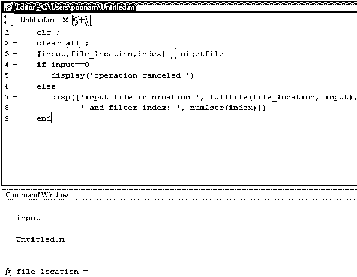

# uigetfile Matlab

> 原文：<https://www.educba.com/uigetfile-matlab/>

## uigetfile Matlab 简介

“uigetfile”是来自文件操作域的重要函数之一，用于访问文件对话框。每当我们运行或执行这个功能，我们得到一个对话框，显示在屏幕上的文件列表。通过使用此功能，我们可以从任何位置直接打开文件，如果我们不知道某个特定文件的确切位置，那么我们可以将该文件涂成褐色，并在命令窗口中检查其位置。每当我们执行命令时，我们可以观察到两种类型的输出，一种是如果我们不选择任何文件并取消执行，另一种是通过选择文件和文件位置。所有与文件和变量相关的信息都自动存储在工作区中。

**语法:**

<small>Hadoop、数据科学、统计学&其他</small>

1.  [输入，文件位置] = uigetfile ( ' *。m’)

`[ file variable name, file location variable name ] = uigetfile ( ‘*. file extension ’ )`

2.  [输入，文件位置，索引] = uigetfile

`[ file variable name, file location variable name, index variable ] = uigetfile`

### 为什么我们在 Matlab 中使用 uigetfile？

Uigefile 功能帮助用户访问当前文件夹或其他文件夹中的文件。当我们执行该命令时，它会显示一个对话框，我们可以通过选择文件或键入文件名来选择文件。如果当前文件夹中没有我们的文件，我们可以从对话框左侧的对话框中浏览文件夹。它以 0 和 1 的形式给出结果。如果我们选择特定的文件，那么它给出的结果为 1，如果我们不选择，那么它给出的输出为 0。

### 例子

让我们讨论 uigetfile Matlab 的例子。

#### 示例#1

让我们考虑一个访问文件的简单例子。文件存储在变量输入中，路径存储在变量 file _location 中。众所周知，uigetfile 函数以 1 和 0 的形式给出结果。因此，如果输出为 0，那么它将显示消息“取消打开文件操作”,如示例 1 ( a)所示。如果我们选择一个文件，那么它将输出 1 长度的文件位置，如示例 1 ( b)所示。在这个特殊的例子中，我们还提到了程序可访问的文件类型。这里的类型或扩展是。m ' '.“m”是 Matlab 文件的扩展名。所以我们只能选择 Matlab 文件。

**Matlab 程序示例 1(a)–**

`clc ;
clear all ;
[ input, file_location ] = uigetfile ( ' * .m')
if input == 0
display ( ' Canceled open file operation ' ) ;
else
display ( [ ' selected file is ', fullfile(file_location, input) ] ) ;
end`

**输出:**

**实例 2 ( b)的 Matlab 程序—**

`clc ;
clear all ;
[ input, file_location] = uigetfile ('*.m')
if input == 0
display ( ' Canceled open file operation ' ) ;
else
display ( [ ' selected file is ', fullfile (file _location, input) ] ) ;
end`

**输出:**

#### 实施例 2

在第二个例子中，uigetfile 分配了三个参数。文件存储在变量输入中，路径存储在变量 file _location 中，第三个参数是以 0 和 1 的形式显示结果的索引。因此，如果输出为 0，那么它将显示消息“取消打开文件操作”,如示例 2 (a)所示。如果我们选择一个文件，那么它将输出 1 和其他信息，如索引、文件位置和过滤器索引，如示例 2 (b)所示。在示例 2 中，我们没有提到任何类型或扩展名的文件以及 uigetfile 函数，所以我们可以从对话框中访问或打开任何类型的文件，包括图片。

**实例 2 (a)的 Matlab 程序—**

`clc ;
clear all ;
[ input, file_location, index ] = uigetfile
if input == 0
display ( ' operation canceled ' )
else
disp ( [ ' input file information ', fullfile (file _location, input),...
' and filter index: ', num2str(index)])
end`

**输出:**

**实例 2 ( b)的 Matlab 程序—**

`clc ;
clear all ;
[ input, file_location, index ] = uigetfile
if input == 0
display ( ' operation canceled ' )
else
display ( [ ' input file information ', fullfile(file_location, input),...
' and filter index: ', num2str(index)])
end`

**输出:**

### 结论

正如我们在本文中看到的，如何在不使用直接选项的情况下从 Matlab 函数中访问文件。在 Matlab 窗口中，我们可以从对话框中打开单个以及多个 Matlab 文件。我们也可以打开其他类型的文件。txt，。doc，。xls，。png，。jpg 和更多。还有一个打开文件的选项是 dir 命令，但 uigetfile 更有效。除了文件可访问性，我们还可以在命令窗口中检查文件规范和其他信息。我们还可以在 uigetfile 函数的参数中应用过滤器，这样用户就可以很容易地浏览文件。

### 推荐文章

这是一个 uigetfile 的 Matlab 指南。这里我们分别讨论了介绍、语法、为什么在 Matlab 中使用 uigetfile，以及示例和代码实现。您也可以看看以下文章，了解更多信息–

1.  [MATLAB 工具箱](https://www.educba.com/matlab-toolbox/)
2.  [MATLAB 冒号](https://www.educba.com/matlab-colon/)
3.  [Matlab 积分](https://www.educba.com/matlab-integral/)
4.  [Matlab xcorr](https://www.educba.com/matlab-xcorr/)

