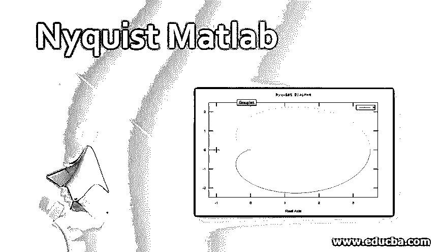
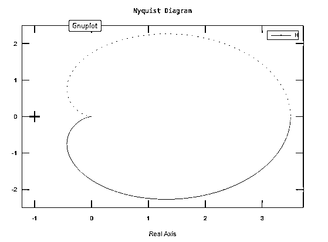
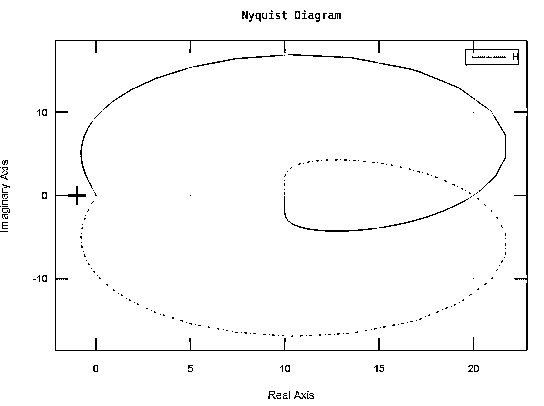
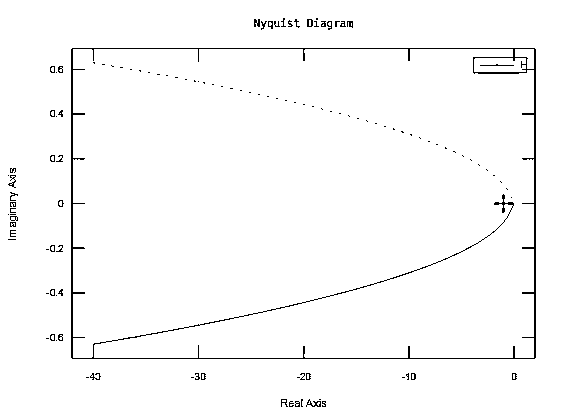
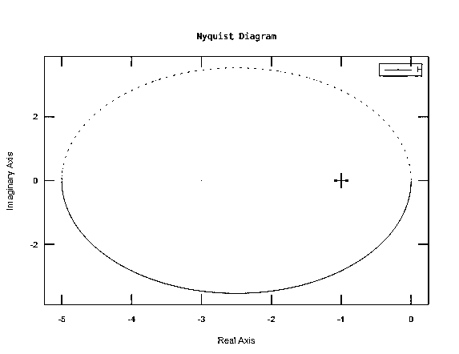

# 奈奎斯特 Matlab

> 原文：<https://www.educba.com/nyquist-matlab/>

## 奈奎斯特 Matlab 简介

在本文中，我们将学习如何在 MATLAB 中创建奈奎斯特图。奈奎斯特图可用于分析系统属性，如相位裕量、增益裕量和稳定性。随着本文的深入，我们将学习如何创建简单的奈奎斯特图以及复杂条件下的奈奎斯特图。

### 理解奈奎斯特图

奈奎斯特图也称为奈奎斯特图，在信号处理和控制工程中用于绘制频率。奈奎斯特图通常用于评估系统的稳定性，也用于获得反馈。笛卡尔坐标用于奈奎斯特图。X 轴表示传递函数的实部，Y 轴表示虚部。为了得到一个频率图，它被作为一个参数传递，这导致了一个基于频率的图形。极坐标也可用于奈奎斯特图。这里，径向坐标用于表示传递函数的增益，相应的角度坐标由传递函数的相位表示。

<small>Hadoop、数据科学、统计学&其他</small>

### 在 Matlab 中创建奈奎斯特图的语法

`nyquist(sys)`

MATLAB 中的奈奎斯特函数有助于我们创建与动态模型产生的频率响应相关的奈奎斯特图。

让我们借助几个例子来清楚地理解这一点:

为了绘制奈奎斯特图，我们首先创建一个传递函数，如下所示:

`H = 70 / (s+5) (s+ 4)`

这是一个简单的例子，没有任何其他条件。

我们可以把上面的系统写成:

`H = 70 / (s^2 + 9s + 20)`

然后，该传递函数作为参数传递给我们的函数‘Nyquist’
I . enyquist(H)

这是我们的输入和输出在 MATLAB 控制台中的样子:

**输入:**

`H=tf([0 0 70],[1 9 20]);
nyquist(H)`

**输出:**

在下一个例子中，我们将看到一个极点位于中心/原点的奈奎斯特图。

这是我们的传递函数:

`H = 40 / s^3 + 2s ^ 2 + 3s + 4`

然后，该传递函数作为参数传递给我们的函数‘Nyquist’
I . enyquist(H)

这是我们的输入和输出在 MATLAB 控制台中的样子:

**输入:**

`H=tf([40],[3 2 3 4]);
nyquist(H)`

**输出:**

由我们的传递函数表示的系统在原点有一个极点。这意味着需要绕过这个极点。这在 Matlab 创建的图中没有显示。在这样一个需要绕过极点的系统中，我们必须了解绕行的结果。在我们的例子中，因为我们有一个位于原点的单极&绕行线的半径接近‘0’&逆时针方向移动，我们解释为 MATLAB 没有显示的图的缺失部分是一个半圆。这个半圆位于无穷远处，顺时针方向。

让我们举另一个不同条件的例子:

在本例中，我们将看到一个双极点位于中心/原点的奈奎斯特图。

这是我们的传递函数:

`H = 5s + 20 / s^3 + 5s^2`

然后，该传递函数作为参数传递给我们的函数‘Nyquist’
I . enyquist(H)

这是我们的输入和输出在 MATLAB 控制台中的样子:

**输入:**

`H=tf([5 20],[1 5 0 0]);
nyquist(H)`

**输出:**

正如我们从所获得的图中看到的，这两个分支向无穷大发展。此外，由于我们在原点有一个双极，因此可以推断出，围绕原点逆时针绕行 180°会产生顺时针绕行 360°。

最后，让我们举一个例子，传递函数在 RHP 有一个极点，这个极点是稳定的:

这是我们的传递函数:

`H = 20s + 40 / s^2 - 8`

然后，该传递函数作为参数传递给我们的函数‘Nyquist’
I . enyquist(H)

这是我们的输入和输出在 MATLAB 控制台中的样子:

**输入:**

`H=tf([20 40],[ 1 0 -8]);
nyquist(H)`

**输出:**

因此，在本文中，我们学习了如何在 MATLAB 中创建奈奎斯特图。我们可以在 MATLAB 中创建稳定和不稳定的图。另外，请记住，为了显示给定频率的实部和虚部，我们可以激活 MATLAB 中的数据标记。为此，我们只需单击曲线上的任意一点。

### 推荐文章

这是奈奎斯特 Matlab 指南。这里，我们讨论如何理解奈奎斯特图以及在 Matlab 中创建它的语法。您也可以看看以下文章，了解更多信息–

1.  [MATLAB 中的 Break](https://www.educba.com/break-in-matlab/)
2.  [Matlab 中的求和](https://www.educba.com/summation-in-matlab/)
3.  [高斯拟合 Matlab](https://www.educba.com/gaussian-fit-matlab/)
4.  [Matlab Errorbar](https://www.educba.com/matlab-errorbar/)

