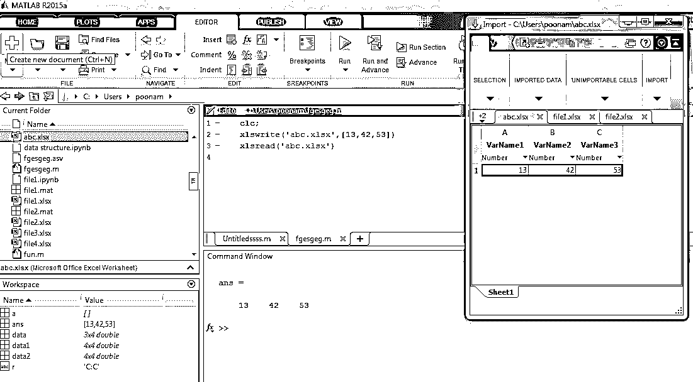
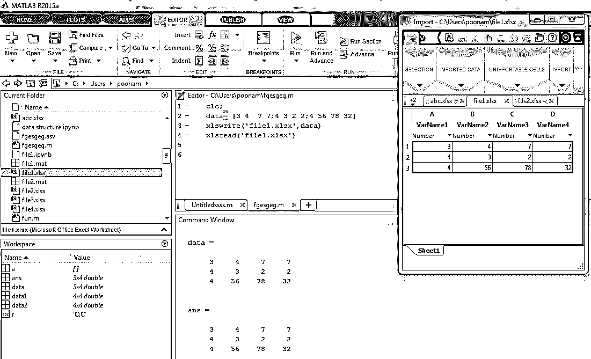
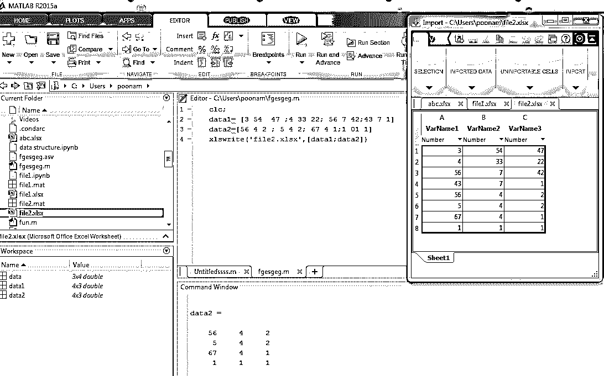
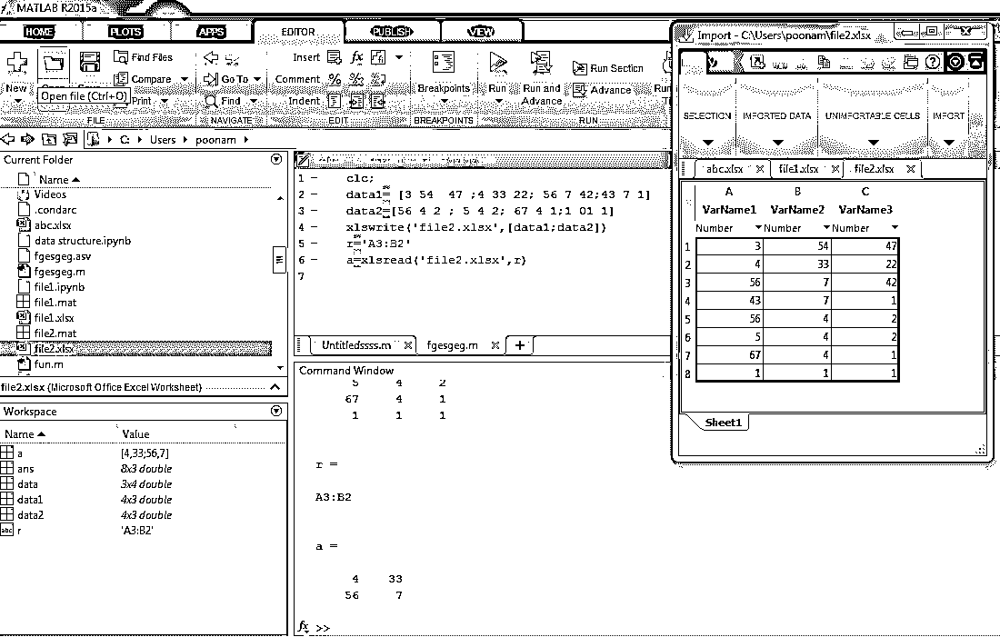
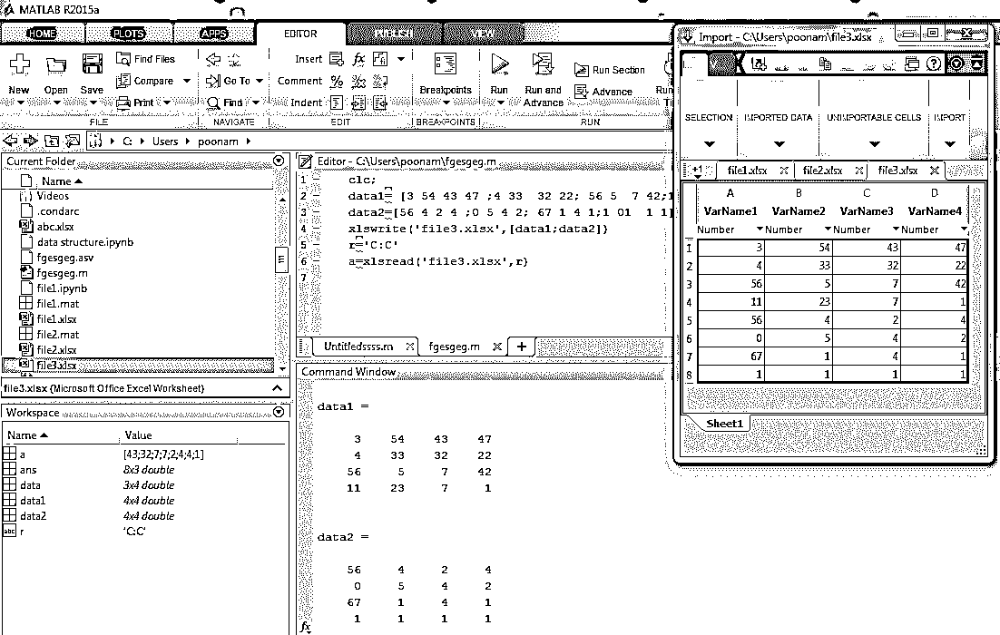

# xlsread Matlab

> 原文：<https://www.educba.com/xlsread-matlab/>

## xlsread Matlab 简介

xls '命令在 Matlab 中用于将 excel 文件导入和导出到 Matlab 中。我们可以使用该命令创建 excel 文件，也可以使用该命令读取 excel 文件。Matlab 中有两种操作，一种是创建 excel 文件，另一种是读取或打开 excel 文件。这些命令是 xlsread 和 xlswrite。Xlsread 命令用于读取或打开 Matlab 中已有的 excel 文件。Xlswrite 命令用于在 Matlab 中编写或创建 excel 文件。通过使用 xlswrite 命令，我们还可以修改现有 excel 文件的内容。该命令通过访问其他格式的数据，提高了 Matlab 语言的适应性。

**语法:**

<small>Hadoop、数据科学、统计学&其他</small>

`xlsread (filename)
xlsread (filename, parameters list)
xlsread (filename, [data])
xlsread (filename, sheet name)
xlsread (filename, range for columns or row)`

### xlsread 在 Matlab 中是如何工作的？

要在 Matlab 中读取任何 excel 文件，我们首先需要创建一个包含一些数据的文件。有多种方法可以读写 excel 文件。这些文件可以通过单参数列表、直接数据、给定表名或给定列或行的范围来编写。

在 Matlab 中读取 excel 文件的步骤

*   清除工作空间
*   声明和分配数据
*   使用“xlsread”语法写入 excel 文件(xlswrite (filename，[data])
*   声明变量以读取文件
*   通过使用语法使用 xlsread read 命令。(xlsread(文件名))。

### xlsread Matlab 示例

下面是一些例子:

#### 示例#1

在本例中，excel 文件为“abc.xlsx”，添加到该文件的数据为[ 13，42，53 ]。所以它在当前目录下创建一个 excel 文件。

| **Matlab 编辑器** | **命令窗口** |
| Clc ;xlswrite('abc.xlsx '，[13，42，53])xlsread (' abc.xlsx ') | ans =13    42    53 |

**输出:**

#### 实施例 2

在这个示例中，输入数据是通过使用另一个变量来声明的，该变量是“data”(data =[3 4 7 7；4 3 2 2;4 56 78 32]) .数据被写入“文件 1”。

| **Matlab 编辑器** | **命令窗口** |
| Clc ;数据=[3 4 7 7；4 3 2 2 ;4 56 78 32]xlswrite(' file1.xlsx '，数据)xlsread (' file1.xlsx ') | data =3     4     7     74     3     2     24    56    78    32ans =3     4     7     74     3     2     24    56    78    32 |

**输出:**

#### 实施例 3

在本例中，输入数据通过使用另外两个变量来声明，这两个变量是“data”(data1 =[3 54 47；4 33 22;56 7 42;43 7 1]和 data 2 =[56 4 2；5 4 2;67 4 1;1 01 1].数据被写入“文件 2”。

| **Matlab 编辑器** | **命令窗口** |
| Clc ;data1 =[3 54 47；4 33 22;56 7 42 ;43 7 1]data 2 =[56 4 2；5 4 2 ;67 4 1 ;1 01 1]xlswrite(' file2.xlsx '，[data1；数据 2])xlsread(' file2.xlsx ') | data1 =3    54    474    33    2256     7    4243     7     1dota2 =56     4     25     4     267     4     11     1     1ans =3    54    474    33    2256     7    4243     7     156     4     25     4     267     4     11     1     1 |

**输出:**

#### 实施例 4

在本例中，输入数据通过使用另外两个变量来声明，这两个变量是“data”(data1 =[3 54 47；4 33 22;56 7 42;43 7 1]和 data 2 =[56 4 2；5 4 2;67 4 1;1 01 1]).数据被写入“文件 1”。为了读取文件，我们使用范围函数。通过指定特定文件的范围，我们可以只显示重要的数据。

| **Matlab 编辑器** | **命令窗口** |
| Clc ;data1 =[3 54 47；4 33 22;56 7 42;43 7 1]data 2 =[56 4 2；5 4 2 ;67 4 1 ;1 01 1]xlswrite('file2.xlsx '，[data1；数据 2])B2a = xlsread(' 2 . xlsx 文件，r) | data1 =3    54    474    33    2256     7    4243     7     1dota2 =56     4     25     4     267     4     11     1     1r =A3:B2a =4    3356     7 |

**输出:**

#### 实施例 5

在此示例中，输入数据通过使用另外两个变量来声明，这两个变量是“data”(data1 =[3 54 43 47；4 33 32 22 ;56 5 7 42 ;11 23 7 1]和 data 2 =[56 4 2 4；0 5 4 2;67 1 4 1;1 01 1 1 ]).数据被写入“文件 3”。为了读取文件，我们使用范围函数。通过指定特定文件的范围，我们可以只显示重要的数据。这里的起始范围值和结束范围值是相同的，通过使用这种方法，我们可以只显示特定的行或列。

| **Matlab 编辑器** | **命令窗口** |
| clc;data1 =[3 54 43 47；4 33 32 22;56 5 7 42;11 23 7 1]data 2 =[56 4 2 4；0 5 4 2;67 1 4 1;1 01 1 1]xlswrite('file3.xlsx '，[data1；数据 2])r = C:Ca=xlsread('档案 3.xlsx，r) | data1 =3    54    43    474    33    32    2256     5     7    4211    23     7     1dota2 =56     4     2     40     5     4     267     1     4     11     1     1     1r =丙:丙a =Forty-threeThirty-twoSevenSevenTwoFourFourOne |

**输出:**

### 结论

我们知道现在大部分数据都是 excel 格式的，所以处理 excel 文件并不困难。但是通过使用 Matlab，我们可以很容易地将数据从 excel 导入和导出到 Matlab，或者从 Matlab 导出到 excel。我们可以根据自己的需要和应用程序的需要以各种方式读取 excel 数据。Matlab 对 excel 数据的操作非常有效和高效。

### 推荐文章

这是一个 xlsread Matlab 的指南。这里我们也讨论一下简介，以及 xlsread 在 matlab 中是如何工作的？以及不同的示例及其代码实现。您也可以看看以下文章，了解更多信息–

1.  [xlabel Matlab](https://www.educba.com/xlabel-matlab/)
2.  [Matlab mesh()](https://www.educba.com/matlab-mesh/)
3.  [绘图矢量 Matlab](https://www.educba.com/plot-vector-matlab/)
4.  [MATLAB 中的尺寸函数](https://www.educba.com/size-function-in-matlab/)

