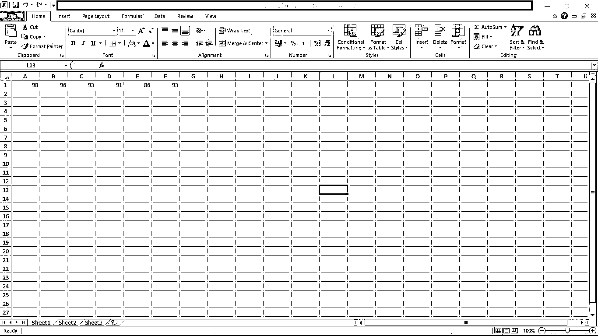
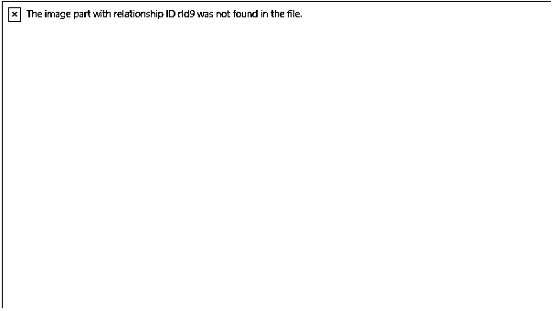

# Matlab xlswrite

> 原文：<https://www.educba.com/matlab-xlswrite/>

## Matlab xlswrite 简介

Xls 命令基本用于 excel 文件操作，xlswrite 用于编写或解释一个 excel 文件。除了这个命令之外，我们还可以给出我们想要的文件名，并决定或选择我们想要写入的工作表。还有一个参数范围决定了要使用的行数和列数的限制。在本主题中，我们将学习 Matlab xlswrite。

**语法:**

<small>Hadoop、数据科学、统计学&其他</small>

*   xlswrite(文件名，A)
*   xlswrite(文件名，A，工作表，xlRange)

### Xlswrite 函数在 Matlab 中是如何工作的？

为了在 Microsoft Excel 工作表中写入数据，我们使用 xlswrite 语句。filename 语句用于文件的唯一标识。识别文件后，数据将在“xlswrite”函数的帮助下写入 Microsoft Excel 工作表。

使用 xlswrite 语句在 Microsoft Excel 工作表中写入数据的步骤:-

**步骤 1:** 首先，使用‘filename’语句识别文件。

然后，我们将输入数据放入一个变量中

**步骤 3:** 然后，我们使用带有适当语法的 xlswrite 语句将数据写入微软

Excel 工作表

**步骤 4:** 在执行完 Matlab 中的代码后，数据被存储在 Microsoft Excel 工作表中

### Matlab xlswrite 示例

下面给出了 Matlab xlswrite 的例子:

#### 示例#1

让我们看一个 xlswrite 语句的简单例子。基本上，xlswrite 用于将数据写入 Microsoft Excel 工作表。为了在 Microsoft Excel 工作表中写入数据，我们使用了具有适当语法的 xlswrite 语句。filename 语句用于文件的唯一标识。我们使用“filename = 'data.xlsx '”来标识' data.xlsx '文件。扩展名为“xlsx”的文件只是一个 Microsoft Excel 工作表。我们创建一个名为“data.xlsx”的 Microsoft Excel 文件。然后我们用一个变量来存储输入参数。所以我们取一个变量，即 D，输入参数被加载到变量中。D = [98 96 93 91 86 93]它将输入值赋给变量 d。现在，我们可以将数据写入 Microsoft Excel 工作表。为了写入数据，我们使用 xlswrite 函数。为了写入 Excel 文件，使用了“xlswrite(filename，D)”语法。执行文件后，输入数据被写入 Microsoft Excel 工作表。

**代码:**

`clc;
clear all;
close all;
filename = 'data.xlsx';
D = [98 96 93 91 86 93 ];
xlswrite(filename,D)`

**输出:**

**命令窗口:**

#### 实施例 2

让我们看看 xlswrite 语句的另一个例子。我们知道，xlswrite 用于将数据写入 Microsoft Excel 工作表。在这个例子中，我们可以将数据写入特定的地址和特定的工作表。在本例中，我们读取信号的电压和频率。这里的' filename '语句用于文件的唯一标识。我们使用“filename = 'readings.xlsx '”来标识' readings.xlsx '文件。扩展名为“xlsx”的文件只是一个 Microsoft Excel 工作表。我们创建一个名为“data.xlsx”的 Microsoft Excel 文件。然后我们用一个变量来存储输入参数。所以我们取一个变量，即 G，输入自变量加载到变量 G = { '电压'，'频率'；200,98;225,99;223，97}它将输入值赋给变量 g。这里我们使用了一个简单的语法“sheet = 2；选择第二张图纸。xlRange 函数用于给出开始写入的具体位置。现在，我们可以将数据写入 Microsoft Excel 工作表。为了写入数据，我们使用 xlswrite 函数。“xlswrite(filename，G，sheet，xlRange)”该行用于将输入数据写入 Microsoft Excel 工作表。执行文件后，读数被写入给定的 Microsoft Excel 工作表。

**代码:**

`clc;
clear all;
close all;
filename = 'readings.xlsx';
G = {'VOLTAGE','FREQUENCY'; 200,98; 225,99; 223,97};
sheet = 2;
xlRange = 'D1';
xlswrite(filename,G,sheet,xlRange)`

**输出:**

**命令窗口:**

#### 实施例 3

让我们再看一个 xlswrite 语句的例子。在本例中，我们可以将变量的数据写入 Microsoft Excel 工作表。在本例中，我们使用路径来标识文件。这里我们直接识别 Excel 文件。所以首先我们取一个变量，即 b .随机数据存入变量 b .之后我们使用 xlswrite 语句将数据写入 Excel 文件。

xls write(' C:\ Users \ win-10 \ Desktop \ temp.xlsx '，b，' D5:m15 ')用于将存储在变量 b 中的数据写入指定的 Excel 文件中，该文件为“temp . xlsx”。D5 和 m15 是写入数据的起点和终点。执行完代码后，变量 b 中的数据被写入给定的 Microsoft Excel 工作表中，并带有指定的起点和终点。

**代码:**

`clc;
clear all;
close all;
b= rand(10);
xlswrite('C:\Users\win-10\Desktop\temp.xlsx',b,'D5:m15');`

**输出:**

**命令窗口:**

### 结论

在本文中，我们已经看到了 xlswrite 的概念；基本上，xlswrite 用于将数据与自定义参数和默认参数一起写入 Microsoft Excel 工作表文件。然后我们看到了用 Matlab 代码生成数据库的 xlswrite 语句的相关语法。

### 推荐文章

这是一个 Matlab xlswrite 的指南。在这里，我们讨论 Xlswrite 函数如何在 Matlab 中工作，以及代码和输出的例子。您也可以看看以下文章，了解更多信息–

1.  [Matlab fopen](https://www.educba.com/matlab-fopen/)
2.  [Strcmp Matlab](https://www.educba.com/strcmp-matlab/)
3.  [Matlab 梯形()](https://www.educba.com/matlab-trapz/)
4.  [低通滤波器 Matlab](https://www.educba.com/low-pass-filter-matlab/)

