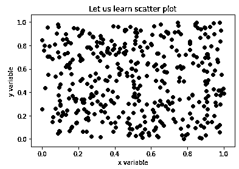
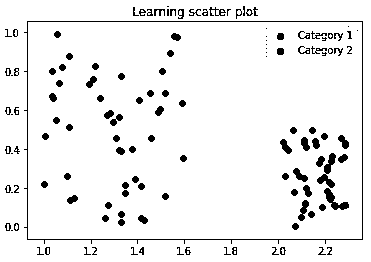
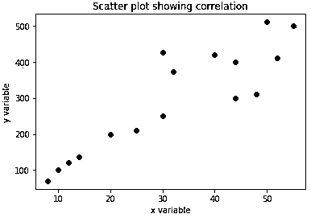

# Matplotlib 散点图

> 原文：<https://www.educba.com/matplotlib-scatter/>

## Matplotlib 散点图简介

Matplotlib 散点图，在这里我们将学习 python 中用于可视化的最重要的图之一，散点图。为此，我们将利用 Python 的 matplotlib 库。在我们开始创建散点图之前，让我们先快速了解一下什么是散点图。

**散点图:**散点图用于数据可视化，以便直观地了解我们的数据。通过散点图，我们可以了解两个变量之间的关系。这些图在理解变量之间的相关性方面也非常强大，可以进一步用于统计技术，如线性回归、多元回归等。

<small>Hadoop、数据科学、统计学&其他</small>

### 如何使用 Matplotlib 在 python 中创建散点图？

我们将从导入所需的库开始

`import numpy as np[importing ‘numpy’] import matplotlib.pyplot as plt[importing ‘matplotlib’]`

接下来，让我们为散点图创建数据

A = 400
A = NP . random . rand(A)[具有 400 个随机值的变量 A]b = NP . rand . rand(A)[具有 400 个随机值的变量 b]colors =(0，0，0)[这将设置我们的绘图的颜色]

**步骤#1:我们现在准备创建我们的散点图**

`plt.scatter(a, b, c = colors)[‘scatter’ is called using ‘plt’] plt.title('Let us learn scatter plot)     [‘title’ is called to set title of our scatter plot] plt.xlabel('x variable')[setting name of x-axis] plt.ylabel('y variable')[setting name of y-axis] plt.show()[displaying our scatter plot]`

这是我们的输入和输出在 python 中的样子:

**代码:**

`import numpy as np
import matplotlib.pyplot as plt
A = 400
a = np.random.rand(A)
b = np.random.rand(A)
colors = (0,0,0)
plt.scatter(a, b, c = colors)
plt.title('Let us learn scatter plot')
plt.xlabel('x variable')
plt.ylabel('y variable')
plt.show()`

**输出:**

**解释:**在我们的图中，我们对变量采用了随机值，在输出中也是如此。正如我们在散点图介绍中提到的，它们有助于我们理解变量之间的相关性，由于我们的输入值是随机的，我们可以清楚地看到没有相关性。

**步骤 2:接下来，让我们取两种不同类别的数据，并用散点图将它们可视化。**

`import numpy as np[importing ‘numpy’] import matplotlib.pyplot as plt[importing ‘matplotlib]`

接下来，让我们为散点图创建数据

A = 50
a1 =(1+0.6 * np.random.rand(A)，NP . random . rand(A))【随机值为 50 的变量 a1】a2 =(2+0.3 * NP . rand . rand(A)，0.5 * NP . rand . rand(A))【随机值为 50 的变量 a2】

data = (a1，a2)
colors =("红色"，"绿色")【定义变量'颜色'，用于设置类别的颜色】groups =("类别 1 "，"类别 2 ")【定义变量'组'，用于创建标签】

让我们现在创造我们的情节

`fig = plt.figure()
Z = fig.add_subplot(1, 1, 1, facecolor='#E6E6E6') [Setting the color of the plot as grey] for data, color, group in zip(data, colors, groups):[‘for loop’ to create the plot and set color, label] x, y = data
Z.scatter(x, y, c=color, label=group)
plt.title(‘Learning scatter plot')[‘title’ is called to set title of our scatter plot] plt.legend(loc=1)[‘loc’ is used to set the location of labels in the pot] plt.show()[displaying our scatter plot]`

这是我们的输入和输出在 python 中的样子:

**代码:**

`import numpy as np
import matplotlib.pyplot as plt
A = 50
a1 = (1 + 0.6 * np.random.rand(A), np.random.rand(A))
a2 = (2+0.3 * np.random.rand(A), 0.5*np.random.rand(A))
data = (a1, a2)
colors = ("red", "green")
groups = ("Category 1", "Category 2")
fig = plt.figure()
Z = fig.add_subplot(1, 1, 1, facecolor='#E6E6E6')
for data, color, group in zip(data, colors, groups):
x, y = data
Z.scatter(x, y, c=color, label=group)
plt.title('Learning scatter plot')
plt.legend(loc=1)
plt.show()`

**输出:**

**解释:**因此，我们在这里为不同的类别创建了散点图，并对它们进行了标记。

### 实现 Matplotlib 散点图的示例

最后，让我们举一个变量之间存在相关性的例子:

#### 示例#1

这里我们将定义两个变量，这样我们可以得到它们之间的某种线性关系

a = [8，10，14，12，20，25，30，44，48，52，32，30，44，40，55，50]

b =[70 100 136 120 200 210 250 300 310 411 373 427 400 420 500 510]

colors = (0，0，0)[这将设置我们的绘图颜色]

让我们现在绘制数据

`plt.scatter(a, b, c = colors)
plt.title('Scatter plot showing correlation')[‘title’ is called to set title of our scatter plot] plt.xlabel('x variable')[setting name of x-axis] plt.ylabel('y variable')[setting name of y-axis] plt.show()[displaying our scatter plot]`

这是我们的输入和输出在 python 中的样子:

**代码:**

`import numpy as np
import matplotlib.pyplot as plt
a = [8,10, 14, 12,20,25,30, 44, 48,52, 32, 30,44, 40, 55,50] b = [70, 100, 136,120, 200, 210, 250, 300, 310, 411, 373, 427, 400, 420, 500, 510] colors = (0,0,0)
plt.scatter(a, b, c = colors)
plt.title('Scatter plot showing correlation')
plt.xlabel('x variable')
plt.ylabel('y variable')
plt.show()`

**输出:**

**解释:**我们可以清楚地看到，在我们的输出中，两个变量之间最初存在某种线性关系。虽然对于较大的值，线性关系继续，但是也有一些分散的值或异常值。

### 结论

当我们试图直观地理解数据时，散点图变得非常方便。它有助于我们理解变量之间的任何关系，也有助于我们找出异常值(如果有的话)。

### 推荐文章

这是 Matplotlib 散点指南。在这里，我们讨论一个 Matplotlib 散点图的介绍，如何创建图与例子，以更好地理解。您也可以浏览我们的其他相关文章，了解更多信息——

1.  [Matlab Mesh()](https://www.educba.com/matlab-mesh/)
2.  [颤 Matlab](https://www.educba.com/quiver-matlab/)
3.  [Matlab 图](https://www.educba.com/matlab-figure/)
4.  [Matlab 中的协方差](https://www.educba.com/covariance-in-matlab/)

