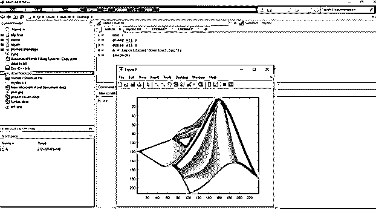
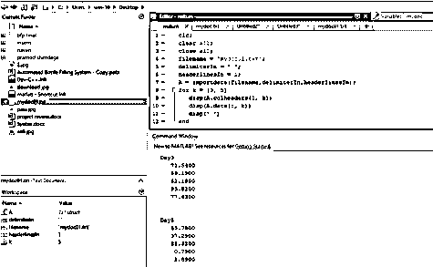
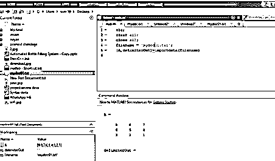

# matlab 导入数据

> 原文：<https://www.educba.com/matlab-import-data/>

## Matlab 导入数据简介

Import 是 MATLAB 函数，用于导入不同格式的数据，如 txt、jpg 等。此外，我们可以使用导入功能从剪贴板导入数据。在许多应用中，我们需要各种文件或数据库作为输入。如果没有导入功能，这些类型的应用程序将无法工作或运行。在导入功能中可以访问所有类型的输入数据。我们可以使用文本文件、excel 文件、记事本，也可以使用不同格式的图像。导入功能的基本语法是“导入数据”。除了导入数据，我们还可以给出程序中将要使用的文件的名称。

**语法:**

<small>Hadoop、数据科学、统计学&其他</small>

将数据导入 Matlab 有以下语法:

*   **X = importdata( filename )** ，将数据加载到数组 X 中
*   **X = import data('-paste special ')**，从系统剪贴板加载不在文件中的数据。
*   **X = importdata( ___，delimiterIn )** ，将分隔符 In 解释为 ASCII 文件、文件名或剪贴板数据中的列分隔符。您可以很容易地在上述语法中的任何输入参数中使用 delimiter 来导入数据。

### 如何创建 Matlab 导入数据？

您可以使用不同的方式将数据导入 MATLAB，例如

**1。来自文件**

执行以下过程之一从文件导入数据:

*   在主页选项卡的变量部分中，选择导入数据。
*   双击浏览器文件夹中的文件名。

**2。从剪贴板**

执行以下操作之一，从剪贴板导入数据:

*   单击工作区浏览器标题栏，然后选择粘贴。
*   并用正确的语法调用导入函数。

### 实现 Matlab 导入数据的示例

以下是 Matlab 导入数据的示例:

#### 例#1

让我们看一个例子，在这个例子中，我们使用导入数据功能导入一个图像并显示它。基本上，在这个例子中，我们将带有扩展名图像名称放入一个反逗号中，并将其分配给文件名 1。我们从 filename1 导入数据，filename 1 主要存储图像。然后，我们可以取一个变量，即“X”，在 X 中，我们可以存储从 filename1 导入的数据，对于导入数据，我们使用 MATLAB 上提供的导入数据内置函数。然后我们简单地使用图像函数显示图像，图像函数用于显示图像。我们将存储导入数据的变量传递给 image 函数来显示图像。

**代码:**

`clc ;
clear all ;
close all ;
X = importdata ( ' download.jpg');
Image(X)`

**输出:**

**

** 

**说明:**如我们所见，合成图像与原始图像相同。结果图像只是我们存储在变量 x 中的导入数据图像。

在例 1 之后我们可以看到导入一个文本文件。

#### 实施例 2

让我们看另一个例子，在这个例子中，我们导入一个文本文件(mydoc01.txt)并使用导入数据功能指定分隔符和列头方法。基本上，在本例中，我们将带有扩展名文件名放在一个反逗号中，并将其分配给文件名 1。我们从 filename1 导入数据，filename 1 基本上是存储数据的。然后，我们可以取一个变量，即“A”，在 A 中，我们可以存储从 filename1 导入的数据，为了导入数据，我们使用 MATLAB 上提供的导入数据内置函数。然后我们简单地显示数据，disp 函数用于显示图像。我们将存储导入数据的变量传递给 disp 函数来显示数据

**代码:**

`clc;
clear all;
close all;
filename = 'mydoc01.txt';
delimiterIn = ' ';
headerlinesIn = 1;
A = importdata(filename,delimiterIn,headerlinesIn);
for k = [3, 5] disp(A.colheaders{1, k})
disp(A.data[:,k])
disp(' ')
end`

**输出:**

在例 2 之后，我们可以看到导入一个文本文件并返回检测到的分隔符的方法。

#### 实施例 3

让我们看另一个例子，在这个例子中，我们导入一个文本文件(mydoc01.txt)并使用导入数据函数返回检测到的分隔符方法。使用文本编辑器创建一个名为 mydoc01.txt 的逗号分隔的 ASCII 文件。

**代码:**

`clc;
clear all;
close all;
filename = 'mydoc01.txt';
[A,delimiterOut]=importdata(filename)`

**输出:**

### 结论

在本文中，我们了解了什么是 Matlab 中的导入数据以及如何在 Matlab 中使用导入函数的基本概念。Matlab 中导入数据到底用什么语法。在本文中，我们还看到了一些用 Matlab 代码导入数据的例子，以及相关的输出。

### 推荐文章

这是一个 Matlab 导入数据的指南。这里我们讨论 Matlab 导入数据的基本概念和语法，以及不同的例子和代码实现。您也可以浏览我们推荐的文章，了解更多信息——

1.  [Matlab 中的 Switch 语句是什么？](https://www.educba.com/switch-statement-in-matlab/)
2.  [绘图矢量 Matlab](https://www.educba.com/plot-vector-matlab/)
3.  [Matlab sphere() |语法和示例](https://www.educba.com/matlab-sphere/)
4.  [Matlab 图示例](https://www.educba.com/matlab-figure/)

