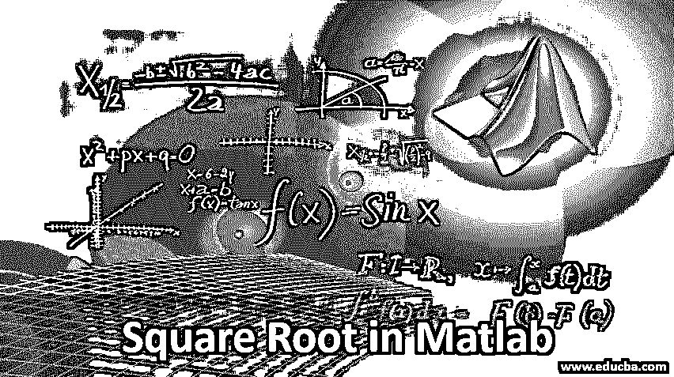
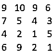
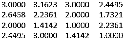

# Matlab 中的平方根

> 原文：<https://www.educba.com/square-root-in-matlab/>

## Matlab 中的平方根介绍

平方根被定义为取单个元素、矩阵或数组的任何平方的根。一个数的平方根可以是正的也可以是负的，因为正数的平方是正的，负数的平方也是正的。用√符号表示。平方根就是平方的逆方法。如果 a^2 是平方整数，那么 a 被定义为该数的平方根。

例如，16 是一个完美的平方数，它的平方根可以是 4 或-4。数学中有许多方法可以用来求一个数的平方根。

<small>Hadoop、数据科学、统计学&其他</small>

### 举例说明平方根在 Matlab 中的运算和应用

Matlab 执行所有的数学函数，所以也有求一个数的平方根的方法。在 Matlab 中，我们使用 sqrt()函数来寻找一个数或数组中定义的每个元素的平方根。函数中使用的输入参数可以是标量、向量、数组或多维数组。它们在性质上也可以是积极的、消极的或复杂的。如果输入本质上是复数或负数，那么它会产生一个复数。

**语法:**

`Y = sqrt(x)`

#### 示例#1

`Y = -3:3`

所以，输入是 1*7 的形式。

`-3  -2  -1  0  1  2  3`

`A=sqrt(Y)`

**输出:**

(0.0000+1.7320 I)(0.0000+1.4142 I)(0.0000+1.0000 I)(0.0000+0.0000 I)(1.0000+0.0000 I)(1.4142+0.0000 I)(1.7320+0.0000 I)

#### 实施例 2

`Y = -5: -3`

所以输入是 1*4 的形式

`-5  -4  -3`

`A = sqrt(Y)`

**输出:**

(0.0000+2.2360 I)(0.0000+2.0000 I)(0.0000+1.7320 I)

我们知道如果一个数组的输入是负数，那么它的结果是一个复数。在上面的两个例子中，我们看到范围由负数和正数组成，所以它的输出是一个复数。与 IEEE 标准相比，Matlab 中的某些运算[有所不同，例如负零的平方根在 Matlab 中为 0，而在 IEEE 中为-0，小于零的值的平方根在 Matlab 中会产生复数，而在 IEEE 中则没有。](https://www.educba.com/what-is-matlab/)

如果想求一个数组中只有正整数的平方根，那么可以使用 Matlab 中的 realsqrt()函数。与 sqrt()函数不同，当我们将输入作为负数或复数传递时，它会给出错误消息。所以，如果我们想查看一个负数或复数的结果，比使用 sqrt()函数更可取。如果我们使用 realsqrt()，输出大小和输入大小应该是相同的。

#### 实施例 3

输入是一个名为

`Y=realsqrt(A)`

**输出:**

在上面的例子中，它产生矩阵中每个元素的平方根。输入参数可以是矩阵、数组、向量、标量或多维数组，它们应该是正整数和实整数。在 Matlab 中，平方根有各种不同的属性，应该注意:

任何完全平方的偶数的平方根应该总是偶数。

比如:16，36，64，100 等。

这里，16、36、64 和 100 都是偶数，是完美的平方，这些数字的平方根是 4、6、8 和 10，也是偶数。

相同数字的平方根相乘得到一个正整数，而数字的平方根也可以相乘并提供输出。

比如:√4 * √4 = 4

√3 * √2=√6

任何完全平方的奇数的平方根应该总是奇数。

例如:25，9，49，81

这里 25，9，47，81 都是奇数的完美平方，这些数的平方根是 5，3，7，9，它们也是奇数。一个元素的单位数字不能是 3、2、8 或 7 才是完美的正方形。

### 结论

平方根在 Matlab 中广泛用于各种业务需求。它们广泛用于求解任何二次方程的解，以及计算标准差和方差等机器学习主题。因此，它是所有数学领域的一个基本特征。

### 推荐文章

这是 Matlab 中的平方根指南。这里我们通过实例来讨论平方根在 Matlab 中的运算和使用。您也可以浏览我们推荐的其他文章，了解更多信息——

1.  [矩阵运算](https://www.educba.com/matrix-in-matlab/)
2.  [内联函数的语法](https://www.educba.com/inline-functions-in-matlab/)
3.  [Matlab 中的向量](https://www.educba.com/vectors-in-matlab/)
4.  [C#数学属性](https://www.educba.com/math-functions-in-c-sharp/)
5.  [学习 Python 中的平方根](https://www.educba.com/square-root-in-python/)

