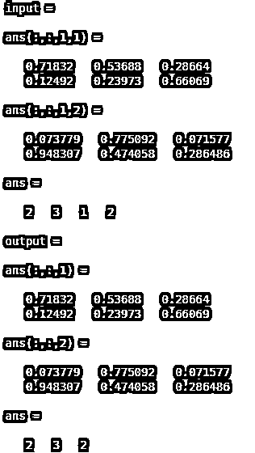
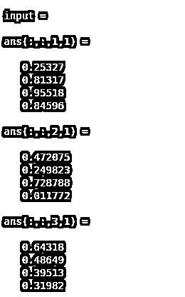
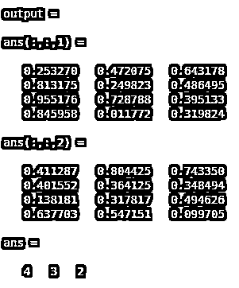
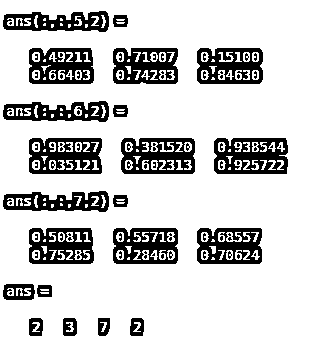

# 挤压 MATLAB

> 原文：<https://www.educba.com/squeeze-matlab/>

## 挤压 MATLAB 简介

Matlab 中的“挤压”命令就像“整形”命令一样。我们知道，整形是用来改变或修改数组或向量或多维矩阵的大小或维数。类似地，挤压也用于重塑数组、向量和多维矩阵维度。整形和挤压的唯一区别是整形是根据用户给定的参数和尺寸来操作的，但是挤压是用来移除矩阵的单一尺寸。因此，它直接消除了单一维度，并相应地调整了元素。

**语法**

<small>Hadoop、数据科学、统计学&其他</small>

1.  输出=挤压(输入)

输出变量名= squeeze(输入变量名)

2.  尺寸(输入)

尺寸(输出)

size(变量名)#观察尺寸的变化。

### 挤压 Matlab 是如何工作的？

挤压函数作用于多维矩阵的维度。它忽略或消除了输入矩阵的单一维度。它压缩输入的形状或维度的变化，但不改变元素的值，这意味着它按原样存储数据。要使用这个函数，首先，我们需要分配一个具有单一维度的多维矩阵。然后，我们可以使用上面的语法对输入应用挤压函数。在获得输出之后，我们无法观察到变化，因为元素看起来是原样的。因此，为了检查输出的变化，我们需要检查输入的大小和输出的大小。投入和产出都会不一样。

### 挤压 Matlab 实例

下面提到了不同的例子:

#### 示例#1

在本例中，我们将多维矩阵形式的一个输入视为变量“输入”矩阵的维数是 2 乘 3 乘 1 乘 2。在这个例子中，维度用两个不同的随机矩阵表示两行和三列。这里“rand”代表矩阵的随机元素。如果我们观察例 1 的输出，那么输入和输出的元素是相同的，但是矩阵的形状或大小是不同的。输入的大小是(2，3，1，2)，输出的大小是(2，3，2)。这意味着挤压从输入中消除了一维。

**代码:**

`clc ;
clear all ;
input = rand(2, 3,1,2)
size ( input )
output = squeeze (input)
size (output )`

**输出:**

**例 2**

在示例 2 中，我们假设了一个更随机的多维矩阵，其维度为 4 乘 1 乘 3 乘 2。因此，有四行和一列三个多维矩阵。如果我们观察输出，那么它消除了 singleton 维，新矩阵的大小将是(4，3，2)，这意味着将有四行三列两个不同的矩阵。

**代码:**

`clc ;
clear all ;
input = rand (4, 1, 3, 2 )
size ( input )
output = squeeze ( input )
size ( output )`

**输出:**

**例 3**

在这个例子中，我们考虑了输入矩阵中的更多维度，其中有两个单独的维度。因此，输入矩阵的维数是二乘三乘一乘七乘一乘二(2，3，1，7，1，2)。如果我们观察输出，那么两个单独的维度都被移除，矩阵的新大小变成(2，3，7，2)。将有两行和三列七个不同的矩阵。

**代码:**

`clc ;
clear all ;
input = rand ( 2, 3, 1 , 7, 1, 2 )
size ( input )
output = squeeze ( input )
size ( output)`

**输出:**

### 结论

挤压函数很重要，因为它改变维度，但它不会忽略矩阵的数据或元素。这意味着没有信息丢失。正如我们在上面的例子中观察到的，一些维度在实现时逻辑上是无用的，但不必要它占用存储空间。所以在这个函数的帮助下，我们可以直接忽略单体维度。

### 推荐文章

这是一个挤压 Matlab 的指南。在这里，我们讨论如何挤压 Matlab 工程和例子，以及代码和输出。您也可以看看以下文章，了解更多信息–

1.  [MATLAB 文本()](https://www.educba.com/matlab-text/)
2.  [Matlab 积分](https://www.educba.com/matlab-integral/)
3.  [Matlab 绘图标题](https://www.educba.com/matlab-plot-title/)
4.  [Matlab 表单](https://www.educba.com/matlab-forms/)

