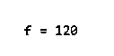
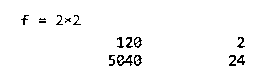
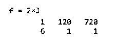
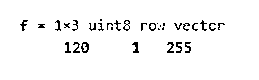
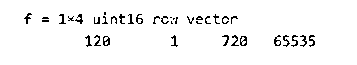

# Matlab 中的阶乘

> 原文：<https://www.educba.com/factorial-in-matlab/>

## Matlab 中阶乘的介绍

MATLAB 为我们提供了大量的功能，在各种计算问题中非常有用。在本文中，我们将研究一个强大的 MATLAB 函数，称为“MATLAB 阶乘”。

在了解如何在 MATLAB 中计算阶乘之前，让我们先刷新一下对阶乘的理解。任何正整数‘n’的阶乘都是从 1 到 n(包括 1 和 n)的所有整数的乘积。在数学中，感叹号用来表示一个数的阶乘。

<small>Hadoop、数据科学、统计学&其他</small>

**Matlab 中阶乘函数的语法**

`f= factorial(n)`

### Matlab 中阶乘函数的描述

这是下面提到的描述

#### 1.f =阶乘(n)

*   这里 n 是一个非负的整数值，这个函数将产生所有正整数的乘积，这些正整数的值将等于“n”或者小于“n”
*   让我们把“n”看作一个数组，那么函数“f”将得到数组“n”中所有值的阶乘。输出数组的大小及其数据类型将与输入数组“n”相同
*   一般用 n 来表示！在数学中，但在 MATLAB 中，它将被写成 f =阶乘(n)

**现在让我们用各种例子来理解 MATLAB 中阶乘的计算:**

让我们先举一个计算整数阶乘的简单例子。

##### 示例#1

`f = factorial(5)`

这是我们的输入和输出在 MATLAB 控制台中的样子:

所以，我们的输出是所有小于等于我们输入的整数的乘积(不包括零)。

f = 5X4X3X2X1

f = 120

##### 实施例 2

`f = factorial(3)`

这是我们的输入和输出在 MATLAB 控制台中的样子:

**接下来，我们将了解如何取数组的阶乘。**

f = 3×2

f = 6

在下面的例子中，让我们取一个 2×2 的数组。

##### 实施例 3

输入数组:

[ 5 2 ;7 4]

当我们的输入数组传递给 MATLAB 时，它将单独计算数组中每个元素的阶乘。

f =[阶乘(1)阶乘(5)；阶乘(3)阶乘(2)]

f = 2×2

f = 1202

5040 24

这是我们的输入和输出在 MATLAB 控制台中的样子:

`n = [ 5 2 ;7 4];
f = factorial(n)`

正如我们在输出中看到的，MATLAB 已经计算了数组中每个元素的阶乘，即 5，2，7，4 分别为 120，2，5040，24。

接下来，让我们来看一个 2×3 的数组

##### 实施例 4

n =[1 5 6；3 0 1]

这里，当我们的输入数组被传递给 MATLAB 时，它将单独计算数组中每个元素的阶乘。

f =[阶乘(1)阶乘(5)阶乘(6)；阶乘(3)阶乘(0)阶乘(1)]

f = 2×3

f = 1 120 720

6 1 1

这是我们的输入和输出在 MATLAB 控制台中的样子:

`n = [ 1 5 6 ;3 0 1];
f = factorial(n)`

#### 2.对于无符号整数值

f = uintx(系数)

它将把阶乘 n 转换成一个无符号的 8 位整数。因为 8 位整数的最大值是 255，所以它只取值超过 255 的整数的阶乘为 255。

类似地，对于 x= 16，取最大值为 16 位整数值，即 65535。

**让我们用一个例子来理解:**

##### 示例#1

这里我们将使用无符号的 8 位整数。

f= uint8 ([5 1 6])

f= 1X3 单元 8 行向量

f= 120 1 255

**这是我们的输入和输出在 MATLAB 控制台中的样子:**

`n = uint8([5 1 6]);
f = factorial(n)`

正如我们在输出中看到的，尽管由于无符号 8 位整数，6 的阶乘是 720，但它被转换为最高的 8 位值 255

##### 实施例 2

在本例中，我们将采用无符号 16 位整数

f = uint16 ([5 1 6 9])

f= 1X4 单元 16 行向量

f= 120 1 720 65535

这是我们的输入和输出在 MATLAB 控制台中的样子:

`n = uint16 ([5 1 6 9]);
f = factorial(n)`

正如我们在输出中看到的，虽然 9 的阶乘是 362880，因为是无符号的 16 位整数，但它被转换为最高的 8 位值 65535。

因此，正如我们所看到的，MATLAB 可以用来计算任何正整数的阶乘。此外，我们可以根据需要使用无符号整数。它还可以用来计算数组中元素的阶乘。

### 推荐文章

这是 Matlab 中阶乘的指南。这里我们通过各种例子来讨论 Matlab 中阶乘的描述，以便更好的理解。您也可以阅读以下文章，了解更多信息——

1.  [Matlab 线条样式](https://www.educba.com/matlab-line-style/)
2.  [Matlab 中的直方图](https://www.educba.com/histogram-in-matlab/)
3.  [Matlab Errorbar](https://www.educba.com/matlab-errorbar/)
4.  [Matlab 计数](https://www.educba.com/matlab-count/)

