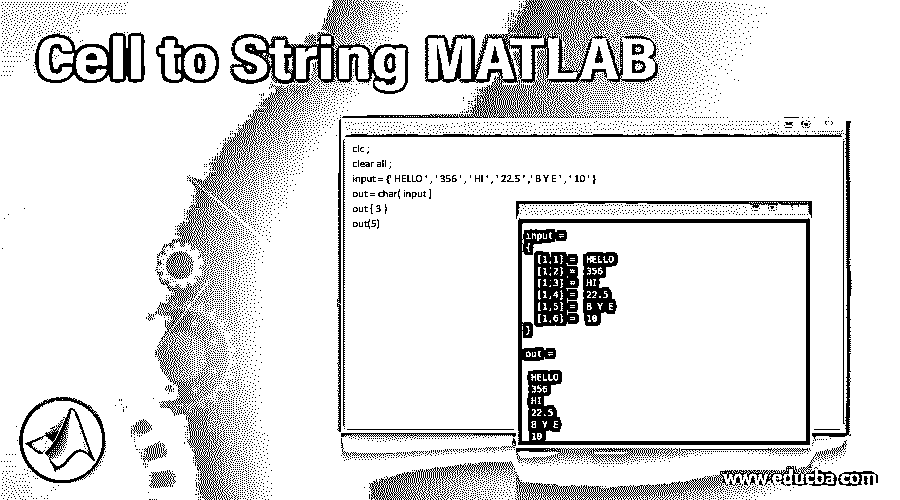
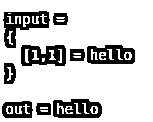
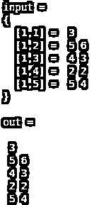
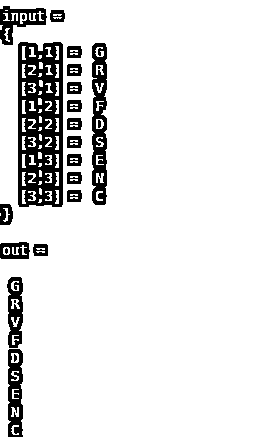
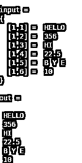

# 单元格到字符串 MATLAB

> 原文：<https://www.educba.com/cell-to-string-matlab/>

## 从单元格到字符串 MATLAB 简介

有两个命令用于将单元格数据转换成字符串格式，一个是 char，另一个是 string。char 和 string 命令从单元格数组中提取所有数据，并以字符串的形式存储。在 Matlab 中，我们使用单引号或双引号(“”或“”)中的字符串符号作为数据。有些操作和方法不能在单元格或单元格数组上操作，但可以在字符串上操作，在这种情况下使用这种操作。对单元数据没有限制，它可以是单个元素，也可以是向量形式或多维矩阵形式。

**语法:**

<small>Hadoop、数据科学、统计学&其他</small>

`Out = char ( input)`

*   输出变量名= char(输入单元格名)

`Out = string ( input)`

*   输出变量名=字符串(输入单元名)

### Matlab 的单元格转字符串是如何工作的？

要将单元格数据转换成字符串，首先我们需要创建包含一些数据的单元格。单元格是用花括号({ })创建的。如果数据是一维的，那么元素可以用逗号分隔，如果数据是多维的，那么数组用分号(；)以及用逗号分隔的元素。在分配单元格后，我们可以使用上面的语法格式应用命令 char 或 string 将所有数据转换为字符串。

### 实现单元格到字符串的 MATLAB 实例

下面是提到的例子:

#### 示例#1

在第一个例子中，让我们假设一个输入单元作为可变输入。一个数据被分配给“hello”输入。在输出端，我们可以检查数据是否为字符串格式。

**代码:**

`clc ;
clear all ;
input = {'hello'}
out = char(input)`

**输出:**

#### 实施例 2

在这个例子中，我们将颜色名称数组分配给输入，这意味着在这个问题中，输入是单元数组或向量，它在一个维度中有多个值。输入数组是{ '红色'，'蓝色'，'黄色'，'绿色'，'黑色'，'白色' }。在应用命令后，我们将得到独立的输出和单独的输入字符串。

**代码:**

`clc ;
clear all ;
input = { ' red ' , ' blue ' , ' yellow ' , ' green ' , ' black '  , ' white ' }
str = char ( input )`

**输出:**

**代码:**

`clc ;
clear all ;
input = {' 3 ' , ' 5 6 ' , ' 4 3 ' , ' 2 2 ' , ' 5 4 ' }
out = char ( input )`

**输出:**

#### 实施例 3

在这个例子中，让我们考虑输入数组是一个具有三行三列的多维矩阵。输入是单元格矩阵以及字母形式的输入数据，如{ ' G '，' F '，' E '；r '，' D '，' N '；v '，' S '，' C ' }

**代码:**

`clc ;
clear all ;
input = { ' G ' , ' F ' , ' E ' ; ' R ' , ' D ' , ' N ' ; ' V ' , ' S ' , ' C ' }
out = char ( input )`

**输出:**

#### 实施例 4

现在让我们考虑所有数据类型形式的输入，比如 int、float、char 和 string。在此示例中，输入被分配了一个一维数组或数据为“HELLO”、“356”、“HI”、“22.5”、“B Y E”、“10”的向量。在这个 HELLO 中，HI 和 BYE 是字符串数据类型。365 和 10 是整数，22.5 是浮点数。

**代码:**

`clc ;
clear all ;
input = {' HELLO ' , ' 356 ' , ' HI ' , ' 22.5 ' ,' B Y E ' , ' 10 ' }
out = char( input )
out ( 3 )
out(5)`

**输出:**

### 结论

在本文中，我们看到了如何使用 string 函数和 char 函数将单元格数据转换为字符串。我们可以将所有类型的数据(整数、字符、浮点数等)转换成字符串格式。以及我们可以将所有格式(单元素、一维数组、多维数组)的数据转换成所需的格式。

### 推荐文章

这是一个关于单元格转字符串的 MATLAB 指南。在这里我们讨论一个介绍细胞字符串 MATLAB，语法，它是如何工作的例子分别。您也可以浏览我们的其他相关文章，了解更多信息——

1.  [如何使用 Matlab？](https://www.educba.com/how-to-use-matlab/)
2.  [MATLAB 版本](https://www.educba.com/matlab-version/)
3.  [Matlab 编译器](https://www.educba.com/matlab-compiler/)
4.  [Matlab 命令](https://www.educba.com/matlab-commands/)

