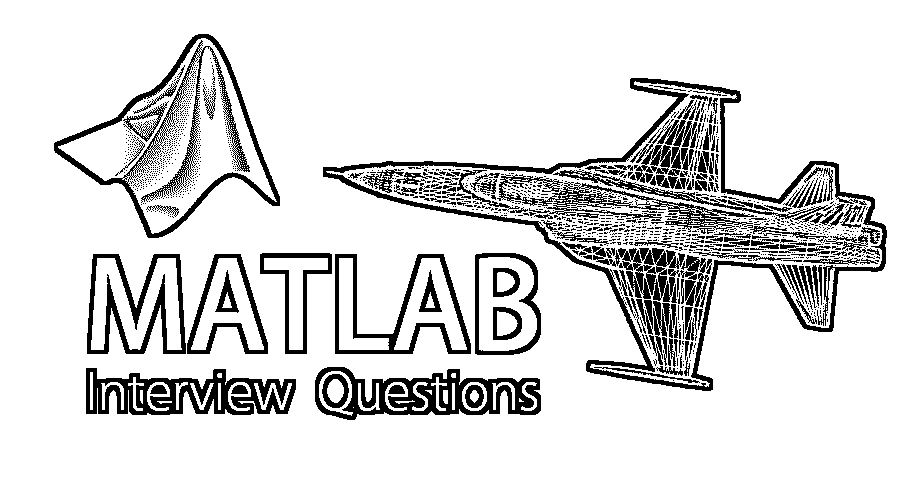

# MATLAB 面试问题

> 原文：<https://www.educba.com/matlab-interview-questions/>

## MATLAB 面试问答介绍

MATLAB 是一种高级编程语言，由 MathWorks 于 1970 年开发。它是一种非常强大的编程语言，能够做很多事情。它可以用于矩阵操作、绘制函数和数据、开发算法、进行数值计算、创建用户界面，可以轻松地与用其他编程语言编写的其他程序进行交互，如 C、C++、Java、PHP、ASP、Python。

#### Matlab

Matlab 还可以用于数据模型、嵌入式系统等。它有许多内置的命令和数学函数来解决复杂的数值计算，它主要用于数学计算中的积分，变换，曲线拟合，数据分析，统计，三维，2D 绘图，线性代数，非线性代数，图形，微分方程的非线性函数计算。

<small>Hadoop、数据科学、统计学&其他</small>

#### 特征

*   它是一种用于应用程序开发和数值计算的第四代高级语言。
*   它为迭代搜索、设计和解决问题提供了一个交互式环境。
*   它提供了内置函数、数值计算命令、积分、统计、线性代数、过滤、优化、傅立叶分析和求解常微分方程。
*   它提供了将程序集成到用 C++、JAVA、C、Python、PHP、ASP.Net 等不同语言编写的其他程序的功能。
*   它有工具来构建带有自定义图形用户界面的应用程序。

#### 使用

MATLAB 用于科学、工程领域，包括所有的流、物理、化学，主要领域如下。

*   计算金融
*   控制系统
*   测试和生物
*   计算生物学
*   图像处理
*   视频处理
*   信号处理
*   通信

现在，如果你正在寻找一份与 MATLAB 相关的工作，那么你需要准备 MATLAB 面试问题。的确，每个面试都会因职位不同而有所不同，但要通过面试，你仍然需要对 MATLAB 有一个清晰的了解。在这里，我们准备了重要的 MATLAB 面试问题和答案，将帮助你在面试中取得成功。

以下是在面试中经常被问到的 10 个重要的 MATLAB 面试问题和答案。这些问题分为如下几个部分:

### 第 1 部分–MATLAB 面试问题(基础)

第一部分涵盖了基本的 MATLAB 面试问题和答案

#### 1.MATLAB 是什么，有什么用途？

**答案:**

MATLAB 是由 MathWorks 于 1970 年开发的一种高级编程语言，它具有可视化的交互环境，编程功能

数值计算，它用在以下领域

*   矩阵操作
*   功能和数据的绘图
*   算法实现
*   可以与其他语言编写的程序交互，如 C，Java C++ FORTRAN，Python
*   数据分析
*   模型创建
*   用户界面创建

#### 2.解释一下 MATLAB API，MATLAB 的主要部分是什么？

**答案:**

MATLAB API-应用程序编程接口是一个库，它使我们能够编写与 MATLAB 交互的 C 和 FORTRAN 程序。

MATLAB 有 5 个重要部分，如下所示。

*   MATLAB 应用编程接口 API
*   处理图形
*   MATLAB 函数库
*   MATLAB 工作环境
*   MATLAB 语言

让我们转到下一个 MATLAB 面试问题和答案。

#### 3.解释 MATLAB 命令？

**答案:**

这些是在面试中被问到的基本的 MATLAB 面试问题。下面是 [MATLAB 命令](https://www.educba.com/matlab-commands/)如下:

**会话管理命令**

*   帮助搜索帮助主题。
*   whos 列出当前变量(长显示)。
*   他列出了当前的变量。
*   退出停止 MATLAB。
*   将变量声明为全局变量。
*   清除从内存中删除变量。
*   clc 清除命令窗口。
*   查找关键字的搜索帮助条目。
*   exist 检查文件或变量是否存在。

**系统的命令**

*   路径显示搜索路径。
*   pwd 显示当前目录。
*   删除删除文件。
*   日记打开/关闭日记文件记录。
*   列出当前目录中的所有文件。
*   cd 改变当前目录。
*   日期显示当前日期。
*   删除删除文件。
*   类型显示文件的内容。
*   列出了当前目录下所有的 MATLAB 文件。
*   wklread 读取. wk1 电子表格文件。

**输入和输出命令**

*   格式控制屏幕显示格式。
*   fprintf 对屏幕或文件执行格式化写入。
*   输入显示提示并等待输入。
*   显示数组或字符串的内容。
*   fscanf 从文件中读取格式化数据。

**绘图命令**

*   轴创建轴对象。
*   关闭关闭当前图。
*   全部关闭关闭所有图。
*   极地创造极地情节。
*   semilogx 创建半对数图。(对数横坐标)。
*   半逻辑创造半逻辑情节。(对数纵坐标)。
*   楼梯创建楼梯地块。
*   词干创造词干情节。
*   轴设置轴限制。
*   函数的智能绘图。
*   网格显示网格线。
*   绘图生成 xy 绘图。
*   打印打印绘图或将绘图保存到文件中。
*   标题将文本放在情节的顶部。
*   xlabel 向 x 轴添加文本标签。
*   ylabel 向 y 轴添加文本标签。
*   刷新重画当前图形窗口。
*   set 指定对象(如轴)的属性。
*   子情节在子窗口中创建情节。
*   文本在图形中放置字符串。
*   条形图创建条形图。
*   双对数创建双对数图。

**阵列、矩阵和矢量命令**

*   重塑改变大小。
*   size 计算数组大小。
*   排序对每列进行排序。
*   对每一列求和。
*   眼睛创造了一个身份矩阵。
*   创建一个 1 的数组。
*   零创建一个零数组。
*   cat 连接数组。
*   查找非零元素的索引。
*   length 计算元素的数量。
*   linspace 创建规则间隔的向量。
*   对数空间创建对数空间向量。
*   max 返回最大的元素。
*   min 返回最小的元素。
*   每列的产品。

#### 4.MATLAB 支持哪些运算符？

**答案:**

*   逻辑运算符
*   位运算
*   集合操作
*   算术运算符
*   关系运算符

#### 5.解释预分配非双矩阵的流程

**答案:**

预先分配一块内存用于保存非双精度矩阵是内存高效的。为矩阵分配内存块时，会将零预先分配给矩阵。预分配内存的函数是 int8()，例如 matrix =int8(零(100))；

repmat 函数用于创建一个双精度矩阵，例如 matrix2=repmat(int8(0)，100，100)

### 第 2 部分–MATLAB 面试问题(高级)

现在让我们来看看高级面试问题。

#### 6.解释一下 X-math MATLAB 及其特性？

**答案:**

对于 Xwindow 工作站，Xmath 是一个交互式脚本和图形环境。

以下是 X-math 的特性。

*   具有面向对象特性的脚本语言。
*   LNX 和 C 语言兼容的库。
*   一个具有 GUI 特性的调试工具。
*   彩色图形可以点击。

#### 7.什么是 M 文件和 MEX 文件？

**答案:**

m 文件:它们只是在运行时解释的普通 ASCII 文本。

它们就像存储在文本文件中的子程序。M 扩展名，称为 M 文件。

对于 MatLab 的大部分，使用开发 M 文件。

MEX 文件:它们基本上是本地 C 或 C++文件，在运行时直接链接到 MatLab 应用程序中。MEX 文件具有使 MatLab 应用程序崩溃的效率。

让我们转到下一个 MATLAB 面试问题和答案。

#### 8.说说 MATLAB 的一些工具？

**答案:**

1.  LMI 控制
2.  神经网络
3.  鲁棒控制
4.  系统辨识
5.  控制系统
6.  [模糊逻辑](https://www.educba.com/what-is-fuzzy-logic/)
7.  图像处理
8.  LMI 控制

#### 9.关于 MATLAB 中的 Set 和 Get？

**答案:**

Get 和 Set 被称为 getter 和 setter 函数。用于分配属性。

#### 10.解常微分方程的函数有哪些？

**答案:**

1.  ODE23
2.  ODE45
3.  四胞胎之一
4.  Quad8

### 推荐文章

这是一个指南，列出了 MATLAB 面试的问题和答案。这里我们列出了最有用的 10 组面试问题，这样求职者就可以轻松应对面试了。您也可以阅读以下文章，了解更多信息——

1.  [Windows Server 面试问题](https://www.educba.com/windows-server-interview-questions/)
2.  [C++面试问题|问得最多的](https://www.educba.com/c-plus-plus-interview-questions/)
3.  [Windows 面试问题](https://www.educba.com/windows-interview-questions/)
4.  [WordPress 面试问题](https://www.educba.com/wordpress-interview-questions/)

