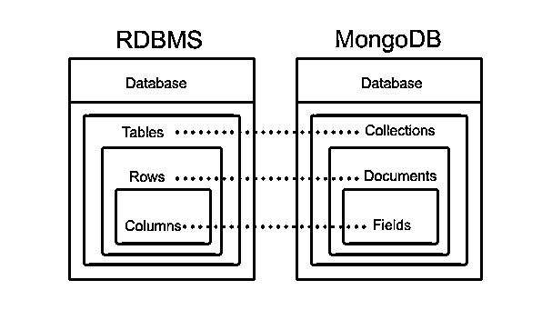
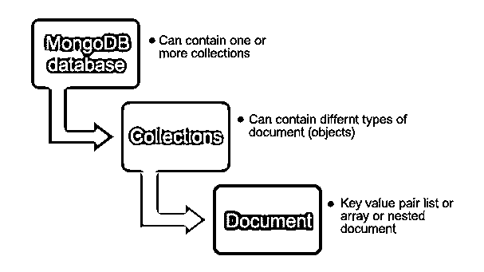
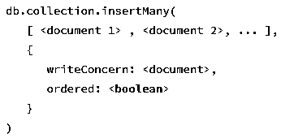

# 什么是 MongoDB？

> 原文：<https://www.educba.com/what-is-mongodb/>

## 什么是 MongoDB？

这是一个为高性能、高可用性和易伸缩性而开发的开源 NoSQL 数据库。集合和文档是 MongoDB 中两个主要使用的术语/概念。这里，集合指的是一组文档，就像一个 RDBMS 表。

<small>Hadoop、数据科学、统计学&其他</small>

将 RDBMS 映射到 MongoDB

### 定义

这些是 NoSQL 数据库，面向跨平台文档。它使用 BSON 格式进行文档存储和与客户端的通信。BSON 是 JSON 的二进制形式。

下面给出了 MongoDB 和 RDBMS 之间的基本区别:

| 【MongoDB 和 RDBMS 的区别 | **RDBMS** | **MongoDB** |
| **模式** | 固定模式 | 无模式 |
| **交易** | 支持交易 | 通过提供高可用性和分区来折衷事务。 |
| **分片** | 不 | 是 |
| **查询缓存** | 这里没有查询缓存 | 查询缓存发生在这里，这导致了更快的数据访问。 |

### 谅解

它在 JSON kn0wn 的扩展版本 BSON(二进制 JSON)上工作，它是:

*   轻量级选手
*   可穿越
*   高效的

这些驱动程序负责发送和接收 BSON 格式的数据。它将数据存储为 BSON 对象。对 BSON 的编码和对 BSON 的解码非常快，所以效率很高。下面是几个和 MongoDB 相关的术语，在使用的时候会用到。

*   **集合:** Its 群的 MongoDB 文档。这可以认为类似于 Oracle、MySQL 等 RDBMS 中的表。这个集合不强制任何结构。因此，无模式的 MongoDB 如此受欢迎。
*   **文档:**文档在 MongoDB 集合中被称为[记录。](https://www.educba.com/mongodb-collection/)

集合层次结构

上面显示的图片使 MongoDB 中集合和文档的概念变得清晰。

*   **字段:**是文档中的名称-值对。一个文档有零个或多个字段。字段就像关系数据库中的列。

### MongoDB 是如何让工作变得如此简单的？

*   它基于用于数据存储的无模式格式和用于与其客户端通信的 BSON 格式；它以创新的方式管理和存储数据。随着互联网接入的增加，世界已经向更大的流量漂移，这可能是无法控制的。它非常能够轻松处理所有网站和应用程序的大流量。
*   它基于分片概念。它依赖于垂直扩展，随着处理能力需求的增加，您需要添加更多的 CPU 和内存。这里可以使用一个以上的服务器来满足处理能力的要求。它遵循分布式系统的原则。
*   它使用内存来存储工作数据集，从而能够更快地访问数据。它还针对最常见的用例优化了您的模式。
*   它有一组丰富的查询来执行快速简单的操作。

### 顶级公司

如今统治 IT 市场的所有巨头都依赖于 MongoDB。其中包括 Adobe、诺基亚、易贝、SAP、思科、威瑞森等。

以下是他们的一些评论:

*   **SAP:** 它是一个核心数据库，将 SAP 的平台作为一个服务内容管理系统。
*   **思科:**通过 MongoDB，管理我们的协作空间。
*   **Adobe:** 内容管理系统依赖 MongoDB。

### 各种子集

MongoDB 有各种子集，它们是:

*   mongod，核心数据库进程；
*   芒果
*   交互式 MongoDB Shell。

它处理所有数据请求，管理数据访问，并执行各种后台管理操作。所以，后台所有繁琐的任务都由 MongoDB 处理。Mongos 负责处理来自应用层的查询。它还确定数据在分片集群中的位置，以完成任务。Mongo 是 MongoDB 的一个交互式 JavaScript shell 接口，管理员和开发人员通过它与 MongoDB 进行交互，以测试查询和运行操作。

### 你能用 MongoDB 做什么？

它可以用来解决大量的商业问题，因为它是先进的技术。这里有一些用例可以为你带来更多的想法和想法，你会发现这些想法和想法与许多场景和实现相关。

*   **实时分析:**批量分析的时代已经一去不复返了，过去批量分析同样复杂耗时。在 MongoDB 的帮助下，这在降低延迟(几秒钟)和提高可用性(99%)方面带来了一场革命。例如:应用程序和浏览器。
*   **产品目录:**我们知道，它是基于动态模式的。因此，它可以保留每个属性的相关值，而不是保留所有属性中的所有记录。这导致在更新任何记录时的快速和良好的用户体验。
*   **可扩展性和动态性:**随着更多开发和研究的进行，公司需要存储各种数据及其各种来源。它们的环境需要如此灵活和进步，以至于增长不应遇到任何障碍。它提供了一个很好的解决方案。

### 使用 MongoDB

一旦您启动 mongo shell，在这里，我们将看到几个重要的 MongoDB 命令，它们将帮助您使用 MongoDB。

**1。插入文件**

*   db.collection.insertOne()

*   db.collection.insert many()

**2。从集合中检索文档**

*   db.collection.find()

**3。更新集合中的现有文档**

*   db.collection.updateOne()

*   db.collection.updateMany()

*   db.collection.replaceOne()

**4。从集合中移除文档**

*   db.collection.deleteOne()

*   db.collection.deleteMany()

**5。验证连接**

**6。在集合中查找不同的值**

这将返回一个包含不同值数组的文档。

**7。文本搜索**

当文本存储在集合中时，这些函数对文本进行索引。$text 查询运算符用于对集合执行文本搜索。查找所有包含“政治问题”的文档

### 优势

不同的优势如下所述:

*   易于使用:这种易于安装和设置的特点使其从其他基于文档的 NoSQL 数据库中脱颖而出。另外，不需要更好的编码背景。你应该知道 [JSON](https://www.educba.com/what-is-json/) 来理解这里集合的树形结构。
*   **没有复杂的连接:**它基于 BSON 格式——键值对，因此这里没有复杂的连接。
*   许多支持的平台:它支持多种平台:Windows、Ubuntu、Debian、Solaris、macOS。这使得它在开发者中非常受欢迎。
*   **敏捷性:**随着需求的快速发展，需要灵活的数据模型来解决所有这些问题。固定的基于模式的数据模型无法解决所有这些问题，无模式数据模型 MongoDB 因其可伸缩性和高度动态性而广受欢迎。在 MongoDB 中添加或更改字段非常容易。
*   **更快地访问数据:**由于其使用存储内部内存的特性，它提供了对数据的快速访问。
*   **水平缩放:**它依赖于水平缩放，而不像 RDBMS 那样依赖于垂直缩放。费用降低了，因为不需要在同一台服务器上添加 CPU 和内存。人们可以利用更多的具有更多处理需求的服务器。这不仅降低了 CPU、内存增加的成本支出，还降低了维护成本。

### 所需技能

以下是 MongoDB 专业人员必须具备的重要技能:

*   实施适当的索引(B 树、地理空间、文本)以提高性能。
*   人们应该知道以最佳方式实施备份和恢复的方法。
*   人们应该能够围绕 MongoDB 及其 API 开发概念证明
*   还应该能够使用 Mongo Profiler 检测性能问题。
*   它还要求 MongoDB 人员应该了解 MongoDB 的方法和潜在限制。

### 为什么要用 MongoDB？

NoSQL 是时代的需要。面对快速的变化和巨大的可扩展性需求，NoSQL 是任何组织都能想到的最终解决方案。

这里我们列出了使用 MongoDB 的一些好处，这有助于您思考相关案例:

*   支持异构数据
*   没有连接
*   分布在自然界
*   高性能、可扩展性和可用性
*   支持多种平台
*   基于文档的查询语言
*   非常灵活地添加/删除字段，因为它是无模式的

### 范围

它满足了当今时代的要求，具有快速、简单的学习曲线。由于开源、高性能、可伸缩性和可用性，许多公司正在生产阶段使用它。从学习的角度来说，你只需要知道 JSON，一种简单的编程语言。随着时间的推移，越来越多的公司将会迁移到 MongoDB，使它变得更加流行，因此市场对 MongoDB 技能的需求将会更高。

### 我们为什么需要它？

当出现存储数据的情况时，以列和行的形式存储数据是一种传统的方式，因为这导致了大量的空间浪费。今天的企业远比预期的更加灵活。为了更好的客户服务和现代应用程序开发，企业应该准备好接受任何变化并满足期望。

从今以后，当务之急是使用 NoSQL 数据库。它是不二之选，因为它基于 NoSQL，而且提供了高性能、可用性和可伸缩性。它有助于组织轻松管理数据。除此之外，模式验证可用于对每个集合实施数据治理控制。

### 谁是学习 MongoDB 技术的合适受众？

这里我们列出了一些 IT 角色，它们被认为是 MongoDB 技术的合适受众。然而，它并不局限于这些角色。

**角色:**

*   数据库管理员、分析专家，如数据分析师、数据科学家。
*   [软件开发人员、](https://www.educba.com/career-as-a-software-developers/)基础设施负责人、架构师、大数据顾问等。
*   研究员。

了解 MongoDB 将有助于这些角色做出更好的选择和商业决策。

### 这项技术将如何帮助你的职业发展？

MongoDB 越来越受欢迎是因为它灵活、快速的特性和强大的查询语言。MongoDB 拥有海量的数据和多种类型的数据，是任何组织使用它的显而易见的选择。

以下是一些使用 MongoDB 的顶级公司:

*   加拿大白鲑
*   精力
*   西班牙电信公司
*   电子艺界游戏公司
*   通过易趣网购买
*   埃里克森
*   福布斯（美国出版及媒体集团）
*   直觉
*   LexisNexis

采用 NoSQL 而不是 SQL 数据库正在推动当今市场的趋势，因此预测对 MongoDB 技能的需求将会增加。因此，学习这个将会给职业发展带来巨大的推动。

### 结论

在浏览了上述所有内容后，很明显 MongoDB 已经被许多顶级公司所吸收，并将继续被其他公司吸收到 it 市场中。这是一项强大而突出的技术。进一步发展需要更多的实现和实践技能，因此将会看到更多的人转向这项技术。它有能力从大数据中提取每一点。学习 MongoDB 是一个有利可图的步骤，在不久的将来会带来更多有利可图的工作。

### 推荐文章

这是什么是 MongoDB 的指南？在这里，我们讨论了 MongoDB 的基本概念，以及它如何以及在什么地方有助于职业发展。您也可以浏览我们推荐的其他文章，了解更多信息——

1.  [什么是数据仓库？](https://www.educba.com/what-is-data-warehouse/)
2.  [MongoDB 指南创建索引](https://www.educba.com/mongodb-create-index/)。
3.  [MongoDB 查找](https://www.educba.com/mongodb-find/)
4.  [MongoDB 删除指南](https://www.educba.com/mongodb-delete/)

