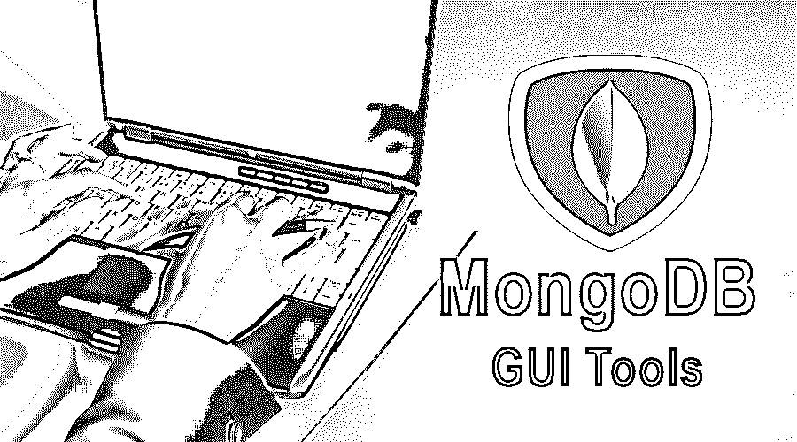
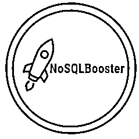
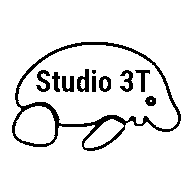
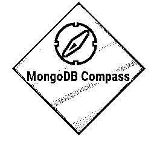
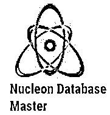
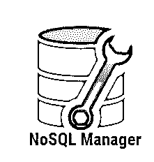
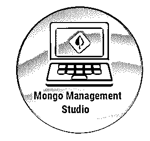
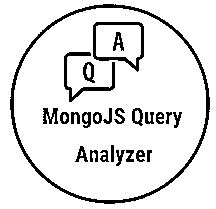
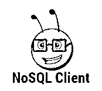
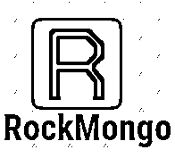

# MongoDB GUI 工具

> 原文：<https://www.educba.com/mongodb-gui-tools/>

## MongoDB GUI 工具简介

MongoDB GUI 工具是一个 [NoSQL 数据库](https://www.educba.com/what-is-nosql-database/)，因其便利性和特性而广受欢迎。No SQL(意味着非 SQL 或不仅仅是 SQL ),这意味着它是一种处理以非表格格式建模的数据并将其存储在数据库中的机制。它的设计更简单，速度更快，并且易于扩展。非 SQL 数据库越来越多地[用于大数据](https://www.educba.com/what-is-big-data/)和实时应用。它可以支持类似 SQL 的操作，并提供更大的灵活性。MongoDB 是跨平台的面向文档的 NoSQL 数据库。它使用带有模式的类似 JSON 的文档。文档模型映射到应用程序代码中的对象，使其易于使用。Mongo DB 是一个分布式系统，因此伸缩性和高可用性是内置特性。即席查询、索引、负载平衡、聚合和上限集合提供了一种分析和查询数据的强大方法。

GUI 工具是一个界面，用于在底层系统之上提供一个交互层，以简化开发。MongoDB 有一个缺点，那就是它没有提供任何 GUI 风格的界面来帮助开发人员。所有工作都是使用命令行工具完成的。GUI 工具帮助开发人员提高生产力。它提供了数据库和存储在其中的数据的更好视图。它可以对文本进行颜色编码，使其易于理解，还可以智能感知以突出错误。易于保存脚本。鉴于所有这些优势，一些第三方工具为 MongoDB 提供了 GUI 界面。

<small>Hadoop、数据科学、统计学&其他</small>

### MongoDB GUI 工具的类型

市场上有许多可用的工具。

以下是一些流行工具的列表:

#### 1.NoSQLBooster

NoSQLBooster 是一个用于 Mongo DB 的以 shell 为中心的跨平台 GUI。内置的工具语言服务提供了良好的智能。它知道所有的方法、变量、关键字、操作符和集合名称。提示总是作为开发人员类型弹出。匹配的括号会突出显示。也可以执行 SQL 查询。它还为性能监控和分析提供了丰富的 GUI，以便您的系统可以平稳运行。

#### 2.3T 工作室

Studio 3T 是为在 Mongo DB 中工作的团队提供的集成开发环境。它有一个可视化的查询生成器，这意味着开发人员可以拖放字段来可视化和创建查询。它还支持就地编辑。用户可以双击该字段并编辑数据。它还可以将代码翻译成其他语言，如 Node.js、PHP、Python、Java 和 C#。它还可以并排收集数据，并使它们保持同步。

#### 3.MongoDB 罗盘

MongoDB GUI 工具 compass 提供了一个 GUI 来分析和理解数据，而无需 MongoDB 语法知识。它还分析文档，让用户实现文档验证，并显示丰富的结构。它允许用户查看查询性能和管理索引。

#### 4.核子数据库主机

该工具提供了代码高亮、代码完成等功能。用户可以将数据导出到 XML、HTML、CSV、JSON、PDF 等文件中。使用 Nucleon Database Master 提供的 SQL 和 LINQ 查询编辑器。它可以用来通过 ODBC 连接到任何数据库系统。

#### 5.NoSQL 经理

NoSQL 管理器结合了用户友好的界面和强大的外壳功能。它提供了高性能和直观的界面。它支持集合和共享集群连接的复制。它提供了易于使用的文档查看器和编辑器。它支持 MongoDB 的所有版本。

#### 6.Mongo 管理工作室

Mongo Management Studio 使得在不使用 MongoDB shell 的情况下执行所有 MongoDB 命令成为可能。它允许用户通过使用 MongoDB 的集成用户管理来管理访问。像其他工具一样，它也允许用户连接到 MongoDB 远程数据库。它使查询编辑变得简单和交互式。它可以执行各种聚合操作。可以使用 Mongo Management Studio 导出和导入数据。它提供了所有特性的丰富文档。

#### 7.MongoJS 查询分析器

它是一个 Javascript 编辑器；它可以在 MongoDB 上执行 JavaScript。它漂亮的打印特性允许用户以易读的 JSON 格式查看结果。查询分析器的结果可以以不同的格式存储。它还允许用户以层次结构、网格和文本格式查看结果。

#### 8.NoSqlClient

这是另一个帮助用户有效开发的 GUI 工具。它关注用户的请求，并允许他们最大限度地使用浏览器/应用程序。它允许用户监控 CPU、RAM 和活动读/写请求，以便有效地使用系统。它支持 LDAP、GSSAPI 和 Xs09。它使用扩展的 JSON 代替 BSON 来查询和显示结果。NoSQL 客户端让您分析模式和数据库结构。

#### 9.MongoHub

MongoHub 是一个用于 MAC OS 的 GUI 工具。它允许您添加和删除数据库以及集合。它方便用户执行定制查询、添加、编辑、从集合中删除行、转储集合等。

#### 10.UMongo

UMongo 是一个 GUI 工具，用于浏览和管理 MongoDB 集群。MongoDB 的树会刷新以获得集群的实时视图。UMongo 中的所有操作都在后台执行，这样可以保持 UI 的响应性。它支持所有类型的查询操作。

#### 11.洛克蒙戈

它支持所有与数据库和集合相关的查询。是用 PHP 写的；因此，PHP 必须存在于系统中才能使用它。这是 PHP 开发人员的福音，因为它是用 PHP 编写的。他们将能够更多地参与其中，并轻松地工作。

#### 12.群控

群集控制提供数据库服务器的全自动安全性和完整性。它允许用户定制 MongoDB 部署。数据库的备份恢复和修复很容易。集群控制提供了自动化的性能调整。用户可以添加定制建议来分析和提高性能。

### 结论

MongoDB 是一个 NoSQL 数据库，因为它提供的易用性和特性而非常受欢迎。但是它没有交互式的图形用户界面，这使得它很难使用。GUI 是必不可少的，因为它减轻了开发人员的工作并提高了效率。这就是为什么许多第三方提供商提供具有智能的交互式简单 GUI 工具。使用哪种工具取决于所需的预算和功能。

### 推荐文章

这是 MongoDB GUI 工具的指南。这里我们讨论了 MongoDB GUI 工具中不同类型的工具的概念。您也可以浏览我们推荐的其他文章，了解更多信息——

1.  [什么是 MongoDB 替代品？](https://www.educba.com/mongodb-alternatives/)
2.  [自动化测试工具](https://www.educba.com/automation-testing-tools/)
3.  [什么是 Appium？](https://www.educba.com/what-is-appium/)
4.  什么是虚拟化？

