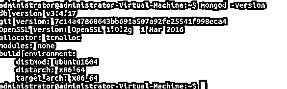

# MongoDB 版本

> 原文：<https://www.educba.com/mongodb-versions/>

## MongoDB 版本介绍

MongoDB 版本表示从该产品的前一版本开始所做的更改和修复的问题。从 1.0 到当前的 4.2 版本，MongoDB 已经成为使用最广泛的 NoSQL 数据库引擎。MongoDB 是一个广泛使用的 NoSQL 数据库，有一个类似 JSON 的文档。它以键值对的形式存储所有内容。MongoDB 是用 C++、Go、JavaScript 和 Python 编写的，是一个跨平台的数据库程序。

### 如何阅读 MongoDB 版本？

MongoDB 中用来表示版本的系统是 A.B.C。现在，A.B 定义了 MongoDB 版本是开发系列还是发布系列，而 C 表示修订版号或补丁号。

<small>Hadoop、数据科学、统计学&其他</small>

#### 版本中的奇偶标记

我们已经了解了版本在 MongoDB 中是如何工作的。在 A.B 之外，B 可以是偶数，有时也可以是奇数。

当 A.B 中的 B 为偶数时，则版本为发布系列。对于生产使用，发布版本是首选，因为它们是稳定的。而当 A.B 中的 B 是奇数时，很明显这是开发系列版本，不适合生产使用，最好只用于测试目的。

### 初始发布

11 年前，2009 年 2 月，第一次发布。MongoDB 1.0.0 是第一个合适的版本。这个 1.0.0 版本支持单个主机、副本配对环境和主从架构。虽然 0.9.10 和 1.0.0 之间没有重大变化，但后一个版本是稳定的，并且在超过 18 个月的时间里，代码一直在生产环境中进行测试。

与以前的版本相比，1.x 几乎没有新功能。除了在每个集合中添加更多的索引之外，索引创建任务也得到了提高，输出也更快了。作为一个基于 JSON 的数据库引擎，JavaScript 是一种重要的编程语言，在这个版本中，实现和保存 JavaScript 函数的能力被添加进来以获得更好的可编程性，并且做了一些小的改动。

### MongoDB 特性

除了上述特定版本的特性之外，MongoDB 还有很多特性。MongoDB 是使用最广泛的 NoSQL 数据库之一，提供了广泛的特性，并且是完全可靠的。为了对使用主索引和辅助索引存储的文档进行索引，Mongodb 提供了具有复制功能的高可用性。

JavaScript 可以在服务器端用来执行查询。从 4.0 版本开始，它还支持多文档 ACID 事务。聚合管道是最有效的执行管道之一，可以通过三种方式执行:聚合管道、单用途聚合和 Map Reduce 函数。GridFS 是 MongoDB 支持的文件系统，具有负载平衡和数据复制特性。

### 最新版本

目前，4.2 是 MongoDB 的最新版本，对于生产使用来说是稳定的。2019 年 8 月发布。最新版本的突出特性之一是分布式事务。这里，分布式事务指的是共享集群上的多个文档之间的事务以及副本集。

然后，在最新版本中，删除了事务的 16MB 限制。MongoDB 的最新版本 4.2 也删除了存储引擎，不推荐使用 MMAPv1。在 4.2 版本中，文档的 shard 键值可以更新，这是不可变的，但现在可以更新，除非键值是不可变的。为 Mongod、Mongos 和 MongoDB shell 添加了新的 TLS 选项。TLS 提供与 SSL 相同的功能。

多个命令已被删除。MongoDB shell 的 find 和 cursor.maxScan()的墨西哥语已经删除。现在，我们可以使用 maxTimeMS 和 cursor.maxTimeMS()命令来代替。

group 命令有一个类似“db.collection.group()”的方法，现在已经被删除，为了产生类似于该查询的结果，我们必须使用 aggregate 方法。在聚合管道中，添加$group 阶段将返回与 group 命令相同的结果。复制和克隆命令也被删除。作为替代，可以使用 mongodump 代替 copy，或者我们可以使用驱动程序编写一个脚本。可以使用 mongodump 和 mongorestore 来代替 clone 命令。上面列出的大多数命令在 4.2 最新版本中已被删除，可以在早期版本中使用。

### 如何检查 MongoDB 的版本？

现在我们已经了解了不同的版本对数据库的工作和功能有着不同的影响。要检查您使用的是什么版本的 MongoDB，有跨平台操作系统的命令行查询。基于 Linux 的 Ubuntu 被广泛使用，下面是你如何检查你的 MongoDB 版本:

`mongod -version`

**输出:**

*   执行上面的命令，您将获得系统上当前 MongoDB 的详细信息。从上面的截图可以看出，我目前的 MongoDB 版本是 3.4。除此之外，您可以检查 Github 版本以获得相同的版本和 OpenSSL 版本，OpenSSL 版本作为计算机的安全元点，用于生成各种私钥和安装安全证书。
*   解释输出:正如我们之前所理解的，版本代表了发布的各种因素。同样，我目前的版本是 3.4.17，发布于 2018 年 9 月 7 日。
*   3.4.17 修复的问题:error()或 severe()函数可用于 windows 堆栈跟踪，而不是 log()。现在，可以将 SSL_version 添加到客户机的元数据日志中。当终止时，MongoDB 客户端运行缓冲的命令。关于安全性，由于与 redactForLogging()命令混淆而导致的日志编辑缺失问题已得到解决。
*   现在，4.2.4 有望成为下一个修复了问题并改进了功能的版本。

### 结论

MongoDB 的最新版本是 2019 年 8 月发布的 4.2，最初的量产兼容版本是 1.0。在此期间，进行了各种更改并修复了一些问题。使用“mongod–version”命令，您可以检查安装的 MongoDB 发布版本。了解您拥有的版本，您可以检查已修复的问题，也可以报告问题。MongoDB 有英文版本，它是一个面向文档的数据库引擎，由 MongoDB 公司开发和管理。

### 推荐文章

这是 MongoDB 版本的指南。这里我们讨论如何读取 MongoDB 版本、初始版本和最早版本，以及如何检查版本。您也可以浏览我们的其他相关文章，了解更多信息——

1.  [MongoDB 工具](https://www.educba.com/mongodb-tools/)
2.  [MongoDB 删除指南](https://www.educba.com/mongodb-delete/)
3.  [MongoDB 数组|示例](https://www.educba.com/mongodb-array/)
4.  [MongoDB Distinct 指南](https://www.educba.com/mongodb-distinct/)
5.  [MongoDB Aggregate |如何工作？](https://www.educba.com/mongodb-aggregate/)
6.  [MongoDB Distinct |示例](https://www.educba.com/mongodb-distinct/)
7.  [MongoDB 版本|如何检查？](https://www.educba.com/mongodb-versions/)
8.  [MongoDB Aggregate |如何工作？](https://www.educba.com/mongodb-aggregate/)

