# MongoDB 命令

> 原文：<https://www.educba.com/mongodb-commands/>

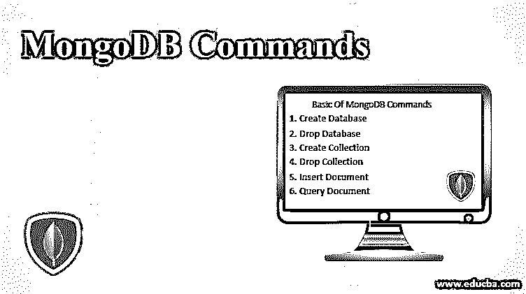

## MongoDB 命令简介

MongoDB 是一个跨平台、面向文档的开源数据库管理系统，它提供了高可用性、高性能和易伸缩性。它是 NoSQL 数据库之一，高度用于大数据应用程序和其他复杂的数据作业处理，这些数据不适合关系数据库。MongoDB 架构由集合和文档组成，而不是使用以表的形式存储数据的关系数据库概念。这里我们讨论 MongoDB 命令。

### 为什么使用 MongoDB 命令？

1.  它可以轻松控制放置在全球的数据，确保快速的性能和合规性。
2.  它提供了一个灵活的数据模型。这适用于需要从头开始构建应用程序或更新单个记录的情况。
3.  如果应用程序是可扩展的，则不会停机。

### 特征

1.  MongoDB 命令使用主从复制概念。为了防止数据库停机，这个复制特性被证明是一个必要的特性。
2.  该数据库可以在多台服务器上运行；因此，数据在多台服务器上被复制。其结果是在硬件故障的情况下这是一个很大的优势。
3.  MongoDB 命令带有自动分片特性，在这个特性中，进程将数据分布在多个物理分区(称为分片)上。其结果是自动负载平衡发生。
4.  它是无模式的。因此效率更高。

### MongoDB 命令的基础

#### 1.创建数据库

在 MongoDB 使用中，DATABASE_NAME 用于创建数据库。如果这个名称数据库不存在，它将被创建，否则它将返回已存在的数据库。

<small>Hadoop、数据科学、统计学&其他</small>

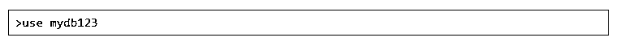

要立即检查当前数据库:

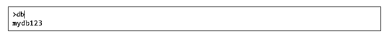

默认情况下，MongoDB 命令带有数据库名“test”。假设您在没有指定数据库的情况下插入了一个文档，它将自动存储在一个“测试”数据库中。

#### 2.删除数据库

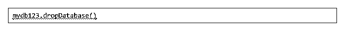

如果没有指定数据库，那么它将删除默认数据库“test”。

#### 3.创建收藏

为了创建集合，使用的 MongoDB 命令是: **db.createCollection(name，options)**

这里，name 是集合的名称& options 是一个用于指定集合配置的文档。尽管“Options”参数是可选的，但提供它还是好的。

#### 4.丢弃收集

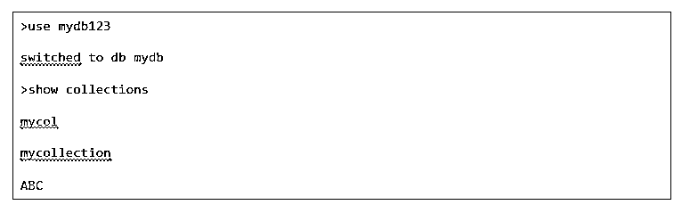

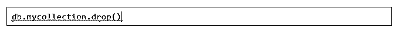

#### 5.插入文档

Insert()或 save()方法用于将数据插入任何数据库集合。

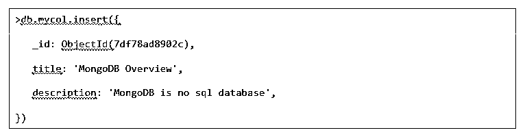

这里“mycol”是集合名称。如果集合不存在，那么 MongoDB 命令将创建数据库集合，然后插入它。

#### 6.查询文档

查询集合是通过 find()方法完成的。

由于 find()方法会以一种非结构化的方式显示结果，所以要获得结构化的结果就要使用 pretty()方法。

### 中间 MongoDB 命令

#### 1.极限()

这个 MongoDB 命令限制了 MongoDB 中需要使用的记录数量。此函数的参数只接受数字类型。参数是需要显示的文档的编号。

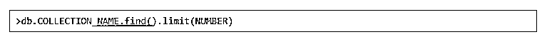

#### 2.排序()

这是 MongoDB 的记录。1 & -1 用于对文档进行排序。1 表示升序，而-1 表示降序。

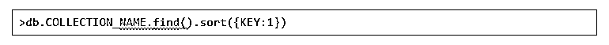

#### 3.索引是帮助 MongoDB 以低效的方式扫描文档的概念

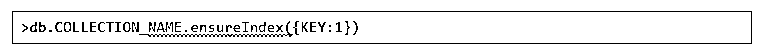

### MongoDB 的高级命令

#### 1.聚合()

这个 MongoDB 命令有助于处理数据，返回计算结果。这可以将多个文档中的值组合在一起。

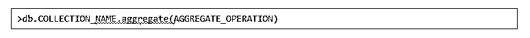

#### 2.复制

[MongoDB](https://www.educba.com/replication-in-mongodb/)中的复制是使用复制集实现的。副本集是一组具有相同数据集的 MongoDB 进程。副本集提供:

1.  高可用性
2.  冗余，因此容错/灾难恢复。

在副本中，一个节点是主节点，其余节点是次节点。所有写操作都保留在主节点上。

让我们看看；独立的 MongoDB 实例被转换成副本集。

以下是相关步骤:

关闭已经运行的 MongoDB 服务器。

现在，通过指定— replSet 选项启动 MongoDB 服务器。

语法:

#### 3.创建和恢复备份

要创建备份，可以使用 mongodump 命令。服务器的全部数据将被转储到转储目录(/bin/dump/)中。有选项可以限制数据。

要恢复备份，可以使用 mongorestore 命令。

#### 4.监控部署

要检查所有正在运行的进程/实例的状态，mongostat 命令很有帮助。它跟踪并返回数据库操作的计数器。这些计数器包括插入、更新、查询、删除和游标。这个 MongoDB 命令非常有用，因为它显示了运行内存不足、一些性能问题等状态。

您需要转到 MongoDB 安装的 bin 目录并运行 mongostat。

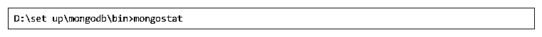

### 使用 MongoDB 命令的技巧和诀窍

*   **预分配空间:**当你知道，你的文档将要增长到一定的大小。这是 MongoDB 中的一种优化技术。插入文档并添加垃圾字段。

*   尝试在单个查询中获取数据。
*   因为 MongoDB 默认情况下是区分大小写的。

示例:

db . people . find({ name:' Russell ' })&

db . people . find({ name:' Russell ' })则不同。

在执行搜索时，使用正则表达式是一个好习惯。比如:

db . people . find({ name:/Russell/I })

*   **首选奇数个副本集:**添加冗余和提高读取性能的一种简单方法是使用副本集。数据在所有节点之间复制，以防主节点出现故障。投票在他们之间进行，选出主节点。在失败的情况下，使用奇数个副本将使投票更容易。

*   **使用防火墙保护 MongoDB:**由于 MongoDB 本身不提供任何身份验证，所以最好使用防火墙保护它，并将其映射到正确的接口。

*   **没有连接:**正如我们所知，MongoDB 不支持连接。要从两个以上的集合中检索数据，需要编写多个查询。如果模式组织得不好，编写查询可能会很麻烦。这可能导致模式的重新设计。花一些额外的时间来设计一个模式总是比较好的。

### 结论

MongoDB 命令是维护高可用性、高效和可伸缩操作的最佳实践解决方案，这是当今的业务需求。

### 推荐文章

这是 MongoDB 命令的指南。在这里，我们讨论了基本、中级和高级 MongoDB 命令以及使用这些命令的技巧和诀窍。您也可以阅读以下文章，了解更多信息——

1.  [Tableau 命令](https://www.educba.com/tableau-commands/)
2.  [Adobe Photoshop 命令](https://www.educba.com/photoshop-commands/)
3.  [Cheatsheet SQL(命令、免费提示和技巧)](https://www.educba.com/cheat-sheet-sql/)
4.  [重要的 VBA 命令-数据过滤和动态更新](https://www.educba.com/visual-basic-commands-data-filter-and-dynamic-update/)
5.  [MongoDB 指南创建索引](https://www.educba.com/mongodb-create-index/)。
6.  [11 大 MongoDB 列表收藏](https://www.educba.com/mongodb-list-collections/)

