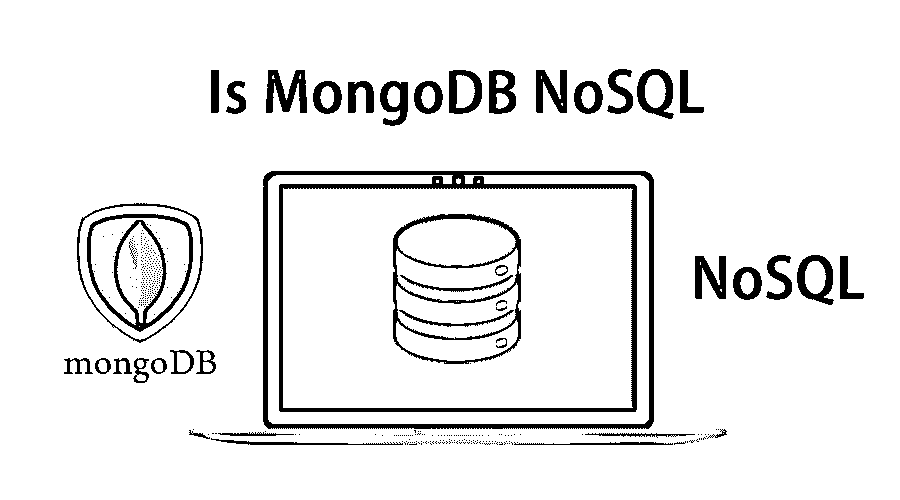

# MongoDB 是 NoSQL 吗

> 原文：<https://www.educba.com/mongodb-nosql/>

## MongoDB 是 NoSQL 吗？

是的，MongoDB 是一个 NoSQL 数据库。MongoDB 是一个开源的 NoSQL 数据库。MongoDB 是一个基于文档的数据库。MongoDB 是领先的 NoSQL 数据库之一。NoSQL 数据库是一种非关系数据库，能够处理结构化、半结构化和非结构化数据。

### 什么是 MongoDB？

MongoDB 是一个开源数据库管理系统(DBMS ),它使用面向文档的数据库模型。MongoDB 是用 C++写的。MongoDB 支持各种形式的数据。MongoDB 使用自己的二进制存储对象将数据存储在平面文件中。这意味着数据存储非常紧凑和高效，非常适合高数据量。MongoDB 将数据存储在类似 JSON 的文档中，这使得数据库非常灵活且可伸缩。

<small>Hadoop、数据科学、统计学&其他</small>

MongoDB 是一个面向文档的数据库模型。每个 MongoDB 数据库都包含集合，而集合又包含文档。每个文档可以是不同的，取决于不同数量的字段。每个文档的模型在大小和内容上都互不相同。数据模型特性允许你以层次关系存储数组和复杂结构。

### 什么是 NoSQL？

NoSQL 是一种新型的数据库管理系统，与关系数据库系统有着根本的不同。NoSQL 数据库是一个高度可扩展和灵活的数据库管理系统。NoSQL 数据库允许用户存储和处理非结构化数据和半结构化数据；这个特性在 RDBMS 工具中是不可能的。NoSQL 是一种数据库设计方法，可以适应各种各样的数据模型，包括键值、文档、列和图形格式。NoSQL 系统通常不能提供与 SQL 数据库相同级别的数据一致性。事实上，虽然 SQL 数据库传统上为了 ACID 属性而牺牲了可伸缩性和性能。NoSQL 数据库保证了高速度和可伸缩性。NoSQL 系统的体系结构以这样一种方式运行在高速和更广泛的灵活性对开发方。

### MongoDB 能取代 NoSQL 吗？

因为我们在存储和处理大量社交媒体和网络数据时受到关系数据库的限制。NoSQL 数据库拯救了大数据。NoSQL 数据库允许 programme1r 轻松高效地执行数据库。NoSQL 数据库有四种类型。就数量和复杂性而言，NoSQL 能够处理更多的数据。NoSQL 数据库要么是无模式的，要么具有宽松的模式。对于批处理，MongoDB 提供了聚合特性来高效地处理您的数据。我们使用 Map Reduce 模型进行聚合操作。

[MapReduce 是](https://www.educba.com/what-is-mapreduce/)由两个过程组成的编程模型:Map()和 Reduce()。Map()过程执行过滤和排序，而 Reduce()过程执行汇总操作。MongoDB 可以在多个服务器上运行。数据被复制以保持系统运行，并在硬件故障时保持其运行状态。MongoDB 是一个无模式数据库。在 MongoDB 架构中——一个集合中有不同的文档。该集合是无模式的，与同一集合中的另一个文档相比，具有不同的内容、字段和大小。NoSQL 的特性与 MongoDB 的产品相一致。所以，NoSQL 不能取代 MongoDB 或者 MongoDB 不能取代 NoSQL。

### MongoDB 的特点

以下是 MongoDB 的特点:

*   **MongoDB 是无模式的:** MongoDB 是一个无模式的数据库，比传统的数据库表更加灵活。它是用 C++语言写的。它没有与同一集合中的另一个文档具有许多不同的字段、内容和大小的模式。
*   **高性能:** MongoDB 是一个高性能的开源数据库。MongoDB 是一个高可用性和可伸缩性的数据库。由于索引和复制等功能，它支持更快的查询响应。
*   **MongoDB 索引:**索引对于提高搜索查询的性能非常重要。MongoDB 使用数据集索引来增强查询性能和搜索。MongoDB 索引提高了更快搜索查询的性能。MongoDB 中的文档可以使用主索引和辅助索引进行索引。
*   **文件存储:** MongoDB 可以作为一个文件系统，具有跨多台机器的负载均衡和数据复制特性，用于存储文件。
*   **复制:**复制的特点是将数据分发给多个节点。它可以有主节点和辅助节点来复制数据。数据的复制是使用主从架构完成的。MongoDB 通过在多台机器上分发数据来提供复制特性。
*   **分片:**由于分片 MongoDB 自动进程负载平衡，该进程将数据分布在多个称为分片的物理分区上。我们在需要处理非常大的数据集的情况下使用分片。

### NoSQL 的特色

以下是 NoSQL 的特点:

*   多模型:NoSQL 数据库的这个特性使得它们在处理数据时非常灵活。
*   **易于扩展:**NoSQL 数据库的这一特性易于扩展，以适应海量和复杂的云应用。这种可扩展性还提高了性能，允许连续可用性和非常高的读/写速度。
*   **灵活:**NoSQL 数据库的这一特性允许您处理各种数据。它可以处理结构化、半结构化和非结构化数据。它可以在许多处理器上运行——NoSQL 系统允许您将数据库存储在多个处理器上，并保持高速性能。
*   **更少的停机时间:**NoSQL 的弹性允许工作负载自动分布到任意数量的服务器上。

### MongoDB 和 NoSQL 的区别

*   MongoDB“数据库”是顶层容器，由一个或多个集合组成，而 NoSQL 数据存储提供了用于存储数据的顶层名称空间或容器。
*   MongoDB 基于文档存储数据模型，其中文档以 BSON 格式存储。BSON 格式是一种二进制 JSON 格式。NoSQL 是一个开源的文档数据库，在企业应用程序中提供高性能、可伸缩性、数据建模和大型数据集的数据管理。
*   MongoDB 支持搜索任何字段或查询范围或正则表达式的高级功能，而 NoSQL 数据库在数据存储和处理方面更灵活。
*   MongoDB 使用分片的特性进行水平伸缩。同时，NoSQL 系统允许您将数据拖放到一个文件夹中，然后在不创建实体关系模型的情况下进行查询。

### 结论

有很多机构像 Adobe，LinkedIn，MacAfeeSAP 使用 MongoDB 作为数据库。对于照片提交，New York Times 使用 MongoDB NoSQL，这个应用程序是为表单构建而部署的。MongoDB 提供了一些高级而强大的特性，可以解析所有半结构化和非结构化数据。MongoDB NoSQL 可通过供应商 MongoDB Inc .获得社区版和商业版。

### 推荐文章

这是 NoSQL MongoDB 的指南。这里我们讨论了基本概念、MongoDB 和 NoSQL 的特征以及 MongoDB 和 NoSQL 之间的区别。你也可以看看下面的文章:

1.  卡桑德拉是 NoSQL 吗？
2.  [大数据是数据库吗？](https://www.educba.com/is-big-data-a-database/)
3.  [SQL 是微软吗？](https://www.educba.com/is-sql-microsoft/)
4.  [MongoDB 创建索引|索引类型](https://www.educba.com/mongodb-create-index/)

