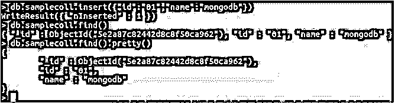
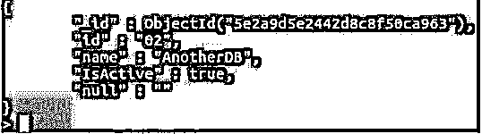
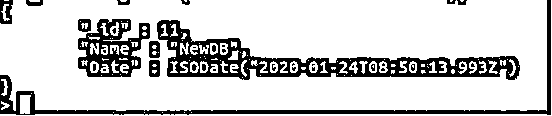
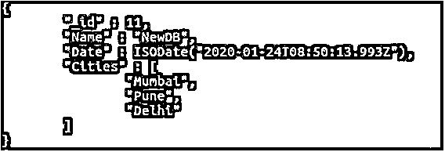
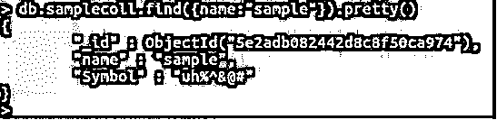

# MongoDB 数据类型

> 原文：<https://www.educba.com/mongodb-data-types/>

## MongoDB 数据类型简介

对于任何编程或脚本语言或数据库来说，数据类型都很重要，可以识别数据的类型。如果您使用过 SQL 或 MySQL，您肯定知道表结构化输出和存储，但是对于 MongoDB 数据类型，情况完全不同。这里没有以表的形式存储任何东西，也没有以这种方式进行检索。现在，当我们说 mongo 以 BSON 格式存储数据时，这并不意味着 JSON 不在这里，BSON 实际上是 JSON 的二进制格式，是 JSON 的扩展版本。

**下面是 MongoDB 版本命令截图:**

<small>Hadoop、数据科学、统计学&其他</small>

**说明:**在上面的截图中，反映了版本细节和环境以及 Git & OpenSSL 版本细节。

### MongoDB 数据类型

MongoDB 提供了各种数据类型。每种数据类型都有特定的应用和语法。

字符串:最广泛使用的数据类型之一，字符串是 UTF 8 (Unicode 转换格式)。“”之间的任何内容都是字符串。MongoDB 支持各种字符串操作。

### 数字数据类型

对于存储数值，MongoDB 提供了整数和浮点数据类型的两种变体。

#### 整数

没有小数点的简单普通数字，32 字节或 64 字节，被保存为 Int 并以同样的方式检索。

**代码:**

`db.samplecoll.insert({"id":"01","name":"mongodb"})`

上述查询将在 samplecoll 集合中插入一条新记录。在下面的截图中，我们展示了字符串和整数的用法。

**输出:**

`db.samplecoll.find()
db.samplecoll.find().pretty()`

**解释:**“id”是我们的整数数据类型，值为 01，“name”是我们的字符串数据类型，名称为 MongoDB。如果您注意到，我们已经执行了两次 find()查询。第一个是 if plain finds 查询，它按原样显示数据，而第二个是 find()。Pretty()我们已经将数据反映为 JSON 格式的键值对。

#### 两倍

我们知道，Double 用于存储浮点值。它代表浮点值，有 8 个字节。Double 是存储和检索 SQL 中已知的十进制值的首选。

**代码:**

`db.samplecoll.insert({"id":"03","name":"doublevalue", "Double":"87.2637"})`

该查询将插入一条以 Double 为键、以 87.2637 为值的记录。参考下面的截图并检查键值对。最后一个键是 double，值是 87.2637，这是一个 Double 数据类型。

**输出:**

`db.samplecoll.find().pretty()`

#### 布尔代数学体系的

像任何其他编程语言或 DB 一样，MongoDB 识别 Boolean 来简单地存储真或假。逻辑学的

#### 空

还是那句话，顾名思义，Null。空值和不存在的值存储在空数据类型中。

**代码:**

`db.samplecoll.insert({"id":"02","name":"AnotherDB", "IsActive":true, "null":})`

该查询将插入另一条记录，该记录的布尔值为 true，键-值对为 null，没有任何内容或值为 null。参考下面的截图实现布尔值和空值。

**输出:**

`<b.samplecoll.find().pretty()`

**说明:**如你所见，我们在这里插入了另一条记录，id 为 02，name 为 AnotherDB。我们添加了另一个 IsActive 为 true 的布尔键值。对于空值，我们有一个空的键，值也是空的，正如你看到的。

#### 时间戳

顾名思义，它必须用时间戳做一切事情，也就是记录事件的时间。每个时间戳都是 64 位值，并具有两个各 32 位的部分。

*   time_t 是 32 位的第一部分。
*   剩余的 32 位是操作的递增序数。

根据文档插入或修改的时间，这些时间戳值总是唯一的。

**代码:**

`db.samplecoll.update( { _id: 11 }, { $set: { Name: "NewDB" }, $setOnInsert: { Date: new Date() } }, { upsert: true } );`

随着上述查询的执行，将插入一条新记录，id 为 11，名称为 NewDB，日期为当前系统日期。参考下面截图。

**输出:**

`db.samplecoll.find().pretty()`

#### ObjectId

就像我们在 SQL 中有 ID 一样，ObjectId 是针对 MongoDB 的，随着每个新记录的插入而唯一生成。即使我们在 mongo 中插入简单的字符串，也会生成带有独特 ObjectId 的“_id”。

**最小/最大键:**这些键用于比较并返回文档中的最小和最大 BSON 值。主要用于内部操作。

**数组:**数组只是用来存储和检索单个键的值或多个值的列表或集合。

**代码:**

`db.samplecoll.update( {"Name":"NewDB"}, {"$pushAll" : {Cities : ["Mumbai","Pune","Delhi"]}} )`

现在，我们在这里使用了一个更新查询，只是为了改变一下。我们已经更新添加了另一个键-值对，这是一个数组数据类型。“城市”是关键，但它有多重价值。当您执行查找查询时，数组将在方括号内垂直显示。请参考下面的截图，了解上述查询的正确输出。

**输出:**

`db.samplecoll.find().pretty()`

#### 标志

与 String 数据类型高度相似，但不被 mongo shell 支持。

如果在执行查询时检索到该符号，它将被转换成一个字符串，然后显示在 shell 上。

**代码:**

`var symbol="uh%^&@#"
db.samplecoll.insert({_id:ObjectId(),name:"sample",Symbol:symbol})
db.samplecoll.find({name:”sample”}).pretty()`

**输出:**

### 二进制数据类型

简单地说，存储并能够检索二进制数据格式。二进制数据格式用于存储原始字节数据，如 IP 地址。

**正则表达式:**用于[存储正则表达式](https://www.educba.com/regular-expression-in-ruby/)，直接映射到 JavaScript。此外，这是一种在复杂的大量数据中识别模式的临时方法。在 MongoDB 的任何集合中存储和检索 JavaScript 代码的简单明了的方法。与 SQL 相比，MongoDB 有集合而不是表，有文档而不是行，Mongo 不遵循行列格式。

### 结论

MongoDB 是一个面向文档的 NoSQL 数据库。数据类型定义了我们如何在数据库中存储信息。每种数据类型都有特定的用途。我们已经了解了 MongoDB 必须提供的各种数据类型。除了对特定数据类型的查询，我们还了解了根据数据类型存储和检索信息，以及相应的屏幕截图。这些数据类型可以根据需要使用。

### 推荐文章

这是 MongoDB 数据类型的指南。这里我们讨论用例子介绍 MongoDB 数据类型、数值数据类型和二进制数据类型。您也可以浏览我们的其他相关文章，了解更多信息——

1.  [MongoDB 的优势](https://www.educba.com/advantages-of-mongodb/)
2.  [MongoDB 工具](https://www.educba.com/mongodb-tools/)
3.  [MongoDB MapReduce |示例](https://www.educba.com/mongodb-mapreduce/)
4.  [MongoDB 地理空间完整指南](https://www.educba.com/mongodb-geospatial/)
5.  [如何对作品进行 MongoDB 计数？](https://www.educba.com/mongodb-count/)

