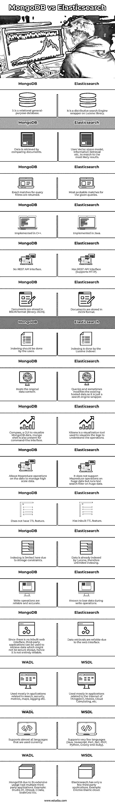

# MongoDB vs Elasticsearch

> 原文：<https://www.educba.com/mongodb-vs-elasticsearch/>

## MongoDB 和 Elasticsearch 的区别

这个世界现在围绕着大数据分析、机器学习和人工智能。毫无疑问，它让我们的生活变得更加轻松。实现这一目标所涉及的数据非常庞大，管理、修改和整理所提供的信息并不是一件容易的事情。MongoDB 是 NoSQL 类别下的一个基于文档的数据库，不需要模式。数据以键值对的形式存储在称为文档的 BSON(二进制 JSON)文件中。JSON 格式有助于以人类可读的形式在客户机-服务器应用程序之间传输数据。Elasticsearch 是一个开源的、高度可扩展的分析和搜索引擎。它是用 Java 开发的，是 Apache Lucene 库的包装器。它由一个 HTTP web API 接口组成。它没有存储所有数据的 JSON 文档模式。在 MongoDB vs Elasticsearch MongoDB 之间，设置它是毫不费力的，因为它没有模式。

### MongoDB 和 Elasticsearch 的面对面比较(信息图)

以下是 MongoDB 和 Elasticsearch 之间的主要对比:

<small>Hadoop、数据科学、统计学&其他</small>

### MongoDB 和 Elasticsearch 的特点

让我们研究一下 MongoDB 和 Elasticsearch 的一些重要特性:

*   如前所述，MongoDB 是一个数据库，而 Elasticsearch 是一个分布式搜索引擎。在当前场景中，我们可以看到 Elasticsearch 被用作通用数据库。尽管数据库和搜索引擎在用途上是可以互换的，但从根本上说，它们是完全不同的实体。
*   选择数据库/搜索引擎完全基于应用程序及其需求。在涉及许多数据写查询的情况下，MongoDB 是更好的选择。当记录或子记录被更新时，所有记录的索引都需要被重新索引。使用 MongoDB 这要容易得多。对于需要快速获取查询的应用程序，elastics 搜索要快得多。它有一个内置的 TTL 功能和广泛的索引。
*   与数据库不同，搜索引擎不能保证准确的结果。它们按照结果与给定查询的接近程度对所有结果进行排序。碰巧最接近的匹配结果是精确的。数据库的工作方式不同。这里不涉及概率。要求仔细编写查询，因为它们与查询完全匹配，并且过滤器取决于执行的顺序。例如，如果查询的数据满足 3 个不同的过滤器，则整个数据集与第一个过滤器匹配，第一个过滤器返回匹配结果的子集。第二个过滤器与第一个过滤器匹配的数据相匹配，依此类推…因此，这对于设计查询是必不可少的。如果先前的查询不匹配任何数据，将不会返回任何数据。
*   MongoDB 有各种高级索引方法，如地理空间索引，有助于更快地检索数据。唯一的缺点是它是内置的，不像弹性搜索，它没有 API 接口来使用这个特性。弹性搜索是一个分布式搜索引擎，结合了 HTTP 网络接口。
*   MongoDB 的索引有限；因此，数据检索更快，而 Elasticsearch 更好地确保了检索数据的可靠性和准确性。

### MongoDB 和 Elasticsearch 的相似之处

让我们来看看 MongoDB 和 Elasticsearch 之间的一些相似之处:

*   它们都在没有模式的 JSON 文档中存储数据。
*   两者都支持索引数据，尽管每一个都有其复杂和简单的程度。
*   两者都用于需要处理的庞大数据集。
*   两者都支持数据分片(基于存储管理索引的分区)。
*   两者都是由开源社区开发的，因此都有详细的文档。
*   两者都支持并发。可以创建同一数据的多个实例，并且可以对实例保存的数据执行各种操作。

### MongoDB 和 Elasticsearch 的比较

以下是 MongoDB 和 Elasticsearch 的十大对比:

| **MongoDB** | **弹性搜索** |
| 它是一个关系型通用数据库。 | 它是 Lucene 库上的分布式搜索引擎包装器。 |
| 通过比较文档来检索数据。 | 使用向量空间模型、信息检索等..来匹配最可能的结果。 |
| 将返回与查询筛选器完全匹配的内容。 | 给定查询的最可能匹配 |
| 用 C++实现 | 用 Java 实现 |
| 没有 REST API 接口 | 有 REST API 接口(支持 HTTP) |
| 文档以 BSON 格式(二进制 JSON)存储。 | 文档以 JSON 格式存储。 |
| 用户应该做索引。 | Lucene 索引器做索引。 |
| 承载原始数据内容 | 查询，有时会修改现有的托管数据，因为它只是一个搜索引擎包装。 |
| Compass 是一个可视化 MongoDB 数据的 GUI，mongo shell 也用于命令行界面。 | Kibana 是一个可视化工具，用于可视化日志以理解操作。 |
| 允许对数据进行 Mapreduce 操作来管理大规模数据 | 它不支持对海量数据的 Mapreduce 操作，但对海量数据运行文本搜索过滤器。 |
| 不具备 TTL 功能 | 内置 TTL 功能 |
| 由于存储限制，索引在这里受到限制。 | 因此，Lucene 已经无限索引了索引数据。 |
| 写操作是可靠和准确的。 | 已知在写入操作期间会丢失数据 |
| 由于没有内置的 web 界面，第三方应用程序可以用来检索不总是安全的数据；因此，它并不完全可靠。 | 由于网络接口，数据检索是可靠的。 |
| 主要用于与搜索、安全、指标、地图、日志记录等相关的应用。 | 主要用于物联网(IoT)、移动、云计算等相关应用。 |
| 支持目前使用的几乎所有语言 | Supports very few languages

(Java，Javascript，Perl，。Net、PHP、Python、Groovy 和 Ruby)

 |
| 由于其广泛的使用，MongoDB 有多个第三方应用程序。例如:Studio 3T、DHawk、CData、ScaleGrid 等。 | Elasticsearch 只有少数几个第三方应用。例如:德雷米奥弹性云 |

### 结论

总的来说，MongoDB 和 elastic search 在工作上看起来很相似，但本质上非常不同。选择哪一个完全取决于组织及其应用程序。上面给出了利弊的详细描述，以便对这两个实体有一个简要的了解。

### 推荐文章

这是 MongoDB vs Elasticsearch 的指南。在这里，我们讨论 MongoDB 和 Elasticsearch 的介绍、特性、相似性和比较。您也可以浏览我们的其他相关文章，了解更多信息——

1.  [MongoDB vs Cassandra](https://www.educba.com/mongodb-vs-cassandra/)
2.  [MongoDB vs 甲骨文](https://www.educba.com/mongodb-vs-oracle/)
3.  [什么是 MongoDB？](https://www.educba.com/what-is-mongodb/)
4.  [弹性搜索备选方案](https://www.educba.com/elasticsearch-alternatives/)

