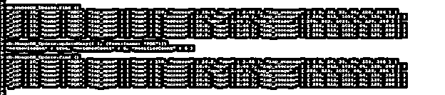
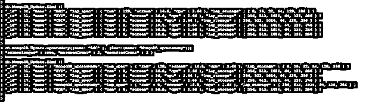
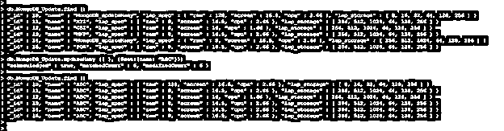
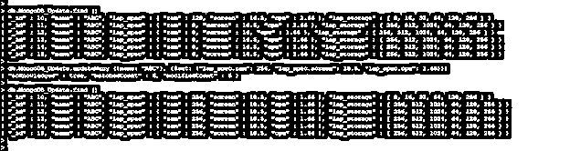
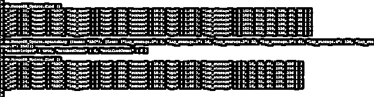
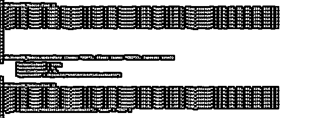

# Mongodb updateMany

> 原文： [https://www.educba.com/mongodb-updatemany/](https://www.educba.com/mongodb-updatemany/)

**

** 

## Mongodb updateMany 简介

Mongodb updateMany 方法用于更新符合查询选择标准的所有文档，我们可以说 updateOne 方法将只更新单个文档，而 updateMany 方法将更新符合我们选择标准的所有文档。如果我们没有使用任何选择标准或者我们传递了空的{ }，那么将使用 updateMany 方法从集合中更新所有文档。MongoDB updateMany 许多方法会将新字段添加到文档中，还会在结果中返回匹配的计数和更新的行。

**语法**

<small>Hadoop、数据科学、统计学&其他</small>

下面是 updateMany 的语法。许多方法如下。我们可以使用这种方法更新多个文档。

`db.name_of_collection.updateMany (
{Selection criteria of update query using updateMany method}, {$set operator} {Upsert (optional), writeConcern (Optional), collation (optional), arrayFilters (Optional), hint (optional)}
)`

**MongoDB****中** **findOneAndUpdate 方法的参数说明。**

*   **集合名称–**该参数被定义为集合名称，我们使用 updateMany 方法来更新多个文档。
*   **update many****–**这个方法在 MongoDB 中用于从一个查询中更新多个文档。
*   **更新查询的选择条件—**本节定义了更新单据的选择条件。我们更新了哪些文档，这在选择标准中有定义。
*   **$set 操作符–**该操作符在 MongoDB 中用于更新任何文档。它将用新值更新或替换现有值。
*   **up sert–**这是一个可选参数，用于 MongoDB 中的 updateMany 方法。要在 updateMany 方法中使用该参数，我们需要在查询中将该参数值定义为 true。此参数的默认值为 false。
*   **write concern–**我们只能在不需要该参数的默认值时使用该参数。updateMany 方法中 writeConcern 参数的类型是文档。
*   **Collation–**这也是 MongoDB 中 updateMany 方法使用的默认参数。该参数将指定 MongoDB 中排序规则操作的使用。在 updateMany 方法中使用此参数时，它将允许用户使用特定于语言的规则。
*   **array filters–**update many 方法中该参数的类型为数组。此参数显示了我们使用 updateMany 修改的数组
*   **提示–**这指定我们是否使用索引来过滤数据。这也是 MongoDB 中使用 updateMany 方法的可选参数。

### 在 Mongodb 中 updateMany 是如何工作的？

*   MongoDB updateMany 方法主要用于在单个查询中更新集合中的多个文档。
*   我们在选择标准中定义的所有文档都已更新。如果我们没有使用任何选择标准，那么来自该特定集合的所有文档都将被更新。
*   下面的例子显示，当我们没有使用任何选择标准时，集合中的所有文档都将被更新。

**代码:**

`> db.MongoDB_Update.find ()
> db.MongoDB_Update.updateMany ({ }, {$set: {name: "PQR"}})
db.MongoDB_Update.find ()`

*   在上面的例子中，我们可以看到，我们没有使用任何选择标准来更新文档，只是使用了一个集合操作符来更新现有的值。
*   虽然没有使用任何标准，但我们可以看到 MongoDB_Update 集合中的所有文档都将从 ABC 更新为 PQR。
*   基本上，我们在 MongoDB 的 updateMany 方法中使用了三个参数。
*   过滤器
*   更新
*   选择
*   在 MongoDB 中使用 updateMany 方法时，Filter 和 update 参数是必需的，而 options 参数是可选的。
*   update MongoDB 中的许多方法将返回确认，要么为真，要么为假。matched count 将返回与我们的选择标准相匹配的文档数。修改后的计数将返回我们使用 updateMany 方法更新的已更新文档的计数。

### 例子

*   下面是 update 的例子，MongoDB 中的很多方法如下。

**使用选择标准更新多个文档—**

*   在下面的例子中，我们使用选择标准更新了多个文档。我们已经在从 ABC 到 MongoDB_updateMany 的更新名称上使用了选择标准。
*   我们可以看到所有包含 ABC 名称的文档都将被更新。

**代码:**

`> db.MongoDB_Update.find ()
> db.MongoDB_Update.updateMany ({name: "ABC"}, {$set:{name: "MongoDB_updateMany"}})
> db.MongoDB_Update.find ()`

**不使用选择标准更新多个文档—**

*   在下面的例子中，我们在没有使用选择标准的情况下更新了多个文档。我们没有使用选择标准，所以所有的文件将被更新为名称 ABC。
*   我们可以看到所有的文档都将从集合 MongoDB_Update 中更新。

**代码:**

`> db.MongoDB_Update.find ()
> db.MongoDB_Update.updateMany ({ }, {$set:{name: "ABC"}})
db.MongoDB_Update.find ()`

**使用** **更新多** **方法-**更新嵌入文档

*   在下面的例子中，我们已经更新了嵌入的文档。我们已经为 ABC 字段的名称更新了 lap_spec 集。

**代码:**

`> db.MongoDB_Update.find ()
> db.MongoDB_Update.updateMany ({name: "ABC"}, {$set: {"lap_spec.ram": 256, "lap_spec.screen": 18.5, "lap_spec.cpu": 1.66}})
db.MongoDB_Update.find ()`

**使用** **updateMany** **方法-**更新数组元素

*   在下面的例子中，我们已经更新了数组元素文档。我们已经为 ABC 的名称更新了 lap_storage 数组。

**代码:**

`> db.MongoDB_Update.find ()
> db.MongoDB_Update.updateMany ({name: "ABC"}, {$set: {"lap_storage.0": 8, "lap_storage.1": 16, "lap_storage.2": 32, "lap_storage.3": 64, "lap_storage.4": 128, "lap_storage.5": 256}})
db.MongoDB_Update.find ()`

**使用** **更新多个** **方法-**更新插入参数

*   在下面的例子中，我们使用了 upsert 参数。我们已将 PQR 的名字更新为 CBZ。
*   在选择标准中，我们没有发现任何名字为 PQR，所以 upsert 参数将在集合中插入新文档，我们可以看到新文档被插入到集合中。

**代码:**

`> db.MongoDB_Update.find ()
> db.MongoDB_Update.updateMany ({name: "PQR"}, {$set: {name: "CBZ"}}, {upsert: true})
> db.MongoDB_Update.find ()`

### 结论

MongoDB updateMany 方法用于更新集合中的多个文档。我假设我们没有在选择标准中定义任何选择，那么所有的文档都将从指定的集合中更新。在 MongoDB 的 updateMany 方法中，我们有一个传递过滤器、更新和可选参数。

### 推荐文章

这是一个 Mongodb updateMany 的指南。在这里，我们将讨论 updateMany 在 Mongodb 中是如何工作的，并给出一些例子。您也可以看看以下文章，了解更多信息–

1.  [MongoDB 分组依据](https://www.educba.com/mongodb-group-by/)
2.  [MongoDB 日期查询](https://www.educba.com/mongodb-date-query/)
3.  [蒙戈布进口](https://www.educba.com/mongodb-import/)
4.  [MongoDB 监控](https://www.educba.com/mongodb-monitoring/)

