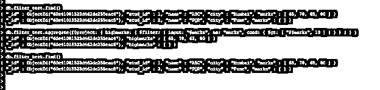
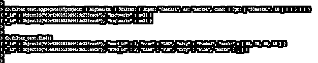
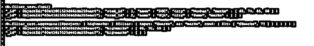
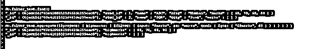

# MongoDB 过滤器

> 原文：<https://www.educba.com/mongodb-filter/>

## MongoDB 过滤器的定义

Mongodb 过滤器聚合是在版本 3.2 中添加的，它用于选择数组的子集，并使用指定的条件返回结果。filter 操作符将返回一个匹配指定条件的元素数组，它将按原始顺序返回元素。我们需要用 filter operator 传递 input、as 和 cond 参数，在 MongoDB 中使用 filter operator 时，input 和 cond 是强制参数，而“as”是可选参数。在 MongoDB 中使用 filter 操作符时，我们需要在 filter 关键字前使用$ sign。

**语法:**

<small>Hadoop、数据科学、统计学&其他</small>

下面是 MongoDB 中 filter 操作符的语法。

`{$filter: {input: <array used as input string>, as: <The type of as keyword is string>, cond: <expression is used to evaluate the array elements>}}`

**MongoDB 中 filter 运算符的参数描述语法。**

1)Filter–Filter 运算符用于根据指定条件返回结果。我们在 MongoDB 中使用了一个过滤器操作符，根据我们在查询中给出的条件过滤结果。

2)输入–这是一个用于在数组中解析的表达式。在输入参数中，我们传递了数组字段来过滤文档。在过滤器操作符中使用输入字段参数之前，我们需要使用$符号。

3)As–它是过滤器操作符中使用的可选参数。这是在输入数组中用作元素的变量名。filter 运算符中此参数的类型是字符串。通过使用“as”关键字，可以从输入数组的每个元素中访问该表达式。

4)Cond–该参数用于确定我们应该在哪里包含来自结果数组的元素。筛选运算符中此参数的类型是表达式。我们使用表达式从指定的集合中过滤数据。我们可以使用多个条件操作符来过滤数组元素中的数据。

### MongoDB 中的过滤器是如何工作的？

MongoDB filter 用于使用我们在查询中使用的指定条件从数组中过滤数据。如果文档数组包含空值，那么使用 filter 操作符的结果将返回空数组。下面的例子表明，当我们的集合文档包含一个空数组时，filter 操作符将返回一个空数组集。

**代码:**

`db.filter_test.find ()
db.filter_test.aggregate ({$project: { highmarks: { $filter: { input: "$marks", as: "marks", cond: { $gt: [ "$$marks", 10 ] } } } } } )`

**Figure–Filter 运算符将在结果中返回空的文档集。**

*   在上面的例子中，我们可以看到第二个文档有一个空的数组集，所以在这个字段上使用过滤器后，它将返回空的数组集。
*   我假设我们在不包含数组元素的字段上使用了过滤器，那么过滤器操作符将在输出中返回一个错误。
*   如果数组元素的字段包含空值而不是数组元素，则使用 filter 运算符的数组字段的结果是空值。
*   使用 filter 操作符，我们还使用条件来过滤数组元素以检索数据。
*   我们可以使用 MongoDB 中的 filter 操作符对数组字段使用下面的条件操作符。

1)大于((>)或$gt)
2)小于((<)或$lt)
3)大于等于((> =)或$gte)
4)小于等于((< =)或$lte)

使用上述条件，我们可以按照我们在查询中使用的条件检索数据。

我假设我们对集合中不存在的字段应用了过滤器，那么数组元素的结果包含空值。

在下面的例子中，我们可以看到我们已经对 marks1 字段应用了一个过滤器，但是这个字段没有出现在 filter_test 集合中。因此，使用筛选运算符的该字段的结果包含一个空值。

**代码:**

`db.filter_test.aggregate({$project: { highmarks: { $filter: { input: "$marks1", as: "marks1", cond: { $gt: [ "$$marks1", 10 ] } } } } } )
db.filter_test.find ()`

**图–如果集合中不存在数组字段，过滤运算符返回空值。**

### 例子

下面的例子展示了 MongoDB 中的 filter 操作符。

#### 1)使用大于条件过滤数组元素的过滤运算符

在下面的例子中，我们使用了一个带有大于条件的过滤运算符来过滤数组元素中的数据。我们在标记字段上使用了过滤运算符，并使用大于条件从大于 65 的数组元素中检索标记。

**代码:**

`db.filter_test.find ()
db.filter_test.aggregate({$project: { highmarks: { $filter: { input: "$marks", as: "marks", cond: { $gt: [ "$$marks", 65 ] } } } } } )`

**图–使用大于条件过滤数组元素的过滤运算符示例。**

#### 2)使用小于条件过滤数组元素的过滤运算符

在下面的例子中，我们使用了一个带有小于条件的过滤运算符来过滤数组元素中的数据。我们在标记字段上使用了过滤运算符，并使用小于 75 的条件从数组元素中检索标记。

**代码:**

`db.filter_test.find ()
db.filter_test.aggregate({$project: { highmarks: { $filter: { input: "$marks", as: "marks", cond: { $lt: [ "$$marks", 75 ] } } } } } )`

**图–使用小于条件过滤数组元素的过滤运算符示例。**

#### 3)使用大于等于条件过滤数组元素的过滤运算符

在下面的示例中，我们对标记字段使用了过滤运算符，并使用大于等于条件从大于等于 65 的数组元素中检索标记。

**代码:**

`db.filter_test.find ()
db.filter_test.aggregate({$project: { highmarks: { $filter: { input: "$marks", as: "marks", cond: { $gte: [ "$$marks", 65 ] } } } } } )`

**图–使用大于等于条件过滤数组元素的过滤运算符示例。**

### 结论

MongoDB filter 操作符用于过滤数组字段中的元素。我们可以使用$gt、$lt、$gte 和$lte 等多个条件从数组元素中检索数据。我想我们已经在空数组字段上使用了过滤器操作符，它将在输出中返回空结果。

### 推荐文章

这是一个 MongoDB 过滤器的指南。在这里，我们讨论了 MongoDB 中过滤器的定义、语法和工作原理。示例和代码实现。您也可以看看以下文章，了解更多信息–

1.  [MongoDB 加入](https://www.educba.com/mongodb-join/)
2.  [MongoDB findOne()](https://www.educba.com/mongodb-findone/)
3.  [MongoDB 分组依据](https://www.educba.com/mongodb-group-by/)
4.  [MongoDB 数据库](https://www.educba.com/mongodb-database/)

