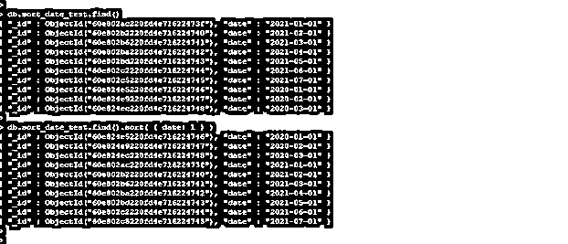
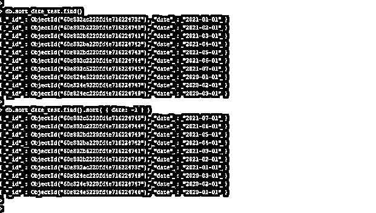
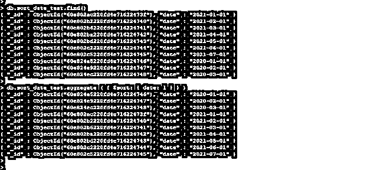
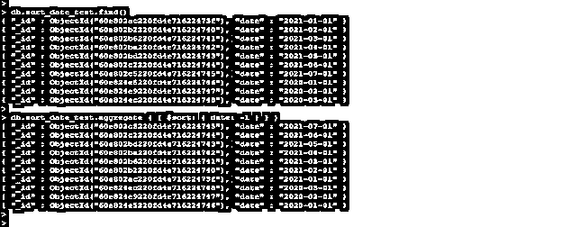

# MongoDB 按日期排序

> 原文：<https://www.educba.com/mongodb-sort-by-date/>

## MongoDB 按日期排序的定义

MongoDB sort by date 用于对日期字段进行升序或降序排序，我们可以使用 MongoDB 中的 sort 方法对日期进行排序。我们还可以使用 aggregate 方法对 MongoDB 中的日期和时间戳字段进行排序。我们需要向日期字段传递-1 或 1 值来对数据进行排序。如果我们用日期字段传递-1 值，我们的结果以降序显示，如果我们用日期字段传递 1 值，我们的结果以升序显示。

**语法:**

<small>Hadoop、数据科学、统计学&其他</small>

下面是 MongoDB 中按日期排序的语法。

1) `db.collection_name.find ().sort ( { name_of_date_field : 1 (Display the date in ascending order)} )`

2) `db.collection_name.find ().sort ( { name_of_date_field : -1 (Display the date in descending order) } )`

3) `db.collection_name.aggregate ( { $sort: { name_of_date_field : -1 (Display the date in descending order) } } )`

4) `db.collection_name.aggregate ( { $sort: { name_of_date_field : 1 (Display the date in ascending order) } } )`

**MongoDB 按日期排序的参数描述语法。**

1)集合名称–这被定义为集合的名称，该名称与排序方法一起使用，以按照升序或降序对日期字段进行排序。

2)Find——这个方法用于显示由 MongoDB 中的 sort 方法排序的文档的结果。我们可以使用 MongoDB 中的 find 方法显示集合文档的结果。

3)排序–该方法用于按照升序或降序对日期字段进行排序。为了对集合字段的数据进行排序，我们需要用 sort 方法定义字段的名称。

4)日期字段名称–该参数定义为我们应用排序方法，按升序或降序显示日期采集结果的日期字段的名称。

5) 1 或-1–该值与排序方法一起使用，按升序或降序显示结果。

6)Aggregate——这个方法用来代替 find 方法，使用 MongoDB 中的 sort 方法对日期类型的文档进行排序。我们还可以使用多个字段和排序方法，按照升序或降序对结果进行排序。

### 如何在 MongoDB 中按日期排序？

我们可以使用 sort 方法对 MongoDB 中的日期进行排序。我们可以按照升序或降序对结果进行排序。为了使用升序显示结果，我们需要使用参数值 1，如果假设我们需要使用降序显示结果，我们需要使用参数值-1。如果假设我们没有使用任何值使用日期字段，或者假设我们已经定义了任何其他值，查询将返回错误。

下面的示例显示，当我们没有使用任何值或在 sort 方法中使用除 1 和-1 之外的不同值时，查询会返回错误。

**代码:**

`db.sort_date_test.find ().sort ( { date: 2 } )
db.sort_date_test.find ().sort ( { date: } )`

**Figure–当我们没有使用任何值或在排序方法中使用除 1 和-1 之外的不同值时，查询返回错误。**

在上面的第一个例子中，我们在 sort 方法中使用了两个值来显示日期字段的结果。但是它会显示错误消息，说明排序规范不正确，因为有效值只有 1 或-1。在第二个例子中，我们必须用 sort 方法传递空值来显示日期字段的结果。但是它会显示语法错误消息，因为我们需要传递一个有效值，即 1 或-1。

我们可以使用聚合方法对数据进行排序，聚合方法对于按升序或降序对日期字段进行排序非常有用。我们还可以使用 order by 操作符对 MongoDB 中的日期类型字段文档进行排序。使用任何运算符时，我们都需要指定升序或降序的值。

我们还可以使用 MongoDB 中的 sort 方法对时间戳字段进行排序。我们可以按照升序或降序对时间戳字段进行排序。使用聚合我们可以对时间戳和日期进行排序，我们可以使用多个操作符和聚合方法来对集合文档的结果进行排序和显示。

### 例子

下面是 MongoDB 中按日期排序的例子。

#### 1)使用排序方法按升序对日期进行排序

以下示例显示了使用 sort 方法按照升序对日期进行排序。我们使用 sort_date_test 集合和日期字段对文档进行排序。我们在日期字段中使用了值 1，以便按照升序对日期字段进行排序。

**代码:**

`db.sort_date_test.find ()
db.sort_date_test.find ().sort ( { date: 1 } )`

**图–使用排序方法按照升序对日期进行排序的示例。**

#### 2)使用排序方法按降序对日期进行排序

以下示例显示了使用排序方法按降序对日期进行排序。我们使用 sort_date_test 集合和日期字段对文档进行排序。我们将值 as -1 用于日期字段，按照降序对日期字段进行排序。

**代码:**

`db.sort_date_test.find ()
db.sort_date_test.find ().sort ( { date: -1 } )`

**图–使用排序方法按降序对日期进行排序的示例。**

#### 3)使用聚合方法将日期按升序排序

以下示例显示了如何使用 aggregate 方法按照升序对日期进行排序。我们使用值为 1 的日期字段按照升序对文档进行排序。

**代码:**

`db.sort_date_test.find ()
db.sort_date_test.aggregate ( { $sort: { date: 1 } } )`

**图–使用聚合方法按照升序对日期进行排序的示例。**

#### 4)使用聚合方法按降序对日期进行排序

以下示例显示了如何使用 aggregate 方法按降序对日期进行排序。我们使用值 as -1 和日期字段按照降序对文档进行排序。

**代码:**

`db.sort_date_test.find ()
db.sort_date_test.aggregate ( { $sort: { date: -1 } } )`

**图–使用聚合方法按降序排列日期的示例。**

### 结论

我们可以对 MongoDB 中的日期类型字段进行排序，对于日期类型的文档，我们可以使用 sort 和 aggregate 方法。按照升序或降序对日期类型的文档进行排序。如果我们需要升序排列的日期，那么我们需要用 sort 方法传递 1。

### 推荐文章

这是 MongoDB 按日期排序的指南。这里我们讨论一下定义，语法，如何在 MongoDB 中按日期排序？示例和代码实现。您也可以看看以下文章，了解更多信息–

1.  [MongoDB 时间戳](https://www.educba.com/mongodb-timestamp/)
2.  [MongoDB findOne()](https://www.educba.com/mongodb-findone/)
3.  [MongoDB 分组依据](https://www.educba.com/mongodb-group-by/)
4.  [MongoDB 数据库](https://www.educba.com/mongodb-database/)

