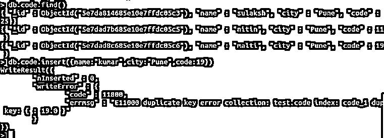
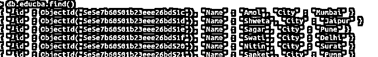
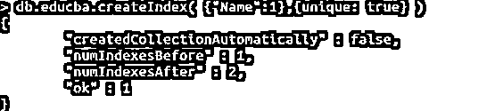
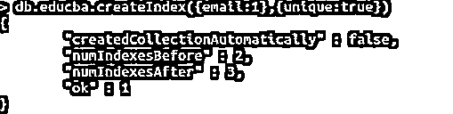
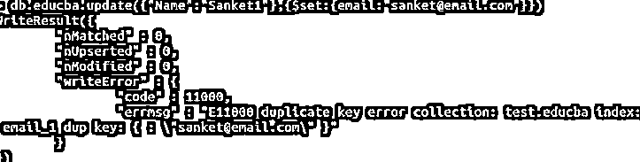

# MongoDB 唯一

> 原文：<https://www.educba.com/mongodb-unique/>

## MongoDB Unique 简介

MongoDB 的 Unique 约束确保其中索引的字段不会为同一个字段存储重复值，即确保字段的唯一性。默认情况下，在插入新数据时，MongoDB 在“_id”字段上强制执行这个惟一的约束。主要职责之一是确保没有重复的数据存储在一个键中。我们在这里也有限制，比如 MongoDB 将不能在任何特定的字段上建立唯一的索引，以防集合已经存储了任何违反索引的唯一约束特性的数据。

**语法**:

<small>Hadoop、数据科学、统计学&其他</small>

既然我们已经理解了 MongoDB 中的惟一约束，那么让我们学习编写这个惟一方法的标准语法。

`db.collection_name.createIndex( {field_name : 1} , {unqiue : true} )`

**解释:**现在，正如您在上面的语法中看到的，我们已经创建了一个简单的索引，这意味着存储在集合中的数据将被索引，并且添加带有“{unqiue: true}”的参数实现了唯一约束。

### 唯一约束在 MongoDB 中是如何工作的？

如果同一集合中没有其他文档具有相同的索引键和值，那么唯一索引允许将文档中的值插入和存储到集合中。unique 约束可以在复合索引上实现。这有助于 MongoDB 在组合索引键值时实现惟一性。在 MongoDB 中，可以对独立的多个文档进行惟一约束，这是避免在不同的文档中为索引键存储相同值的一个重要功能。

MongoDB 中的 Unique 约束将只允许索引键具有相同值的单个文档。如果我们试图为单个索引键插入相同的值，将会导致错误。

**查询#1**

`db.code.find()`

这将返回集合中的每个文档。

**查询#2**

`db.code.insert( { name:”kumar”, city:“Pune”, code:19 } )`

这是试图插入具有相同代码的记录。

**代码:**

`db.code.find()`

**输出:**

**解释:**这里，我们实现了“code”键的惟一索引，因此当我们试图存储一个具有现有代码的文档时，会导致“重复键错误”。

#### 空值的唯一约束

当我们存储任何文档时，我们存储各个键的值，它是按照索引存储的。但是，如果我们试图存储一个没有特定值或数据的文档，对于任何不确定的键，该文档都将被存储，而空值将作为空值存储在该文档中。在 MongoDB 中，只允许在缺少单个索引字段的情况下存储文档上的。

### 在 MongoDB 中实现唯一约束的示例

在不同的文档上实现唯一约束，以避免在两个不同的文档中为索引键存储相同的值。

#### 示例#1

我们将尝试插入和存储具有重复值的文档。我们有一个名为 educba 的集合，我们将使用 find 方法检查它:db.educba.find()

**代码:**

`db.educba.find()`

**输出:**

如上图所示，我们有一个名为 educba 的集合，文档有一个默认的惟一的“_id”和另外两个键。我们现在将在“Name”上实现 unique 约束，这将使它成为唯一的、重复插入证明。

**代码:**

`db.educba.createIndex( { “Name” : 1 } , { unique : true } )`

**输出:**

使用> db . educba . create index({ " Name ":1，{ unique: true})我们实现了 Name 键的唯一约束。在返回消息中，我们有“ok”和其他详细信息。现在让我们尝试插入一个新文档，然后用相同的值重新插入它。请参考下面的屏幕截图以获得正确的输出。

**代码:**

`db.educba.insert({ Name : "Sulaksh" ,  City : "Pune" })`

**输出:**

**第一次查询:** `db.educba.insert({ Name : "Sulaksh" ,  City : "Pune" })`

上述查询将被成功插入。然后，我们尝试插入相同的查询，即具有相同值的相同文档，但它导致了一个错误，该错误为“terms”:“e 11000 重复键错误集合:test . educba index:Name _ 1 dup key:{:\ " Sula ksh \ " }”。这使得我们的惟一约束成功地应用于 Name 字段。

#### 实施例 2

我们现在将在 Key 上实现唯一值约束，它保存电子邮件值。我们将更新我们的文档，以添加另一个电子邮件字段。然后，我们将在电子邮件字段中添加另一个索引，以避免为多个文档存储相同的电子邮件 id。

**代码:**

`db.educba.createIndex( {email : 1},{unique : true} )`

**输出:**

我们不会尝试插入另一个文档中已经存在的具有不同名称但电子邮件 id 的文档。预期是插入操作将不会工作，并通过我们的重复值的错误。出于测试目的，我们有另一个名称稍有不同的文档:Sanket1，现在我们将尝试用电子邮件:sanket@email.com 来更新该文档。

**代码:**

`db.educba.update( { “Name” : ”Sanket1” } , { $set : {email : “[sanket@gmail.com](mailto:sanket@gmail.com)” }})`

上面的查询旨在搜索名为:Sanket1 的记录，并通过向文档添加电子邮件 id 来更新记录，这里$set 将为文档添加一个字段。

**输出:**

正如您在上面的屏幕截图中看到的，当我们试图用不同的名称字段更新记录时，该电子邮件与一个现有的文档相同。它向我们抛出了一个写错误，这意味着在写文档时发生了错误。错误声明“重复键错误集合:测试。educba 索引:email_1 dup key”。这个错误指出了问题所在，让我们明白了事情的真相。就像在我们的例子中，值为“[sanket@email.com](mailto:sanket@email.com)”的电子邮件是重复的，已经存储，因此由于电子邮件字段的唯一索引，它不会再次存储。如果您想知道的话，我已经使用了$get 的更新为现有记录添加了另一个字段。

**本例的用例:**是新用户注册，我们必须确保单个邮件 id 不会用于创建多个帐户。

### 结论

实现 Unique 约束将限制数据库存储相同索引键的重复值来包装它。此功能有助于存储具有唯一性的文档。我们学习并理解了它的语法和工作原理。然后，我们通过示例实现了唯一约束，并通过截图分别理解了唯一约束。

### 推荐文章

这是 MongoDB Unique 的指南。在这里我们讨论一个介绍，如何独特的作品和例子，以便更好地理解。您也可以浏览我们的其他相关文章，了解更多信息——

1.  [MongoDB 收藏](https://www.educba.com/mongodb-collection/)
2.  [在 MongoDB 中查找](https://www.educba.com/lookup-in-mongodb/)
3.  [MongoDB 中的索引](https://www.educba.com/indexes-in-mongodb/)
4.  [MongoDB GUI 工具](https://www.educba.com/mongodb-gui-tools/)
5.  [MongoDB insert |如何工作？](https://www.educba.com/mongodb-insert/)
6.  [MongoDB 更新|如何工作？](https://www.educba.com/mongodb-update/)

