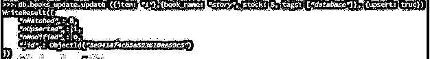
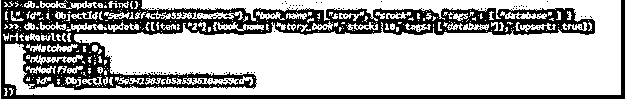
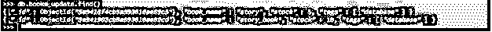
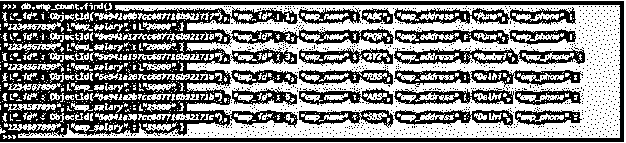
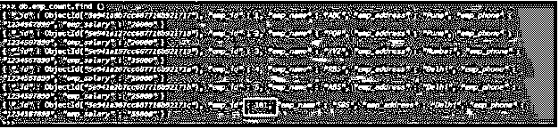
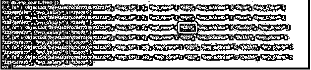

# MongoDB 更新

> 原文：<https://www.educba.com/mongodb-update/>

## MongoDB 更新简介

MongoDB Update 方法用于从集合中更新文档，Update 方法将更新现有文档的值。我们在更新文档时使用了一个$set 操作符。我们可以使用 update 或 updateOne 方法更新单个文档。如果我们想在一个更新命令中更新多个文档，我们必须更新许多方法。使用 update 方法，我们可以在一条语句中更新单个以及多个文档。在 MongoDB 中，update 方法对于更新文档是必不可少的，也是非常有用的。

### 句法

下面是更新方法的语法:

<small>Hadoop、数据科学、统计学&其他</small>

`collection_name.update (document)`

运筹学

`collection_name.update (< query>, <update>)
{
Upsert:  <Boolean>
Multi: <Boolean>
Writeconcern:  <document>
Collation: <document>
ArrayFilters:  [<filterdocument1>, …] } )`

运筹学

`collection_name.updateOne (Document) – Update single document`

运筹学

`collection_name.updateMany (Multiple Documents) – Update multiple document`

运筹学

`collection_name.findOneAndUpdate (Selection_critera_of_document, Updated_data_of_document)`

### MongoDB 更新的参数描述

*   **集合名称:**集合名称定义为使用 update 方法从集合中更新文档。我们可以使用 updateOne 和 update many 方法一次更新单个和多个文档。
*   **文档:**文档定义为我们必须使用更新方法更新集合的数据。我们可以一次更新一个或多个文档。
*   Write concern:这是 update 方法的可选参数。
*   **查询:**查询定义为更新操作的单据选择标准。使用查询，我们必须定义更新的选择标准。
*   **Update:** Update 方法用于从集合中更新文档；update 方法将更新现有文档的值。更新方法是必要且有用的。
*   **Upsert:** 更新方式的可选参数。当我们更新的查询与现有文档不匹配时，它将创建一个新文档。
*   **Multi:** 当我们的查询符合标准时，它将从单个查询中更新多个文档。它是 update 方法的可选参数。
*   **排序规则:**排序规则用于允许用户为字符串比较指定特定于语言的规则。它是 update 方法的可选参数。
*   **数组过滤器:**是 update 方法的可选参数。它将过滤一个数组，该数组指定哪些文档元素修改数组字段中的更新操作。
*   **更新一个:**更新一个方法用于更新单个文档。如果我们想要更新一个单独的文档，那么我们必须使用 update 方法。
*   **更新多:**更新多种方式用于更新多张单据。如果我们想在一个语句中更新多个文档，我们使用了很多方法。
*   **查找一个并更新:**该方法用于查找并更新文档。

### MongoDB 中 Update 命令的工作方式

下面是 MongoDB 中 update 命令的工作方式。

*   在 MongoDB 中，update 方法对于更新文档是必不可少的，也是非常有用的。
*   使用 update 方法，我们可以在 MongoDB 的一个语句中更新单个和多个文档。
*   我们可以使用 update 或 updateOne 方法更新单个文档。如果我们想在一个更新命令中更新多个文档，我们必须更新许多 MongoDB 方法。
*   MongoDB update 方法用于从集合中更新文档；MongoDB 中的 update 方法将更新现有文档的值。
*   我们在更新文档时使用了一个$set 操作符。
*   在 MongoDB 中使用 Upsert 方法时，当文档不在集合中时，它将插入文档。在 MongoDB 中使用 Upsert 方法更新文档时，也会自动创建集合。
*   以下示例显示了当集合中不存在该文档时，Upsert 方法将自动插入该文档。

`use db_update`

`db.books_update.update ({item: "1"},{book_name: "story", stock: 5, tags: ["database"]}, {upsert: true})`

`db.books_update.find()`

`db.books_update.update ({item: "2"},{book_name: "story_book", stock: 10, tags: ["database"]}, {upsert: true})`

`db.books_update.find()`

**解释:**在第一个例子中，我们使用 MongoDB 中的 update 和 upsert 方法插入了一个文档。在插入时，我们已经创建了一个 books_update 集合。

### 实现 MongoDB 更新的示例

下面是 MongoDB 中更新方法的例子。我们以 emp_count 表为例来描述 MongoDB 的 update 方法，如下所示。下面是 emp_count 表的数据描述如下。

**代码:**

`use emp_count
db.emp_count.find ()`

**输出:**

#### 示例#1

使用 Update 方法更新单个文档:在下面的示例中，我们使用 update 方法更新了单个文档。我们已经通过使用 MongoDB 中的 update 方法将 emp_id 值从 6 更新为 101。

**代码:**

`db.emp_count.update({'emp_id': 6},{$set:{'emp_id': 101}})
db.emp_count.find ()`

**输出:**

#### 实施例 2

使用 UpdateOne 方法更新单个文档:在下面的示例中，我们使用 update 方法更新了单个文档。我们已经使用 update 方法将 emp_id 值从 5 更新为 100。

**代码:**

`db.emp_count.updateOne({'emp_id': 5}, {$set: {'emp_id': 100}})
db.emp_count.find ()`

**输出:**

#### 实施例 3

使用 update many 方法更新多个文档:在下面的例子中，我们使用 update many 方法更新了多个文档。我们已经使用 MongoDB 中的 update many 方法将 emp_name 值从 XYZ 更新到 CBA。

**代码:**

`db.emp_count.updateMany ({'emp_name': "XYZ"}, {$set:{'emp_name': "CBA"}})>
db.emp_count.find ()`

**输出:**

### 结论

MongoDB update 方法用于从集合中更新文档；MongoDB 中的 update 方法将更新现有文档的值。我们在更新文档时使用了一个$set 操作符。在 MongoDB 中，update 方法对于更新文档是必不可少的，也是非常有用的。

### 推荐文章

这是 MongoDB 更新指南。在这里，我们讨论 MongoDB 更新的介绍，语法，它是如何工作的，代码和输出的例子。您也可以浏览我们的其他相关文章，了解更多信息——

1.  [MongoDB 命令](https://www.educba.com/mongodb-commands/)
2.  [MongoDB 列表收藏](https://www.educba.com/mongodb-list-collections/)
3.  [MySQL vs MongoDB](https://www.educba.com/mysql-vs-mongodb/)
4.  [MongoDB Unique | Examples](https://www.educba.com/mongodb-unique/)
5.  [MongoDB vs Elasticsearch 用信息图](https://www.educba.com/mongodb-vs-elasticsearch/)
6.  [MongoDB 投影指南](https://www.educba.com/mongodb-projection/)
7.  [MongoDB insert |如何工作？](https://www.educba.com/mongodb-insert/)

