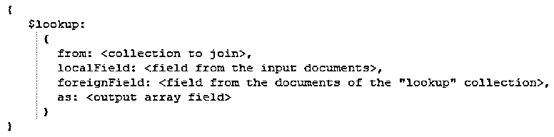
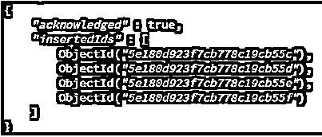
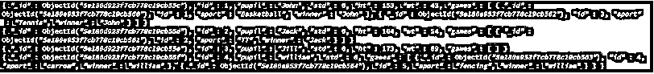
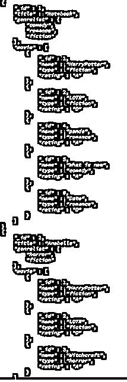
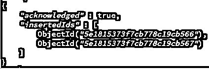
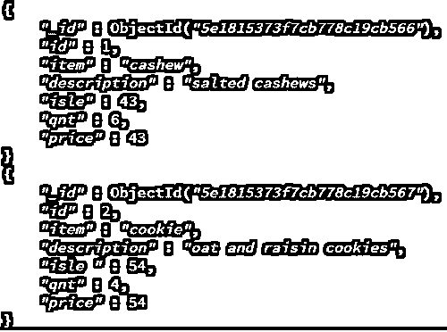
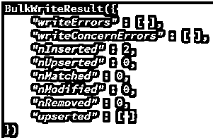
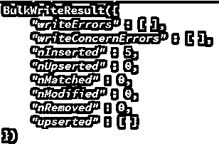
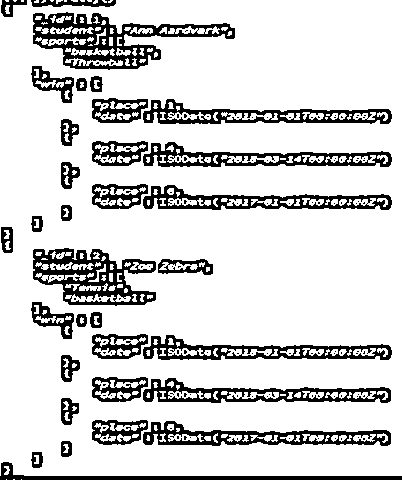

# 在 MongoDB 中查找

> 原文：<https://www.educba.com/lookup-in-mongodb/>

## MongoDB 中的查找介绍

[MongoDB 由](https://www.educba.com/what-is-mongodb/)聚合管道组成，这是一个基于管道化文档概念的框架。文档进入由多个操作符(如 match 和 group)组成的多级管道，以相应地聚合数据。Lookup 是聚合管道阶段之一，它允许将数据从 lookup 集合(从中检索数据以进行联接的集合)联接到输入集合(当前正在执行查询的集合),并返回由 lookup 集合的匹配数据数组组成的文档。在本主题中，我们将学习 MongoDB 中的查找。

**语法:**

<small>Hadoop、数据科学、统计学&其他</small>

**相等匹配$查找**

*   **from:** 这是文档连接的集合
*   **localField:** 这是输入集合中的字段
*   **foreignField:** 这是查找集合中与本地字段匹配的字段
*   **as:** 这是查找集合中所有匹配结果以数组形式存储的字段。**T3】**

**连接和不相关的子查询**

*   **管道化:**管道化是将所有的匹配和过滤器按照执行顺序进行分级
*   **let:** let 用于定义特定表达式中的变量，并访问表达式的返回结果。

### $lookup 的特征

1.  $lookup 支持不相关的子查询和相等匹配。
2.  将 MongoDB 用于数据的应用程序充当 MongoDB 服务器的客户端。$lookup 在服务器端处理数据，这比在客户端执行多个 DB 请求并处理结果要快得多。
3.  $lookup 扫描整个查找集合，查看输入集合中的每个文档是否都匹配所提到的过滤器。因此，对于庞大的数据集，需要像索引这样的高效搜索技术。
4.  在管道中，顺序是至关重要的，因为数据是根据管道中首先提到的操作符/规则进行聚合的。

**对$lookup 使用的约束**

1.  这两个集合应该在同一个数据库中。
2.  应该共享查找集合

### MongoDB 中的查找示例

下面是下面提到的 MongoDB 中的查找示例

#### 1.使用$lookup 的单一等式连接

使用以下文档创建学生集合:

**代码:**

`db.students .insertMany([
{“id” : 1 , “pupil” : “John” , “std” : 6, “ht” : 153 , “wt” : 43},
{“id” : 2 , “pupil” : “Jack” , “std” : 6, “ht” : 164 , “wt” : 54},
{“id” : 3 , “pupil” : “Jill” , “std” : 6, “ht” : 173 , “wt” : 69},
{“id” : 4 , “pupil” : “william” , “std” : 6}
])`

**输出:**

另一个运动集合包含以下文档:

**代码:**

`db.sports .insertMany([
{“id” : 1, “sport” : “Basketball” , “winner” : “John”},
{“id” : 2, “sport” : “TT”             , “winner” : “Jack”},
{“id” : 3, “sport” : “Tennis”       , “winner” : “John”},
{“id” : 4, “sport” : “carrom”      , “winner” : “william”},
{“id” : 5, “sport” : “fencing”      , “winner” : “william”},
{“id” : 6}])`

**输出:**

以下查询分别基于学生和体育中的字段值学生和获胜者，将体育集合中的匹配项联接到学生集合中

**代码:**

`db.students.aggregate([
{
$lookup:
{
from : “sports”,
localField : “pupil”,
foreignField : “winner”,
as : “games”
} } ] )`

当执行上述查询时，会显示以下结果。

**输出:**

#### 2.$用数组查找

使用以下文档创建收藏类型

**代码:**

`db.geners.insertMany( [
{ _id: 1, title: "Notebook", genrelist: [ "comedy", "romance", "fiction" ]},
{ _id: 2, title: "Anabelle", genrelist: [ "horror", "fiction" ]}
])`

**输出:**

使用以下文档创建另一个电影收藏

**代码:**

`db.movies.insertMany( [
{ _id: 1, name: "HarryPotter", "type": "fiction", rating: "A" },
{ _id: 2, name: "LOTR", "type": "fiction", rating: "D" },
{ _id: 3, name: "Witchcraft", "type": "horror", rating: "A" },
{ _id: 4, name: "panda", "type": "romance", rating: "A" },
{ _id: 5, name: "What is new", "type": "comedy", rating: "A" },
{ _id: 6, name: "Date", "type": "romance", rating: "D" }
])`

**输出:**

当查询数组类型的 localField 时，$lookup 将每个元素的值与 lookup 集合中外字段的值进行匹配。它返回一个类似相等匹配的数组。

**代码:**

`db.geners.aggregate([
{
$lookup:
{
from : “movies”,
localField : “genrelist”,
foreignField : “type”,
as : “movie”
} } ] ).pretty()`

当执行上述查询时，会显示以下结果。

**输出:**

#### 3.使用$mergeobjects 的$lookup

$lookup 返回输入集合中与查找集合中的匹配文档相结合的文档，但是原始输入集合中的文档是以包含所有匹配的数组的形式添加的。$mergeobjects 使用户能够根据$lookup 中设置的过滤器修改输入集合中的文档。

创建一个杂货集合，并插入以下文档:

**代码:**

`db.groceries .insertMany([
{“id” : 1 , “item” : “cashew” , “qnt” : 6, “price” : 43},
{“id” : 2 , “item” : “cookie” ,   “qnt” : 4, “price  ” : 54}
])`

**输出:**

创建另一个收藏库并插入以下文档。

**代码:**

`db.stock .insertMany([
{“id” : 1 , “item” : “cashew” , “description” : “salted cashews”, “isle” : 43},
{“id” : 2 , “item” : “cookie” ,   “description” : “oat and raisin cookies”, “isle ” : 54}
])` 

**输出:**

**代码:**

`db.groceries.aggregate([
{
$lookup: {
from: "stock",
localField: "item",
foreignField: "item",
as: "fromItems"
}
},
{
$replaceRoot: { newRoot: { $mergeObjects: [ { $arrayElemAt: [ "$fromItems", 0 ] }, "$$ROOT" ] } }
},
{ $project: { fromItems: 0 } }
])`

这将从股票集合中读取所有匹配的文档，当执行上述查询时，将显示以下结果。

**输出:**

#### 4.不相关子查询

不相关的子查询独立于外部查询。它们在 outer/parent 语句中没有对对象的引用。

创建一个集合运动

**代码:**

`db.sports.insert([
{ "_id" : 1, "student" : "Ann Aardvark", “sports”: [ "basketball","Throwball" ] },
{ "_id" : 2, "student" : "Zoe Zebra", “sports”: [ "Tennis","TT"] },
])` 

**输出:**

**代码:**

`db.winners.insert([
{ "_id" : 1, “sport”: "basketball", “place”: 1, date: new Date("2018-01-01") },
{ "_id" : 2, “sport”: "basketball", “place”: 4, date: new Date("2018-03-14") },
{ "_id" : 3, “sport”: "basketball", “place”:2, date: new Date("2018-07-15") },
{ "_id" : 4, “sport”: "TT", “place”: 6, date: new Date("2017-01-01") },
{ "_id" : 5, “sport”: "TT", “place”: 8, date: new Date("2017-07-16") }
])`

**输出:**

该查询匹配 sport basketball 和 lookup 集合中的所有文档，选择地点和日期，创建一个新的 array 类型的 field win，并将所有匹配存储在数组中。

**代码:**

`db.sports.aggregate([
{
$lookup:
{
from: "winners",
pipeline: [
{ $match: { sport: "basketball" } },
{ $project: { _id: 0, date: { place: "$place", date: "$date" } } },
{ $replaceRoot: { newRoot: "$date" } }
],
as: "win"
}
}
]).pretty()`

当执行上述查询时，会显示以下结果。

**输出:**

### 推荐文章

这是一个在 MongoDB 中查找的指南。在这里，我们将讨论 MongoDB 中查找的特征和示例，以及查询和输出。您也可以浏览我们推荐的其他文章，了解更多信息——

1.  [MongoDB 的优势](https://www.educba.com/advantages-of-mongodb/)
2.  [MongoDB 工具](https://www.educba.com/mongodb-tools/)
3.  [什么是 MongoDB？](https://www.educba.com/what-is-mongodb/)
4.  [MongoDB 命令](https://www.educba.com/mongodb-commands/)
5.  [11 大 MongoDB 列表收藏指南](https://www.educba.com/mongodb-list-collections/)
6.  [MongoDB Limit() |如何运作？](https://www.educba.com/mongodb-limit/)

