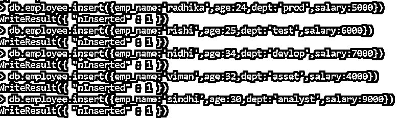
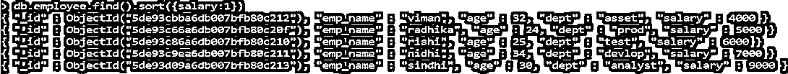
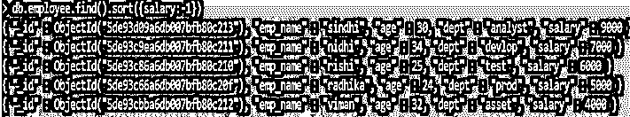
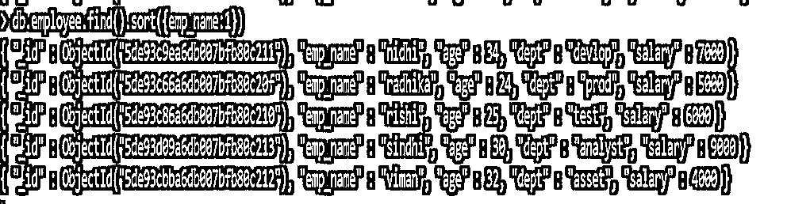
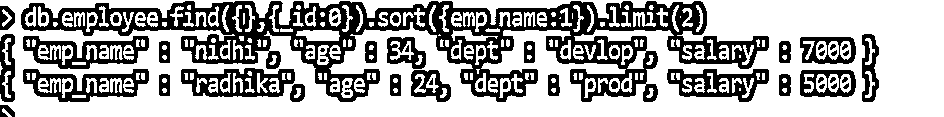
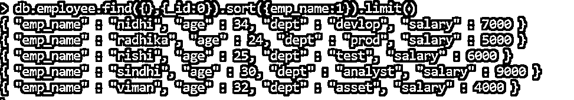
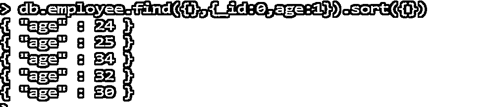
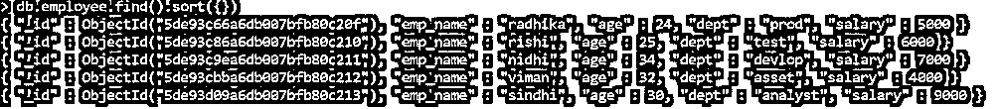
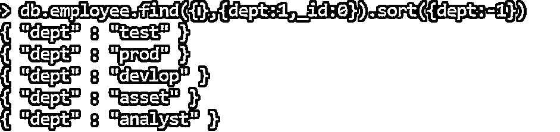

# MongoDB 中的排序依据

> 原文：<https://www.educba.com/order-by-in-mongodb/>

## MongoDB 中的 order by 介绍

By 运算符按升序和降序对查询结果进行排序，升序和降序基于我们在查询中提到的值，即 1 表示升序，-1 表示降序。MongoDB shell 中不赞成使用 Order by 命令。MongoDB shell 提供 cursor.sort()方法来查询数据库。

**语法:**

<small>Hadoop、数据科学、统计学&其他</small>

`db.collection.find().sort({field:value})`

“db”代表数据库，集合代表我们在数据库下创建的集合名称，find 是从集合中找出值，sort 是对字段进行排序，即从集合中找出值。排序功能要求在 32 兆字节内完成排序。

### order by 在 MongoDB 中是如何工作的？

Order by 按升序或降序排序集合中的返回值。当我们提到 field: value 对时，它将从一个给定的字段中以选择的降序或升序返回值。但是我们使用 sort()方法，按顺序显示值。我们将在下面的上下文中看到一个排序示例。

### 在 MongoDB 中实现 order by 的示例

以下是在 MongoDB 中实现 order by 的示例:

#### 示例#1

我们已经创建了公司数据库。

**代码:**

`use company`

#### 实施例 2

我们在一家数据库公司下创建了一个集合。

**代码:**

`collection_name.insert({field;value})`

#### 实施例 3

我们已将文档插入到集合中。

**代码:**

`db.employee.insert({emp_name:'radhika',age:24,dept:'prod',salary:5000})`

**输出:**

n 已插入:1–记录已成功插入。

#### 实施例 4

我们将按薪水升序对记录进行排序。

**代码:**

`db.employee.find().sort({salary:1})`

Salary 是一个字段，值为 1 是因为我们希望按升序显示数据。

**对上述输出的解释:**在上面的图片中我们可以观察到工资按升序排列为 4000、5000、6000、7000 和 9000。

#### 实施例 5

我们将以值-1 降序排列薪水

**代码:**

`employee.find().sort({salary:-1})`

Salary 是一个字段，值为-1 是因为我们希望按降序显示数据。

**对上述输出的解释:**在上面的图片中我们可以观察到工资按降序排列为 9000、7000、6000、5000 和 4000。

#### 实施例 6

我们可以使用相同的语法对字符串字段进行排序，并且我们需要使用相同的命令。

**代码:**

`db.employee.find().sort({emp_name:1})`

我们可以在下图中看到，emp_name 按字母升序显示。

#### 实施例 7

我们可以在使用 limit()对文档进行排序的同时对文档进行限制。我们可以提到极限值，也可以让它保持空白。

**代码:**

`db.employee.find().sort({field:value}).limit()`

**输出:**

#### 实施例 8

如果我们不提及极限中的值，所有数据都将被获取。

**代号:**
`db.employee.find({},{_id:0}).sort({emp_name:1}).limit()`

**输出:**

#### 实施例 9

在排序时，如果我们没有提到字段:值对，数据将按升序提取，因为升序是默认顺序。

我们将按年龄对数据进行排序，因为我们必须在 find()中提供值。

**代码:**

`db.employee.find({},{_id:0,age:1}).sort({})`

**输出:**

#### 实施例#10

如果我们在 find()中不提供任何值，将获取默认数据。

**代码:**

`db.employee.find().sort({})`

我们可以在下图中观察到，数据是按 with _id 的顺序提取的。

**输出:**

#### 实施例 11

如果我们在 find()中提到-1 个值，在 sort()中提到 1 个值，那么数据将按照给定的排序值提取。

**代码:**

`db.employee.find({},{dept:1,_id:0}).sort({dept:-1})`

部门按升序排序。

**输出:**

### 结论

我们已经学习了 mongo shell 中的 order by，由于 mongo shell cursor.sort()方法中的弃用，我们使用它来对集合进行排序。这将帮助用户按照他们选择的升序或降序获取数据。我们可以使用 limit()方法来限制集合。

### 推荐文章

这是 MongoDB 的订购指南。这里我们讨论语法 order by 在 MongoDB 中是如何工作的？以及具有适当代码和输出的不同示例。您也可以浏览我们的其他相关文章，了解更多信息——

1.  [Mongo DB 创建数据库](https://www.educba.com/mongo-db-create-database/)
2.  [如何安装 MongoDB](https://www.educba.com/install-mongodb/)
3.  [MongoDB 替代品](https://www.educba.com/mongodb-alternatives/)
4.  [MongoDB 开源了吗](https://www.educba.com/mongodb-open-source/)
5.  [PostgreSQL ORDER BY |如何工作？](https://www.educba.com/postgresql-order-by/)
6.  [MongoDB 极限指南()](https://www.educba.com/mongodb-limit/)

