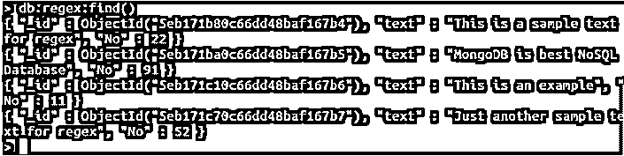
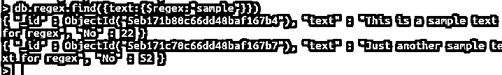
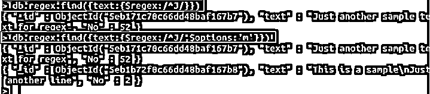
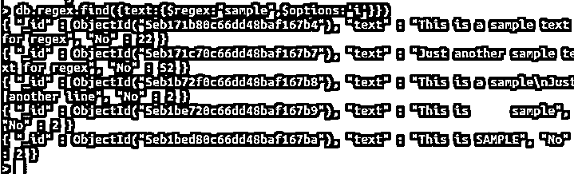

# MongoDB $regex

> 原文：<https://www.educba.com/mongodb-regex/>

## MongoDB $regex 简介

存储在 MongoDB 集合中的每个文档都有一个模式，这个模式可以被识别和使用，使用 MongoDB 的$regex 操作符，这些模式可以被识别。为了执行这个操作，MongoDB 使用了一个用 C 编写的正则表达式引擎，它被称为 Perl 兼容正则表达式，也称为“PCRE”。这些正则表达式是编程中使用最广泛的工具之一，与字符串相关。这就确立了每个字符串都可以通过一个模式以某种方式连接起来，现在这个模式可以被识别并用于促进字符串数据值的搜索。

### 句法

既然我们已经理解了这个$regex 操作符是什么，那么让我们来理解它的基本语法。使用 MongoDB 的$regex，我们有三种简单的语法可供选择，下面是这些语法:

<small>Hadoop、数据科学、统计学&其他</small>

**语法#1**

`{ <field>: { $regex : /pattern/<options> } }`

**语法#2**

`{ <field>: { $regex : 'pattern', $options: '<options>' } }`

**语法#3**

`{ <field>: { $regex : /pattern/, $options: '<options>' } }`

打破上述语法，<field>是键值或字段的名称。然后关键字$regex 打算实现操作符。/pattern/是语法中最重要的部分之一，因为它是理解的重点。这里传递的模式将用于搜索操作。</field>

在上面的三种语法中，第一种是最简单的，我们只需要指定一个字段名和一个简单的模式。第二种和第三种语法非常相似，只是传递预期模式的方式略有不同。

### $regex 在 MongoDB 中是如何工作的？

理解$regex 的工作方式对于深入理解它并在实时应用程序中实现这些强大的 MongoDB 操作符至关重要。正则表达式是一个正则表达式。MongoDB 为$regex 实现了 Perl 兼容的正则表达式。$regex 操作符简单地选择我们提供的模式，并根据选项搜索模式并返回文档。为了更好地理解这些选项，我们将实现上述语法。

此外，通过比较$regex 的工作方式，我们可能会思考并质疑它与简单文本搜索的相似性。尽管如此，我们必须明白，对 mongodb 数据的文本搜索在更大的数据集中不会返回有效的结果。文本搜索可能返回单个文档，并且缺少对 skip 参数的支持。MongoDB 的这种操作符使得 NoSQL 数据库易于操作和实现。$regex 使数据检索操作变得容易。

### MongoDB＄regex 的示例

下面是一些例子:

#### 示例#1

我们已经了解了什么是正则表达式操作符，它是如何工作的，以及它的正确语法，让我们深入实际的实现。通过下面的例子，我们将了解运营商的实时使用情况。下面是一个简单集合的屏幕截图，该集合以 regex 的名称创建，带有实现 regex 示例的字符串数据。

`db.regex.find()`

现在我们已经准备好了数据，让我们构建第一个查询。

`db.regex.find({text:{ $regex: "sample"}})`

上述查询将使用基本的 find 命令执行一个简单的搜索操作。后来我们有了我们的文本，也就是字段的名称或者说关键字。后面是$regex 运算符和参数。这里的参数是一个简单的字符串，“sample”。在执行时，上面的查询将返回每个由模式字符串组成的文档，这意味着它将返回每个包含示例单词的文档。请参考下面的屏幕截图，以正确理解输出:

#### 实施例 2

接下来，我们将在第二个例子中实现下一种类型的语法。我们的下一个例子将不是一个完整的字符串，而是一个单一的字母表，以及一个选项。请参考下面的查询:

`db.regex.find({text: { $regex: /^J/}})
db.regex.find({text: { $regex: /^J/, $options: 'm'}})`

与第一个查询相比，第二个查询几乎类似于添加的选项和模式之间的差异。在这里，我们打算找到每一个文档，其中包含任何单词，以字母 j 开头。

在执行第二个查询时，结果是满足传递的参数的两个文档。但在截图中，我们可以看到选项用法的明显区别:‘m’。用多行存储字符串值是很常见的，这会影响结果。如屏幕截图所示，第一个查询没有选项 m，只返回包含模式的文档，在一行中，没有任何中断。而第二个查询在执行时将返回每个包含以 J 开头的单词的文档，而不考虑行或任何其他因素。这解释了选择的必要性。

#### 实施例 3

我们已经理解了我们所研究的$regex 操作符语法的实时实现；我们现在将了解另一个重要选项。我们经常存储各种数据；差异可以基于小写或大写、行数等。我们的下一个例子将展示一个不区分大小写的选项的工作原理，它会产生更好的结果。

例如，我们插入了一个大写单词的文档，下面是解决方案查询:

`db.regex.find({text: {$regex :"sample", $options: 'i'}})`

通过添加选项 I，我们打算传递一个参数，即返回的结果应该由大写和小写单词组成。我们尝试执行一个查询，该查询将返回包含“sample”单词的每个文档。请参考下面附上的截图，以获得正确的输出。

我们的查询返回了包含单词 sample 的所有文档，而不管其条件如何。我们有一份有小写字母和大写字母的文件。

### 结论

MongoDB 的$regex 操作符提供了一种处理字符串数据类型的简单方法。无论什么条件，正则表达式都会根据传递的参数提供有用的输出。我们的例子解释了选项的必要性以及它如何产生影响。MongoDB 的$regex 操作符可以简化数据处理和快速操作。

### 推荐文章

这是一个 MongoDB $regex 的指南。这里我们还讨论了语法和参数以及$regex 在 MongoDB 中是如何工作的？.您也可以看看以下文章，了解更多信息–

1.  [MongoDB 管理](https://www.educba.com/mongodb-administration/)
2.  [MongoDB 中的索引](https://www.educba.com/indexes-in-mongodb/)
3.  [MongoDB Limit()](https://www.educba.com/mongodb-limit/)
4.  [MongoDB 收藏](https://www.educba.com/mongodb-collection/)

