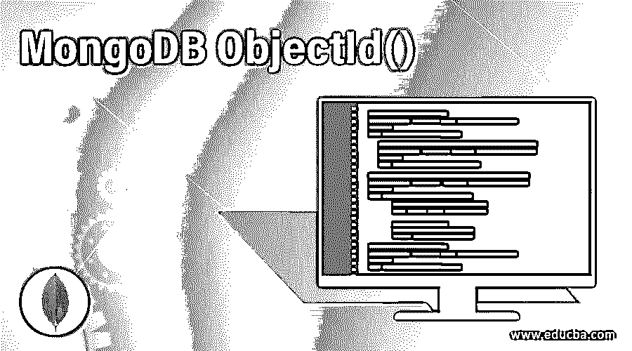
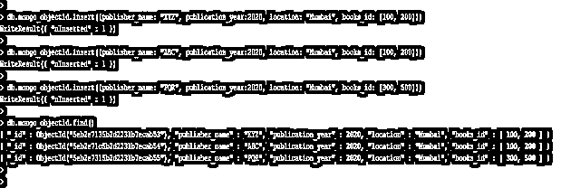
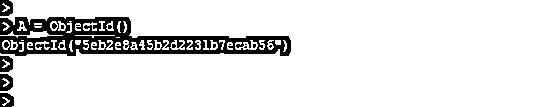
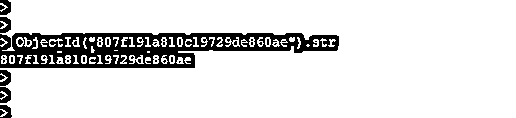
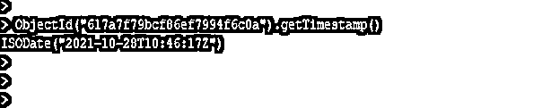
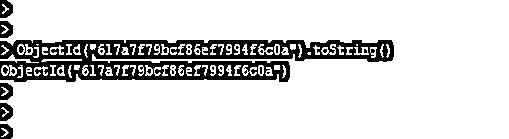

# MongoDB ObjectId()

> 原文：<https://www.educba.com/mongodb-objectid/>

## MongoDB ObjectId()简介

MongoDB objectid()返回一个新的 objectid 值，MongoDB 中的 objectid 由 4 字节的时间戳值组成，表示 objectid 的创建，以秒为单位。Objectid 对于返回一个新的 objectid 值非常重要和有用，MongoDB 中的 objectid 由 12 字节的随机值组成。一个 3 字节递增计数器用于初始化随机值，MongoDB 中的 objectid 将接受新 objectid 的十六进制字符串值。十六进制参数是与 objectid 一起使用的可选参数，十六进制参数的类型是字符串。

### 语法和参数

在下面的语法中，MongoDB 中的十六进制值分为三段。

<small>Hadoop、数据科学、统计学&其他</small>

*   第一段包含 4 字节的值，这是 MongoDB 中 UNIX 纪元以来的第二个值。
*   第二段将包含 5 字节随机值。
*   第三段将包含以随机值开始的 3 字节计数器。

`Objectid (<hexadecimal>)`

下面是 MongoDB objectid 语法的参数描述。

*   **Objectid:** Objectid 在 MongoDB 中非常重要和有用，可以返回新的 Objectid 值。MongoDB 中的 Objectid 包含三种方法，分别是获取时间戳、字符串和值。要在 MongoDB 中创建新的 objectid，我们需要将 objectid 声明为方法。我们可以将 objectid 定义为每个记录的唯一标识符。
*   **十六进制:**这个参数在 MongoDB 中定义十六进制值是必不可少且有用的。十六进制在 MongoDB objectid 中定义为变量的值，我们可以定义一个变量来代替十六进制值。每次在 MongoDB 中使用 objectid 声明变量时，都会返回一个唯一的十六进制值。

### ObjectId()在 MongoDB 中是如何工作的？

下面是 objectid 的工作原理。这基本上提供了 objectid 的三个方法。

*   gettimestamp()
*   toString()
*   的值()

**1。第一个方法是 gettimestamp，它将包含一个时间戳。这是 objectid 的一个基本且有用的方法。它将返回 objectid 的时间戳部分。**

**2。**第二个方法将包含一个 toString 它将转换字符串。MongoDB toString 将返回 objectid 的字符串表示。

*   objectid 中方法的值将在 MongoDB 中返回小写的十六进制字符串。该值将包含 objectid 的字符串属性。
*   我们可以用 objectid 声明一个变量。以下示例显示了 declare objectid。

**A = objectid ()**

*   objectid 只是文档的默认主键，通常在插入文档的 id 文档字段中找到。
*   这个 objectid 将包含 12 个字节的二进制 BSON 类型，其中包含 12 个字节。驱动程序和服务器将使用默认算法生成 objectid。
*   Objectid 在 MongoDB 中是非常重要和有用的，可以返回一个新的 objectid 值，MongoDB 中的 objectid 由 12 字节的随机值组成。
*   十六进制参数是与 objectid 一起使用的可选参数，十六进制参数的类型是字符串。
*   objectid()返回一个新的 objectid 值，MongoDB 中的 objectid 由 4 字节的时间戳值组成，它表示 objectid 的创建，以秒为单位。
*   3 字节递增计数器用于初始化随机值，objectid 将接受新 objectid 的十六进制字符串值。
*   如果我们想在 MongoDB 中定义自己的十六进制值，它将使 definer 能够定义十六进制值。
*   这我们可以用十六进制值定义 objectid 作为参数或方法。我们也可以在 MongoDB 中将 objectid 定义为一个方法。Objectid 也称为唯一标识符。
*   当我们在集合中插入一个新文档时，MongoDB objectid 将自动创建。

### 实现 MongoDB ObjectId()的示例

下面是提到的例子:

#### 示例# 1–在文档插入时创建 objectid

以下示例说明了在文档插入时创建 objectid。在插入文档时，将自动生成 objectid。

`db.mongo_objectid.insert({publisher_name: "XYZ", publication_year:2020, location: "Mumbai", books_id: [100, 200]})
db.mongo_objectid.insert({publisher_name: "ABC", publication_year:2020, location: "Mumbai", books_id: [100, 200]})
db.mongo_objectid.insert({publisher_name: "PQR", publication_year:2020, location: "Mumbai", books_id: [300, 500]})
db.mongo_objectid.find()`

**输出:**

**说明:**在上面的例子中，我们插入了三个文档。但是我们没有插入 objectid 字段。插入文档时，将自动创建 Objectid 字段。

#### 示例 2–生成新的 objectid

以下示例显示了创建新的 objectid。在创建新的 objectid 时，我们必须定义一个 as 变量。

**代码:**

`A = ObjectId()`

**输出:**

#### 示例 3–指定一个十六进制字符串

在下面的例子中，我们必须定义十六进制字符串。十六进制字符串将创建对象。十六进制字符串将返回与我们在示例中定义的相同的十六进制字符串。

**代码:**

`A = ObjectId("757f191a810c19729de860ae")`

**输出:**

#### 示例# 4–访问十六进制字符串

以下示例是使用字符串属性访问十六进制字符串 objectid。它将使用一个字符串属性返回十六进制值。

**代码:**

`ObjectId ("807f191a810c19729de860ae").str`

**输出:**

#### 示例 5–使用 gettimestamp 的 Objectid

在下面的例子中，我们调用了 gettimestamp 方法来生成 objectid。Gettimestamp 是生成 objectid 的一个方便而重要的方法。

**代码:**

`ObjectId("617a7f79bcf86ef7994f6c0a").getTimestamp()`

**输出:**

#### 示例 6–使用 toString 的 Objectid

以下示例显示了使用 toString 方法的 objectid。在下面的例子中，我们调用了 toString 方法来生成 objectid，toString 是一个方便而重要的方法来生成 objectid。

**代码:**

`ObjectId("617a7f79bcf86ef7994f6c0a").toString()`

**输出:**

#### 示例# 7–使用值 Of 的 Objectid

以下示例显示了使用 valueOf 方法的 objectid。在下面的例子中，我们在 MongoDB 中调用了 valueOf 方法来生成 objectid，valueOf 是一个方便而重要的生成 objectid 的方法。

**代码:**

`ObjectId("617a7f79bcf86ef7994f6c0a").valueOf()`

**输出:**

### 结论

Objectid 对于返回新 objectid 值非常重要，objectid 由 12 字节随机值组成。因此，objectid()返回一个新 objectid 值，objectid 由 4 字节的时间戳值组成，该值表示 objectid 的创建，以秒为单位。

### 推荐文章

这是 MongoDB ObjectId()的指南。这里我们讨论 MongoDB ObjectID()的介绍，包括语法、参数和示例，以便更好地理解。您也可以浏览我们的其他相关文章，了解更多信息——

1.  [MongoDB 收藏](https://www.educba.com/mongodb-collection/)
2.  [MongoDB 创建索引](https://www.educba.com/mongodb-create-index/)
3.  [MongoDB 中的索引](https://www.educba.com/indexes-in-mongodb/)
4.  [MongoDB 列表收藏](https://www.educba.com/mongodb-list-collections/)

