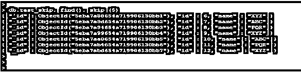
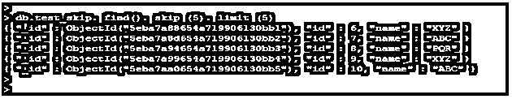

# MongoDB Skip()

> 原文：<https://www.educba.com/mongodb-skip/>

## MongoDB Skip()简介

MongoDB skip()用于当我们需要在一定数量的文档后得到一定数量的结果时，同时我们在 MongoDB 中使用 skip 方法。如果我们想从集合中跳过一定数量的文档，skip 方法将跳过我们与 MongoDB skip 方法一起使用的指定文档。MongoDB 中的 Skip 方法将与 SQL 语言中使用的 offset 方法相同，我们也可以使用有限制的 skip 方法。在 MongoDB 中使用带有限制的 skip 方法后，它将跳过指定数量的文档，然后它将返回结果。在本主题中，我们将学习 MongoDB Skip()。

### 句法

下面是 MongoDB skip 方法的语法。

<small>Hadoop、数据科学、统计学&其他</small>

**1。跳过方法**

`db.collection_name.find ().skip(number of documents that we have skipping)`

**2。有限制的跳过方法**

`db.collection_name.find ().skip(number of documents that we have skipping).limit(number of documents that we have fetching)`

**3。极限跳跃法和漂亮法**

`db.collection_name.find ().skip().limit().pretty();`

**下面是 MongoDB skip 方法的参数描述语法。**

**1。集合名称:**集合名称被定义为我们使用 skip 方法获取数据的名称。我们可以使用任何集合名称从集合中获取数据。我们还使用了带 skip 的 limit 和 pretty 方法从集合中获取数据。

**2。Find:** Find 方法与集合名称一起使用，使用 skip 方法获取文档。如果我们没有对 find 方法使用任何 skip 和 limit，它将返回所有的集合文档。

**3。limit:**limit 方法用于从集合中获取文档的特定编号。我们可以将 limit 方法与 skip 方法配合使用，跳过特定数量的文档，跳过文档后返回限定数量的文档。

**4。Pretty:** Pretty 方法与 skip 方法一起使用，以格式化的顺序检索集合的结果。漂亮的方法既方便又重要。

**5。Skip:**MongoDB 中的 Skip 方法用于在跳过集合中的指定文档后检索文档。MongoDB 中的 skip 方法将跳过指定数量的文档。

### MongoDB Skip()方法是如何工作的？

*   下面是 MongoDB 中 skip 方法的工作方式。
*   limit 方法将用于从集合中返回最大数量的结果，而 skip 方法用于跳过 MongoDB 中集合中的文档数量。
*   如果我们作为学生有一个集合名称，学生集合包含一百个文档。
*   在学生收集中，我们必须以 10 个文档的形式获取数据；同时，我们使用了收集限制。但是限制将从 10 个文档开始获取数据。
*   当我们从 11 到 50 的系列中获取数据时，限制不会同时起作用，这时我们使用数字为 40 的限制，使用数字为 10 的跳过。
*   使用 skip with 10 后，它将跳过集合中的前 10 个文档以及 10 个之后的文档的检索结果。
*   如果我们没有使用 limit with skip，则只跳过前 10 个文档，跳过 10 个文档后，将在结果集中检索所有 90 个文档结果。
*   带有 find 方法的 Skip 方法不是以格式化的方式显示结果，为了以格式化的方式显示结果，我们在 MongoDB 中使用了一个带有 skip 的漂亮方法。
*   MongoDB 中的 Skip 将跳过指定数量的文档，将这些文档传递到第一个阶段，剩余的文档将按照管道顺序传递到下一个阶段。
*   在 MongoDB 中 Skip 将有如下形式。

`{ $skip: <+ve number>}`

*   MongoDB 中的 skip 不允许负数；它将显示消息为“跳过值必须为非负数，但已收到:-1”。
*   在下面的例子中，我们用 skip 方法将值设为-1；它不会显示输出结果，因为在 skip 方法中不允许使用负值。
*   当从集合中检索数据时，我们只需要用 skip 方法定义一个正数。

`db.test_skip.find().skip(-1)`

### MongoDB Skip()的示例

下面是 MongoDB 中 skip 方法的例子。

#### 示例 1–跳过方法

`db.test_skip. find(). skip (5)`

在上面的例子中，我们跳过了 test_skip 集合中的前五个文档。跳过剩余的 5 个文档后，所有文档都将显示在输出中。

我们没有使用 pretty 方法来显示结果，所以输出不是按格式化的顺序接收的。

#### 示例 2–有限制的跳过方法

`db.test_skip. find(). skip (5). limit (5)`

在上面的例子中，我们已经跳过了 test_skip 集合中的前五个文档，并且我们还在 skip 方法中使用了 limit as 5。在使用带 skip 的 limit 后，它将显示从 id 6 到 id 10 的文档。

#### 示例# 3–带限制和美观的 Skip 方法

在下面的例子中，我们必须使用 limit 方法和 MongoDB 中的 skip 和 pretty 方法来检索文档。

使用 pretty 方法后，文档将按格式化的顺序显示。

`db.test_skip. find(). skip (8). limit (2). pretty ()`

### 推荐文章

这是 MongoDB Skip()的指南。这里我们讨论 MongoDB Skip()方法如何与适当的语法一起工作，并给出相应的例子以便更好地理解。您也可以阅读以下文章，了解更多信息——

1.  [MongoDB 数据类型](https://www.educba.com/mongodb-data-types/)
2.  [MongoDB MapReduce](https://www.educba.com/mongodb-mapreduce/)
3.  [在 MongoDB 中查找](https://www.educba.com/lookup-in-mongodb/)
4.  [MongoDB 列表收藏](https://www.educba.com/mongodb-list-collections/)

