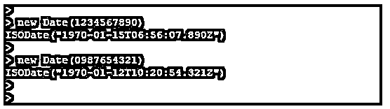
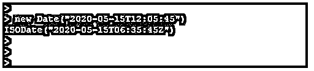
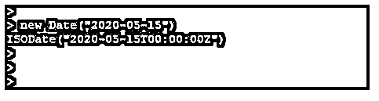
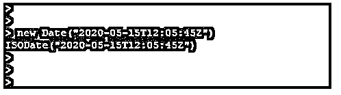
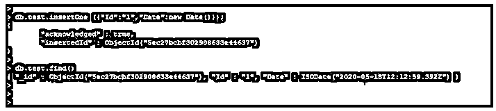
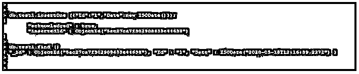
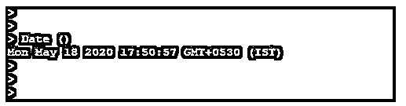
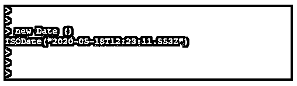

# MongoDB 日期查询

> 原文：<https://www.educba.com/mongodb-date-query/>

## MongoDB 日期查询简介

MongoDB 日期查询以字符串或日期对象的形式返回日期，日期查询将在 mongo shell 中以字符串的形式返回当前日期。MongoDB date 会将当前日期作为 date 对象返回，mongo shell 会用 MongoDB 中的 isolate helper 包装 date 对象。我们可以通过将日期作为 ISO-8601 日期字符串传递来指定特定的日期，该字符串用于 MongoDB 中新的 date()函数，范围为 0 到 9999。

### MongoDB 中的日期查询是如何工作的？

*   我们可以使用 date()命令在查询中获得字符串形式的日期，而不需要 new 关键字或 MongoDB shell。
*   创建新的日期对象时，我们可以如下指定日期对象。
*   MongoDB 中的日期查询将在内部存储代表毫秒数的 64 位整数值，UNIX 从 1970 年 1 月 1 日开始使用它。
*   MongoDB 日期对象存储 64 位，但它不会存储支持 64 位的所有数据库版本和操作。
*   我们可以用日期作为字符串，也可以用日期作为 MongoDB 中的方法和对象。
*   在 MongoDB 中，我们可以将日期对象转换成指定格式的字符串。在 MongoDB 中，日期到字符串有不同操作符。
*   在 MongoDB 中有两种方法可以存储日期时间，它们是 new Date()和 new ISODate()。
*   在第一种方法中，我们可以像 javascript 一样使用 MongoDB 中的 date 对象。date 对象或方法是在 MongoDB 中存储日期或时间的最佳方法。
*   在第二种方法中，我们可以使用 ISODate 方法在 MongoDB 中存储日期或时间。
*   MongoDB 不支持没有时区格式的日期。存储不带时区的日期的另一种方法是使用两种类型的日志表示。
*   第一个是毫秒，第二个是(<yyyy-mm-dd hh:mm:ss="">)。这些是 MongoDB 中可以用来在 MongoDB 中存储不带时区的日期的方法。</yyyy-mm-dd>
*   我们已经在 MongoDB 中使用了 ISODate 函数；这用于构建本地 javascript 函数。
*   MongoDB 中的 ISODate 提供了一种在 MongoDB 中表示日期的便捷方式。
*   字符串日期格式用于以日期格式存储字符串。这用于以人类可读的格式将日期存储为简单的字符串。
*   当以字符串格式存储日期时，很容易显示，而以字符串格式存储日期时，则不需要使用相同的处理。
*   此外，当以字符串格式存储日期时，很容易将其转换成任何其他平台或格式。但是将数据存储为字符串格式时，很难确定日期格式。

### MongoDB 中的各种日期格式

下面给出了日期格式，每个格式都返回一个结果 ISODate 实例:

<small>Hadoop、数据科学、统计学&其他</small>

*   新日期(<milliseconds>)</milliseconds>
*   新日期(<yyyy-mm-dd thh:mm:ss="">)</yyyy-mm-dd>
*   新日期(<yyyy-mm-dd>)</yyyy-mm-dd>
*   新日期(“<mm:ssz>”)</mm:ssz>

#### 1.新日期(<milliseconds>)</milliseconds>

*   毫秒是一个整数，它指定了毫秒数。毫秒定义了 MongoDB 中日期格式使用的整数值。
*   毫秒将日期转换成标准日期格式。
*   下面的例子显示了将毫秒转换成日期格式。在下面的例子中，我们展示了两个例子。在第一个示例中，我们使用了 1234567890 毫秒，该毫秒的输出是 1970-01-15，在第二个示例中，我们使用了 0987654321 毫秒，该毫秒的输出是 1970-01-12。

**举例:**

**代码:**

`new Date(1234567890)` 

`new Date(0987654321)`

**输出:**

#### 2.新日期(<yyyy-mm-dd thh:mm:ss="">)</yyyy-mm-dd>

*   这种格式定义了完整格式的年，月和日期，它也将显示完整格式的小时，分钟和秒。
*   在下面的示例中，我们使用日期作为(“2020-05-15T12:05:45”)，使用此日期的输出为(“2020-05-15T06:35:45Z”)。

**举例:**

**代码:**

`new Date("2020-05-15T12:05:45")`

**输出:**

#### 3.新日期(<yyyy-mm-dd>)</yyyy-mm-dd>

*   这种格式被定义为完整格式的年、月和日。
*   在下面的示例中，我们使用日期作为(“2020-05-15”)，使用此日期的输出是(“2020-05-15T00:00:00Z”)。

**举例:**

**代码:**

`new Date("2020-05-15")`

**输出:**

#### 4.新日期(“<mm:ssz>”)</mm:ssz>

*   这种格式定义了完整格式的年、月和日，也显示了完整格式的小时、分钟和秒。
*   在下面的示例中，我们使用日期作为(“2020-05-15T12:05:45Z”)，使用此日期的输出为(“2020-05-15T06:35:45Z”)。

**举例:**

**代码:**

`new Date("2020-05-15T12:05:45Z")`

**输出:**

### MongoDB 日期查询示例

下面给出了 MongoDB 日期查询的示例:

#### 示例#1

在 MongoDB 中使用新的 date()格式存储日期。

在下面的例子中，我们在 MongoDB 中使用了新的 Date()对象。我们在 MongoDB 中使用日期对象时使用了测试集合。

**代码:**

`db.test.insertOne ({"Id":"1","Date”: new Date()});
db.test.find ()`

**输出:**

#### 实施例 2

在 MongoDB 中使用新的 ISODate()格式存储日期。

在下面的例子中，我们在 MongoDB 中使用了新的 ISODate()对象。我们在 MongoDB 中使用 date 对象时使用了 test1 集合。

**代码:**

`db.test1.insertOne ({"Id":"1","Date":new ISODate()});
db.test1.find ()`

**输出:**

#### 实施例 3

在 MongoDB 中使用 Date()方法。

在下面的例子中，我们使用了日期函数。

**代码:**

`Date ()`

**输出:**

#### 实施例 4

在 MongoDB 中使用新的 Date()方法。

在下面的例子中，我们使用了日期函数。

**代码:**

`new Date ()`

**输出:**

**

** 

### 结论

日期查询用于以查询或字符串的形式返回日期。基本上，有两种存储日期的方法，即 date()和 ISODate()。字符串日期格式用于将字符串存储为日期格式，而将日期存储为字符串格式非常容易显示。

### 推荐文章

这是一个 MongoDB 日期查询的指南。在这里，我们讨论 MongoDB 日期查询的介绍，日期查询如何与 MongoDB 中的各种日期格式一起工作，以及示例。您也可以看看以下文章，了解更多信息–

1.  [MongoDB 数据类型](https://www.educba.com/mongodb-data-types/)
2.  [MongoDB 地理空间](https://www.educba.com/mongodb-geospatial/)
3.  [MongoDB MapReduce](https://www.educba.com/mongodb-mapreduce/)
4.  [MongoDB Limit()](https://www.educba.com/mongodb-limit/)

