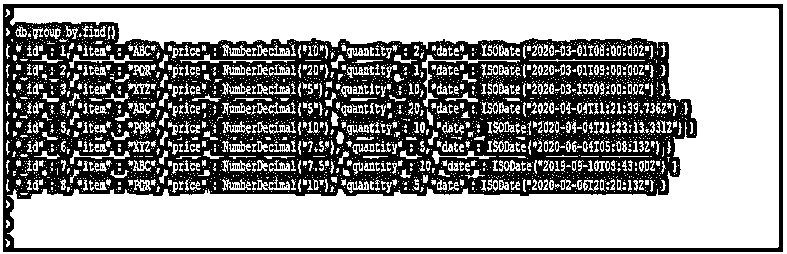
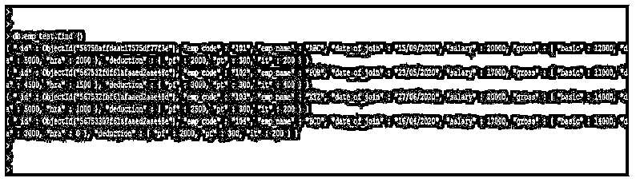
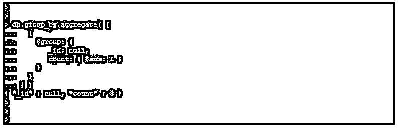
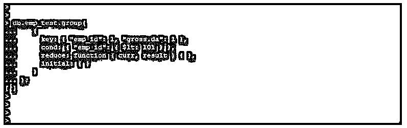
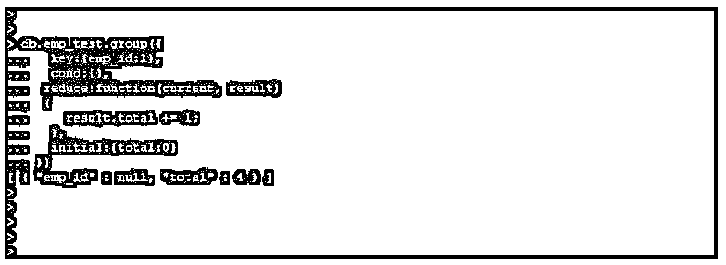

# MongoDB 分组依据

> 原文：<https://www.educba.com/mongodb-group-by/>

## MongoDB group 简介

MongoDB group by 用于对集合中的数据进行分组，在 MongoDB 中使用聚合函数和 group 方法可以实现 group by 子句。虽然在 group by 子句查询操作中使用聚合函数比普通查询更快，但基本上聚合函数用于多种情况。我们可以根据集合中的单个或多个字段进行分组，我们可以在 MongoDB 中使用$group 操作符对集合中的字段进行分组，并返回新的文档作为结果。我们在 MongoDB 中使用$avg，$sum，$max，$min，$push，$last，$first 和$addToSet 运算符和 group by。

### MongoDB group by 的语法

下面给出了语法:

<small>Hadoop、数据科学、统计学&其他</small>

1.使用$group 聚合进行分组

`{ $group (Aggregation is used to define group by): { _id: <expression>, <field1>: { <accumulator1> : <expression1> }, <accumulator2> : <expression2>, <accumulator3> : <expression3> } }...<accumulatorN> : <expressionN> } } }`

2.使用分组方法进行分组

`db.name_of_collection.group ({key or field, reduce (aggregation function), initial (initialize the result of aggregation) [, keyf (it is alternative of the key field)] [, condition] [, finalize] })`

#### 因素

下面是 MongoDB 中 group by 的参数描述语法:

*   **$group:** 这被定义为使用累加器和表达式从集合中检索分组数据。此聚合的输出是 _id 字段，它包含不同记录的 group by 键。分组依据不对结果文档进行排序。
*   **_id:** 使用分组运算符聚合时，此字段为必填字段。我们可以用空值指定 id 值，用于计算所有输入值的累积值。
*   **表达式:**这被定义为在 MongoDB 中与 group by 一起使用的表达式。group by 为的表达式接受有效的表达式。
*   **累加器:**我们在 MongoDB 中使用了带有组操作符的累加器操作符。通过将累加器与表达式一起使用，接受有效的表达式。在 MongoDB 中使用 group by 时，必须使用 group by 来使用任何一个累加器。
*   **Field:** 这被定义为我们在 MongoDB 中与 group by 一起使用的字段名。

### group by 在 MongoDB 中是如何工作的？

我们在 MongoDB 中使用 group 方法和聚合操作来使用 group by。

我们使用下面的运算符按多个字段进行分组。

*   **$sum:** 该运算符用于返回所有使用$group 运算符的数值字段的总和。该运算符忽略集合中的非数值。
*   **$addToSet:** 该运算符用于使用$group 运算符返回每个组数组的唯一表达式值。此运算符数组元素的顺序未定义。
*   **$avg:** 该运算符用于使用$group 运算符返回所有数值字段的平均值。该运算符忽略集合中的非数值。
*   **$first:** 该操作符用于使用$group 操作符返回每个组的第一个文档。
*   **$last:** 该操作符用于使用$group 操作符返回每个组的第一个文档。
*   **$max:** 该操作符用于返回每组的最大值。
*   **$min:** 该运算符用于返回每组中的最小值。
*   **$mergeObjects:** 该操作符用于返回使用输入文档合并的文档。
*   **$push:** 该运算符用于返回各组数组值的表达式。

我们还使用 group 方法对 MongoDB 中的文档进行分组。使用分组方法，我们在 MongoDB 中通过两个或多个字段进行分组。Group 方法将接受集合中的单个文档。基本上，group 方法类似于在其他 SQL 数据库中使用的 group by 子句。

分组方法使用如下参数:

*   最初的
*   钥匙
*   减少
*   Cond
*   完成
*   玩得开心

初始参数的值将初始化代表组中文档的字段。

### MongoDB group by 示例

下面是提到的例子:

我们使用 group_by 和 emp_test 集合来描述 MongoDB 中的 group by 示例。

以下是 group_by 集合的文档。

**代码:**

`db.group_by.find()`

**输出:**

下面是 emp_test 集合的文档。

**代码:**

`db.emp_test.find()`

**输出:**

#### 示例#1

使用$group 聚合进行分组。

*   下面的例子显示了通过使用$group 聚合进行分组。
*   我们在$group 聚合中使用 _id 字段。

**代码:**

`db.group_by.aggregate( [
{
$group: {
_id: "_id",
count: { $sum: 1 }
}
}
] )`

**输出:**

#### 实施例 2

使用分组方法按两个字段分组。

*   以下示例显示了使用分组方法按两个字段分组。
*   在下面的例子中，我们使用关键字段作为雇员标识，cond 作为雇员标识。

**代码:**

`db.emp_test.group(
{
key: { "emp_id": 1, "gross.da": 1 },
cond: { "emp_id": { $lt: 101 } },
reduce: function ( curr, result ) { },
initial: { }
}
);`

**输出:**

#### 实施例 3

使用分组方法计算员工 id 的数量。

*   以下示例显示了使用分组方法计算 emp_id 的数量。
*   在下面的例子中，我们使用了 emp_test 表中的 key 作为 emp_id。

**代码:**

`db.emp_test.group({
key:{emp_id:1},
cond:{},
reduce:function(current, result)
{
result.total += 1;
},
initial:{total:0}
})`

**输出:**

### 结论

我们可以使用具有聚合功能的单个或多个字段来对文档进行分组，并从集合中获取结果。Group 方法用于对集合中的文档进行分组。我们在 MongoDB 中使用了 avg、sum、max 和 min 运算符和 group by。

### 推荐文章

这是 MongoDB group 的指南。这里我们分别用例子讨论 group by 在 MongoDB 中是如何工作的。您也可以看看以下文章，了解更多信息–

1.  [MongoDB 时间戳](https://www.educba.com/mongodb-timestamp/)
2.  [MongoDB 日期查询](https://www.educba.com/mongodb-date-query/)
3.  [MongoDB Skip()](https://www.educba.com/mongodb-skip/)
4.  [MongoDB 关系](https://www.educba.com/mongodb-relationships/)

