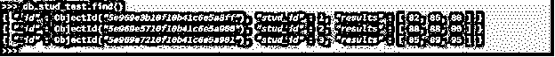
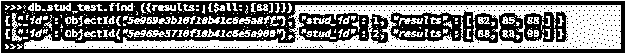
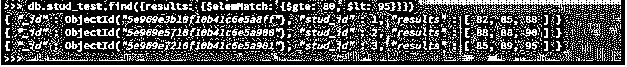
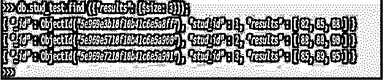

# MongoDB 数组

> 原文：<https://www.educba.com/mongodb-array/>

## MongoDB 数组简介

MongoDB 数组是一种灵活的文档结构；它将使 MongoDB 中有一个值为 array 的字段成为可能。这只是一个简单的值列表，在 MongoDB 中它可以采用多种形式。我们可以定义一个字符串、整数、嵌入文档、杰森和 BSON 数据类型的数组，数组中可以定义任何形式的数据类型。如果我们做了学生集合，并把字段作为年级和年级分成三个部分，比如 MongoDB 数组，那么数组在 MongoDB 中是必不可少且有用的。

### 句法

我们可以如下定义数组。

<small>Hadoop、数据科学、统计学&其他</small>

`{< array field >:  {< operator1> :  <value1>, < operator2> :  <value2>, < operator3> :  <value3>, ….. }}`

**MongoDB 数组的参数**

**1。数组字段:**数组字段定义为集合的字段名称，我们在集合上创建或定义数组值。定义任何数组时，数组字段都很重要。

**2。运算符:**运算符被定义为我们要创建数组的值。运算符名称特定于数组中的值名称。

**3。Value:** 数组中的值被定义为我们在 MongoDB 中定义数组的数组的实际值。值在定义数组时是有意义的。

### 实现 MongoDB 数组的示例

以下是一些有助于更好理解的例子:

#### 示例#1

在下面的示例中，我们必须定义一个 emp_skills 数组。在定义之后，我们已经在 emp_count 集合中插入了一个文档数组:

**代码:**

`db.emp_count.find()`

**输出:**

#### 实施例 2

**代码:**

`db.emp_count.insertOne({"emp_name":"ABC", "emp_skills": [["PostgreSQL", "MongoDB", "MySQL", "Perl","ORACLE"]]});`

**输出:**

**解释:**在上面的例子中，我们必须定义一个雇员 emp_skills 数组。在定义数组时，我们已经插入了文档并创建了 emp_count 集合。在上面的例子中，我们在 emp_count 集合中创建了一个 emp_skills 数组。在定义数组时，我们已经创建了一个名为 emp_array 的集合。我们可以在插入时定义一个数组。我们可以在一个集合中定义多个数组字段。

#### 实施例 3

下面的例子说明了在单个集合中定义一个多重数组字段如下:

**代码:**

`db.emp_countmultiple.insertOne({"emp_name":"ABC", "emp_skills":[["PostgreSQL", "MongoDB", "MySQL", "Perl", "ORACLE"]], "emp_address":[["Pune", "Mumbai", "Delhi"]]});`

**输出:**

**说明:**在上面的例子中，我们在一个集合中定义了多个数组字段。我们必须在一个集合中定义 emp_skills 和 emp_address 数组。

### 如何在 MongoDB 中初始化数组？

下面是如何在 MongoDB 中初始化数组的描述。

我们以 emp_count 集合为例来描述如何在 MongoDB 中初始化数组。

我们可以在 MongoDB 的单个字段中初始化整个数组。以下示例显示了使用单个字段的数组初始化如下。

`db.emp_count.find ( { emp_address: "Pune" } )`

`db.emp_count.find ( { emp_address: "Delhi" } )`

**解释:**在上面的例子中，我们已经用单个字段初始化了数组。在第一个例子中，我们使用红色的字段标签，同时使用红色的标签，显示或初始化 emp_count 集合中的四个文档。在这个例子中，我们已经在 emp_address 中初始化了基于数组的值，此时只有匹配的记录才会被显示或初始化。

### MongoDB 中的各种数组运算符

下面是 MongoDB 中可用的数组操作符类型。

*   所有美元
*   $elemMatch
*   美元大小
*   美元
*   $拉动
*   $推送
*   $pop

我们以 stud_test 表为例来描述各种运算符的示例，如下所示。

`db.stud_test.find ()`

#### 1.所有美元

$all 数组运算符用于显示来自数组字段的所有值。以下示例显示$all 数组运算符:

**代码:**

`db.stud_test.find ({results: {$all: [88]}})`

**输出:**

#### 2.$elemMatch

$elemMatch 数组操作符用于匹配包含数组字段的文档，并且只包含一个符合给定标准的字段:

**代码:**

`db.stud_test.find({results: {$elemMatch: {$gte: 80, $lt: 95}}})`

**输出:**

#### 3.美元大小

MongoDB 中的 size 数组操作符将匹配任何具有参数指定的元素数量的数组。以下示例显示了$size 数组运算符:

**代码:**

`db.stud_test.find ({“results": {$size: 3}});`

**输出:**

#### 4\. $

以下示例显示了一个$ array 运算符。$ Array 运算符用于标识数组元素并将其更新到集合中:

**代码:**

`db.stud_test.updateOne ({stud_id: 1, results: 85},{$set: {"results.$" : 95 }})`

**输出:**

#### 5.$pop

$pop 数组运算符用于从数组中移除第一个和最后一个元素。以下示例显示了一个$pop 数组运算符:

**代码:**

`db.stud_test.updateOne( { stud_id: 1 }, { $pop: { results: -1 } } )`

**输出:**

`db.stud_test.find()`

#### 6.$拉动

拉数组运算符用于从现有数组中移除元素。以下示例显示了一个$pull 数组运算符，如下所示:

**代码:**

`db.stud_test.update( { stud_id: 1 }, { $pull: { results: { $gte: 95 } } } )`

**输出:**

#### 7.$推送

推送数组运算符用于将值追加到现有集合中。以下示例显示了推送数组运算符:

**代码:**

`db.stud_test.update ({stud_id: 1}, { $push: { results: 101 }})`

**输出:**

### 结论

在 MongoDB 中，数组对于在单个集合中定义一组元素非常重要和有用。MongoDB 中提供了不同类型的数组操作符，如$、$size、$elemMatch、$pop、$all、$push 和$pull。MongoDB 数组只不过是 MongoDB 中一个简单的值列表。

### 推荐文章

这是一个 MongoDB 数组的指南。这里我们讨论 MongoDB 数组的语法、参数、例子，以及如何用各种操作符初始化它。您也可以浏览我们的其他相关文章，了解更多信息——

1.  [在 MongoDB 中查找](https://www.educba.com/lookup-in-mongodb/)
2.  [MongoDB 工具](https://www.educba.com/mongodb-tools/)
3.  [MongoDB 删除|如何工作？](https://www.educba.com/mongodb-delete/)
4.  [MongoDB 数组|示例](https://www.educba.com/mongodb-array/)
5.  [MongoDB Distinct 指南](https://www.educba.com/mongodb-distinct/)
6.  [如何查看 MongoDB 版本？](https://www.educba.com/mongodb-versions/)
7.  [MongoDB Aggregate |如何工作？](https://www.educba.com/mongodb-aggregate/)

