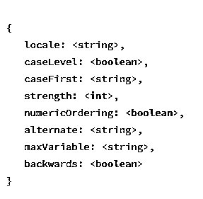

# MongoDB 创建索引

> 原文：<https://www.educba.com/mongodb-create-index/>

## MongoDB 简介创建索引。

Mongo DB 创建索引， [DBMS 中的索引有助于提高](https://www.educba.com/what-is-dbms/)获取和更新数据等查询的性能。复杂的数据挖掘、数据分析算法使用 MongoDB 来管理、修改和安排他们处理的数据。他们处理的数据非常庞大，需要高效的处理。想象一个拥有数百个文档的集合。为了找到与特定过滤器匹配的文档，MongoDB 必须将过滤器与集合中存在的所有文档进行匹配，这是一项繁琐而耗时的工作。而不是索引文档(字段)将大大减少搜索时间。索引是一种数据结构，其中包含部分数据集。索引以有序的方式存储文档中特定字段的值，这种方式支持诸如比较器、等号和基于范围的顺序查询之类的操作。

**创建索引的语法**

<small>Hadoop、数据科学、统计学&其他</small>

`db.collectionName.createIndex(<key and index type specification>, <options>)`

| **键** | Keys is a document that contains a field value pair where the field is index key and value is the type of index.例如，值 1 表示按升序对索引键进行排序，值-1 表示按降序排序。 |
| **选项** | 选项是包含一组影响索引创建的选项的文档。这些选项是可选的。 |

### MongoDB 索引的类型

下面是提到的索引类型:

#### 1.默认 id

Mongo 集合中的每个文档都包含一个名为“_id”的索引默认值。如果没有索引值，则在创建文档时创建对象 id。

#### 2.单一字段

索引是在单个字段上执行的，排序操作要么升序要么降序，因为 MongoDB 可以在两个方向上遍历。

**举例:**

`db.collection.createIndex({"age":1})`

#### 3.复合指数

MongoDB 支持多个字段中的用户定义索引。复合索引中给出的字段顺序非常重要。排序顺序从左到右，复合索引中提到的第一个字段的优先级高于下一个字段。

**举例:**

`db.collection.createIndex({“age”:1,”dim.h”:-1})`

在本例中，所有带有 age 字段的文档首先按升序排序，然后按 dim 中高度的降序排序。

#### 4.多键索引

MongoDB 使用多键索引来索引数组格式的数据。建立索引时，会为数组中的每个元素创建一个单独的索引，并根据数组中存在的元素对数据进行索引。默认情况下，MongoDB 会注意索引字段中是否有数组。

#### 5.地理空间索引

MongoDB 使用地理空间索引来根据位置查找数据。它支持两种类型的搜索，2D(二维)和三维(三维)。这些索引用于获得一定范围内的结果。也可以使用 limit( <number>)功能来限制搜索结果的数量。</number>

**举例:**

`db.players.find({ loc:{ $near: { $geometry: { type: "high_school",sport:"basketball " age: [14, 17]} } } })`

此示例将查找所有高中学生、打篮球的学生以及年龄在 14 到 17 岁之间的学生的条目。

#### 6.文本索引

MongoDB 提供文本索引来支持字符串格式的查询。文本索引可以包含任何由字符串元素或字符串元素数组组成的字段。

**举例:**

`db.movies.find( { $text : { $search : "tom hardy" } } )`

本示例将查找演员姓名为 tom hanks、汤姆·费尔顿、汤姆·希德勒斯顿以及 Robert hardy 和 john hardy 的所有文档。MongoDB 接受为搜索提供的字符串，并为所有文档提供完整或部分的搜索字符串。

#### 7.散列索引

MongoDB 使用散列索引来支持分片。哈希索引使用哈希函数计算索引字段的哈希值。它不支持多键索引(数组值)。哈希索引是使用 createIndex 函数创建的，索引字段的值应该始终为“哈希”。

**举例:**

`db.collection.createIndex( {<fieldname>: "hashed" } )`

为了查找具有散列值的文档，db . collection . find({<fieldname>:math . pow(2，63) })将返回散列索引在 2^63.范围内的所有文档</fieldname>

### 索引选项

#### 1.唯一索引

顾名思义，唯一索引本质上是唯一的。如果使用“unique”选项创建索引，MongoDB 不允许重复值。

要在创建索引时指定索引是唯一的，应使用以下格式:

`db.collection.createIndex( <key and index>, { unique: true } )`

可以对复合索引、多键索引和文本索引施加唯一约束。

#### 2.部分索引

部分索引基于特定的筛选器或表达式对集合中的文档进行索引。由于部分索引索引，只有一个分组的收集空间(内存)需求较少，导致性能降低。

**举例**:

`db.pupils.createIndex( { name: 1},{ partialFilterExpression: {age: { $gt: 5 } } }`

支持的过滤器表达式:

*   $gt，$gte，$lt，$lte(大于、大于或等于、小于和小于或等于)
*   $type 运算符
*   $exists:真操作
*   相等运算符($eq)
*   逻辑 and、or 运算

#### 3.TTL 索引

TTL 索引一种特殊的单键索引，可以在超时后或特定的时钟时间从 MongoDB 集合中删除。一些记录机器生成的数据或在一段时间后最终无效的日志的应用程序发现这非常有用。

**举例:**

`db.log.createIndex( { "lastModifiedDate": 1 }, { expireAfterSeconds: 10000 } )`

#### 4.稀疏索引

稀疏索引仅索引包含索引字段值的文档。它会忽略不包含该字段的所有其他文档。默认情况下，非稀疏索引包含集合中的所有文档，不存在的字段的值为 null。

**举例:**

`db.pupil.createIndex( { "age": 1 }, { sparse: true } )`

该索引不索引不包含字段 age 的文档。

#### 5.不区分大小写索引

不区分大小写的索引用于支持在不区分大小写的情况下执行字符串比较的查询。

**举例:**

`db.collection.createIndex( { "key" : 1 },{ collation: <collation options>} )`

**校对:**

校对文档用于指定语言规则、字母大小写等。，用于字符串比较。

校对文件包括以下内容:

### 结论–MongoDB 创建索引

总之，索引对于更快地执行查询和内存管理至关重要。可以根据用户的要求创建、修改索引，并在不需要时删除索引。

### 推荐文章

这是一个 MongoDB 创建索引的指南。在这里，我们将讨论 MongoDB create Index 的介绍、索引的类型和索引选项，以及相应的示例。您也可以阅读以下文章，了解更多信息——

1.  [MongoDB 工具](https://www.educba.com/mongodb-tools/)
2.  [什么是 MongoDB？](https://www.educba.com/what-is-mongodb/)
3.  [MongoDB 的优势](https://www.educba.com/advantages-of-mongodb/)
4.  [如何使用 MongoDB Limit()？](https://www.educba.com/mongodb-limit/)

