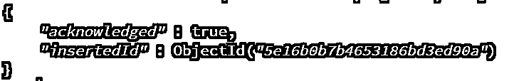
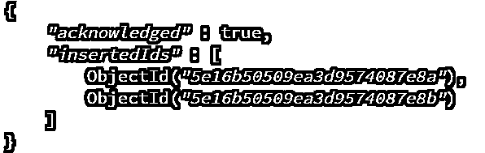
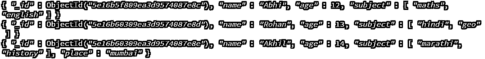
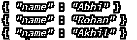
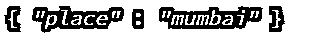
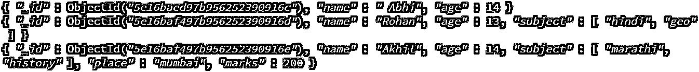

# MongoDB 列表集合

> 原文：<https://www.educba.com/mongodb-list-collections/>

## 什么是 MongoDB 列表集合？

MongoDB 列表集合是关于文档存储的。它类似于 Mysql 中的表来存储记录。MongoDB 是一个无模式数据库，因此它可以在文档中存储任意数量的字段。用户可以创建 n 个文档到集合中，或者可以随时更改，而不需要在 MongoDB 数据库中进行更改。要创建一个集合，我们应该在其中插入一个文档，它必须有字段名和字段值。如果集合不存在，那么当我们尝试向其中插入记录时，将自动创建新的集合。

### MongoDB 集合列表

下面是 MongoDB 列表集合，其中包含适当的示例:

<small>Hadoop、数据科学、统计学&其他</small>

#### 1.首先，我们需要创建一个数据库

我们创建了作为数据库的图书馆。将收藏创建为书籍。

**语法:**

`db.createCollection(name of collection)`

##### 示例#1

**代码:**

`use library`

**输出:**

**代码:**

`db.createCollection(“books”)`

**输出:**

**语法:**

`show collections`

(它将显示我们创建的所有收藏)。

##### 实施例 2

**代码:**

`use library`

**输出:**

**代码:**

`db.createCollection(“students”)`

**输出:**

**代码:**

`show collections`

**输出:**

#### 2.将单个文档插入集合

向集合中插入一个值。我们在学生收藏中增加了价值。

**语法:**

`db.collection.insertOne([{fields:value}])`

**代码:**

`db.student.insertOne({ name: "Abhi", age: 12, subject: [ "maths", "english" ] })`

**输出:**

#### 3.将多个文档插入收藏

下面是提到的语法

**语法:**

`db.collection.insertMany([{field:value},{field:value}])`

**代码:**

`db.student.insertMany([{ name: "Rohan", age: 13, subject: [ "hindi", "geo" ] },{ name: "Akhil", age: 14, subject: [ "marathi", "history" ], place:"mumbai" }])`

**输出:**

**Acknowledge:** true(成功插入所有文档)并且为每个文档提供 ObjectId。

#### 4.查询集合中的所有文档

下面是提到的语法

**语法:**

`db.collection_name.find({})`

**代码:**

`db.student.find( {} )`

**输出:**

#### 5.根据条件查询集合中的文档

下面是提到的语法

**语法:**

`db.collection_name.find({criteria})`

**代码:**

`db.student.find(criteria)`

我们提到了汽车标准。我们已经分别提到了两个标准，即名称和地点。

**代码:**

`criteria={name:"Abhi"}`

**输出:**

**代码:**

`student.find(criteria)`

**输出:**

**代码:**

`criteria={place:"mumbai" }`

**输出:**

**代码:**

`student.find(criteria)`

**输出:**

#### 6.将文档投影到集合

我们要检索字段。我们可以看到，我们只有一个名称的投影字段。我们保持 _id=0，这意味着它不会在结果中包含带有 0 的字段。

**语法:**

`db.collection_name.find(query_document, projection_document)`

**创建投影:** {field1:projection_value，field1:projection_value，…}

**代码:**

`projection_doc={name:1,_id :0}`

**输出:**

**代码:**

`db.student.find({},projection_doc)`

**输出:**

#### 7.更新单个文档

下面是提到的语法

**语法:**

`Create criteria = criteria={field}
Db.collection_name.find(criteria)
Update={criteria_value,field_value}
Db.collection_name.update(criteria,update)`

**代码:**

`criteria={name:"Abhi" }`

**输出:**

**代码:**

`db.student.find(criteria )`

**输出:**

**代码:**

`update={"name":" Abhi","age":14}`

**输出:**

**代码:**

`db.student.update(criteria,update)`

**输出:**

**代码:**

`db.student.find(criteria )`

**输出:**

#### 8.更新多个文档

我们应该使用选项 multi=true，因为要更新集合中的多个文档。我们可以使用$set 命令只更新一个值，而不是提到所有的值。

**代码:**

`criteria={"place":"mumbai"}`

**输出:**

**代码:**

`db.student.find(criteria).count()`

**输出:**

**代码:**

`update={$set:{marks:200}}`

**输出:**

**代码:**

`options={multi:true}`

**输出:**

**代码:**

`db.student.update(criteria,update,options)`

**输出:**

**代码:**

`db.student.find(criteria)`

**输出:**

我们可以在上面的图像中观察到，我们将 Place=Mumbai 的标记设为 200。

#### 9.不同于集合的独特价值

下面是提到的语法

**语法:**

`db.collection_name.distinct(value)`

**代码:**

`db.student.distinct("subject" )`

**输出:**

#### 10.集合中数据的总大小，以字节表示

下面是提到的语法

**语法:**

`db.collection_name.totalSize()`

**代码:**

`db.student.totalSize() `

**输出:**

#### 11.从集合中删除文档

下面是提到的语法

**语法:**

`db.collection_name.remove(criteria)`

`db.student.find ()`

**输出:**

**代码:**

`criteria={marks:200}`

**输出:**

**代码:**

`db.student.find(criteria)`

**输出:**

**代码:**

`db.student.remove(criteria)`

**输出:**

**代码:**

`db.student.find()`

**输出:**

### 结论

我们已经学习了收集和文档。首先，我们需要创建一个数据库，然后收集和插入文件到集合中。该文档是关于字段和值对的。我们可以对集合执行添加、删除、更新、计数操作。我们应该熟练掌握集合命令，然后才能对单个或多个文档执行任何集合操作。

### 推荐文章

这是一个 MongoDB 列表集合的指南。这里我们讨论一下什么是 MongoDB？和 MongoDB 集合列表及其正确的语法和示例。您也可以浏览我们的其他相关文章，了解更多信息——

1.  [什么是 MongoDB？](https://www.educba.com/what-is-mongodb/)
2.  [MongoDB 工具](https://www.educba.com/mongodb-tools/)
3.  [MongoDB 的优势](https://www.educba.com/advantages-of-mongodb/)
4.  [MongoDB 创建索引](https://www.educba.com/mongodb-create-index/)
5.  [MongoDB 集合|方法和示例](https://www.educba.com/mongodb-collection/)
6.  [MongoDB 极限指南()](https://www.educba.com/mongodb-limit/)
7.  [MongoDB MapReduce |示例](https://www.educba.com/mongodb-mapreduce/)

