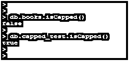
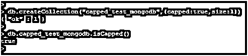
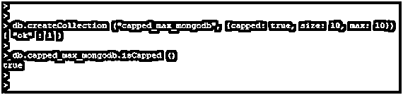
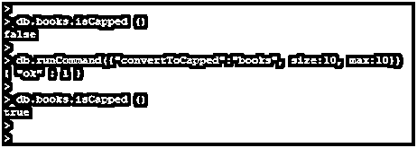

# MongoDB 封顶集合

> 原文：<https://www.educba.com/mongodb-capped-collections/>

## MongoDB 封顶集合简介

MongoDB Capped 集合只不过是固定大小的循环集合，它遵循插入来支持创建、删除和读取操作的高性能。循环上限集合表示，当我们为集合分配固定大小时，它已耗尽。Capped Collection 将从集合中删除最旧的文档，要删除该文档，我们不需要为其提供任何显式命令。capped 集合对于按照插入顺序为集合提供固定的大小是必不可少的，也是非常有用的。

**语法:**

<small>Hadoop、数据科学、统计学&其他</small>

`db.createCollection (Collection_name, {capped: Boolean, autoIndexId: Boolean, size: number, max:number})`

**参数:**

下面是 MongoDB 中封顶集合的参数描述语法。

**1。Create collection:**Create collection 是用来创建一个新的封顶集合的方法。

**2。集合名称:**表示已封顶的集合名称。我们已经为封顶的集合使用了任何名称。

**3。Capped:** 我们将 Capped 选项设置为 true 或 false。如果我们将 capped 选项设置为 true，那么我们的集合将被创建为 capped 集合。如果我们将 capped collection 选项指定为 false，则创建的集合没有 capped collection。

**4。Size:** Size 选项将指定上限集合的大小限制。我们可以用字节来指定上限集合的大小。当我们在 MongoDB 中将集合定义为封顶集合时，这个参数是强制的。

**5。Max:** Max 选项将指定 capped 集合中允许的最大文档数的限制。在 MongoDB capped 集合中，Size 选项将优先于 max 选项。

**6。自动索引 ID:** 我们已经将自动索引 ID 设置为真或假。如果我们当时将自动索引 ID 参数设置为 false，则上限收集将禁用自动索引创建。如果我们将它设置为 true，那么它将在有上限的集合上创建一个自动索引。

### 封顶集合在 MongoDB 中是如何工作的？

下面是 MongoDB 中 capped 集合的工作方式。

*   它只不过是循环集合的固定大小，在插入之后支持创建、删除和读取操作的高性能。
*   当更新结果达到文档大小时，封顶的集合将限制更新。
*   capped 集合将按照磁盘存储的顺序存储文档。当超过最大限制时，不允许对有上限的集合进行插入和更新。
*   caped 集合将确保集合的大小不会增加磁盘上分配的大小。
*   MongoDB 中的 Capped 集合主要用于存储日志信息、大量数据和缓存信息。
*   循环上限集合表示，当我们为集合分配固定大小时，它已耗尽。那时，MongoDB 中的 capped 集合将从集合中删除最旧的文档。
*   要删除文档，我们不需要为其提供任何显式命令。
*   我们使用了普通的 capped collection 命令来创建 capped 集合，但是我们需要指定 capped 选项为 true，并且需要以字节为单位指定集合的最大大小。
*   我们使用 Capped 命令来检查我们的集合是否被封顶。它将显示标志为真或假。如果我们的集合有上限，它将显示 true，如果我们的集合没有上限，它将显示 false。下面是一个例子:

**代码:**

`db.books.isCapped()
db.capped_test.isCapped()`

**输出:**

**解释:**在上面的例子中，books 集合不是 capped 集合，所以它将标志显示为 false，capped_test 是 capped 集合，所以它将标志显示为 true。当达到上限集合的限制时，上限集合将为新文档腾出空间。capped 集合将保持插入顺序，没有索引开销。在 MongoDB 中，capped 集合将支持更高的插入吞吐量。

### MongoDB 封顶集合的示例

下面是 MongoDB 中 capped 集合的例子。

#### 示例 1–创建封顶的集合

我们已经创建了一个名为 capped_test_mongodb 的 capped 集合。

**代码:**

`db.createCollection("capped_test_mongodb",{capped:true,size:1})
db.capped_test_mongodb.isCapped()`

**输出:**

**

** 

**说明:**在上面的例子中，我们已经使用了 size 参数为 1，所以封顶集合的大小为 1 字节。创建封顶集合后，我们检查了创建的集合是否封顶。

#### 示例 2–使用最大参数

我们已经创建了一个名为 capped_max_mongodb 的 capped 集合。在 MongoDB 中创建集合时，我们添加了 size 和 max 参数。以下示例显示了使用 max 和 size 参数创建集合。

**代码:**

`db.createCollection ("capped_max_mongodb", {capped: true, size: 10, max: 10})
db.capped_max_mongodb.isCapped ()`

**输出:**

**说明:**在上面的例子中，我们使用了 size 参数为 10，max 参数为 10，所以封顶集合的大小为 10 字节，max 文档数为 10。

#### 示例# 3–将集合转换为加盖集合

我们已经将图书收藏转化为封顶收藏。在 MongoDB 中将集合转换为 capped 集合时，我们添加了 size 和 max 参数。

**代码:**

`db.books.isCapped ()
db.runCommand({"convertToCapped":"books", size:10, max:10})`

**输出:**

**说明:**在上面的例子中，我们使用了 size 参数为 10，max 参数为 10，所以封顶集合的大小为 10 字节，max 文档数为 10。

### 推荐文章

这是一个 MongoDB 封顶集合的指南。在这里，我们讨论 MongoDB Capped 集合的介绍及其不同的参数和示例。您也可以浏览我们推荐的其他文章，了解更多信息——

1.  [MongoDB 中的](https://www.educba.com/mongodb-collection/) [集合](https://www.educba.com/mongodb-collection/) [方法是如何工作的？](https://www.educba.com/mongodb-collection/)
2.  [MongoDB 备选方案|前 8 名](https://www.educba.com/mongodb-alternatives/)
3.  [在 MongoDB 中查找特征](https://www.educba.com/lookup-in-mongodb/)
4.  [MongoDB Limit() |如何运作？](https://www.educba.com/mongodb-limit/)

