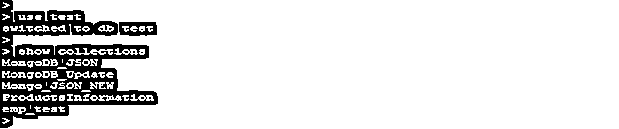
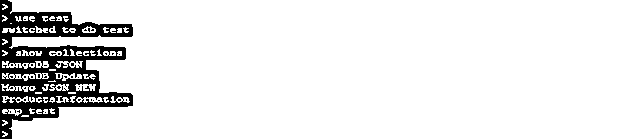
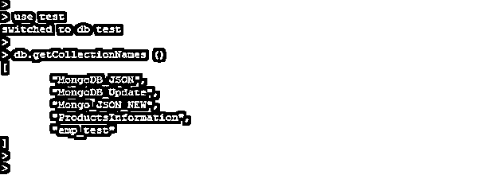
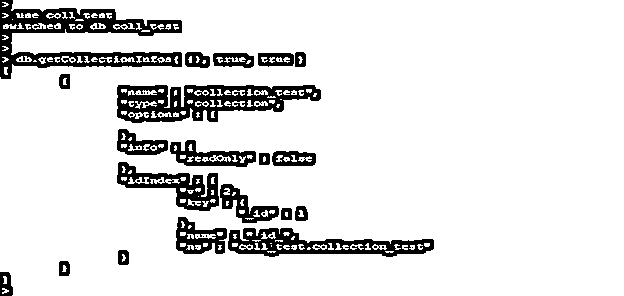
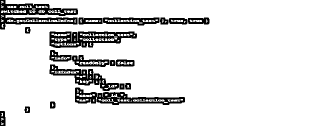

# Mongodb 显示收藏

> 原文：<https://www.educba.com/mongodb-show-collections/>

## Mongodb show 集合简介

MongoDB show collections 被定义为显示来自连接数据库的所有集合和视图；在 MongoDB 中，我们可以使用 show collections 命令列出所有集合。在 MongoDB 中有各种方法可以显示集合，我们可以通过使用 show collections、list collections、db.getCollectionNames()和 db.getCollectionInfos()方法来列出集合。使用 show collections 命令，我们可以列出连接的数据库中的所有集合。当处理多个集合时，我们需要所有集合的列表；我们可以在 MongoDB 中使用 show collections 命令。

**语法**

<small>Hadoop、数据科学、统计学&其他</small>

下面是 MongoDB 显示集合的语法如下。我们可以使用下面的方法显示集合。

*   **使用显示收藏命令。**

`show collections`

*   **使用列表收藏命令。**

`db.runCommand ({listCollections: <value>, nameOnly: <value>, authorizedCollections: <value>})`

*   **使用 getCollectionNames 方法。**

`db.getCollectionNames ()`

*   **使用 getCollectionInfos 方法。**

`db.getCollectionInfos (filter (filter collection), nameOnly (Method only return name of collection.), authorized collections (valid value is true or false))`

**显示集合命令的参数描述—**

*   **Show collections–**这个方法在 MongoDB 中使用，用于列出连接的数据库中的所有集合和视图名称。
*   **列出集合–**这个方法用于列出 MongoDB 中的集合名称和所有细节。使用这种方法，我们可以使用多个参数来显示集合的细节。
*   **Name only—**此参数用于列表集合和 getCollectionInfos 方法。此参数用于显示指定集合的名称。
*   **授权集合—**该参数用于列表集合和 getCollectionInfos 方法。此参数的有效值为 true 或 false 如果该值设置为 true，则允许用户没有任何必需的权限。
*   **GetCollectionNames–**这个方法在 MongoDB 中使用，用于从 MongoDB 中的指定数据库获取所有集合名称。
*   **GetCollectionInfos–**该方法用于从连接的数据库中检索所有集合名称及其详细信息。

### 如何在 Mongodb 中显示收藏？

*   在 MongoDB 中，我们可以使用不同的方法显示集合和视图。下面是用来显示集合的方法。

1.  显示收藏
2.  列出收藏
3.  getCollectionNames()
4.  getCollectionInfos()

*   只获取集合的名称和视图 show collections 是显示数据库中所有集合的最佳命令。
*   要列出所有集合和视图的细节，我们可以使用 MongoDB 中的 list collections 命令。
*   使用 getCollectionNames 命令，我们只能以格式列出所有集合名称。
*   如果我们必须找到所有带有细节的集合名称和指定的带有细节的集合名称，那么我们可以使用 MongoDB 中的 getCollectionInfos 方法。
*   要列出指定数据库的集合，我们需要首先连接到该数据库；连接到数据库后，我们可以列出所有的集合和视图。如果不连接到指定的数据库，就不可能显示收藏。
*   下面的例子表明我们需要连接指定的数据库来显示集合。

`use test
show collections`

图-我们需要连接指定的数据库来显示集合。

*   在上面的例子中，我们首先连接到测试数据库，然后使用 show collections 命令列出测试数据库中的集合。
*   我们可以只列出我们有权访问的那些集合；没有访问权限，我们无法从数据库中列出收藏。

### 例子

下面是下面提到的例子

#### 1 使用显示集合命令显示集合

*   以下示例显示了使用 show collections 命令显示所有集合。
*   我们已经列出了测试数据库中的所有集合。在使用这个命令之前，我们已经连接到了测试数据库。测试数据库包含其中的 5 个集合。

**代码:**

`use test
show collections`

图–使用显示集合命令显示集合。

#### 2.使用“列出收藏”命令显示收藏

*   以下示例显示了使用 list collection 命令显示集合。我们使用了授权集合，并用 list collection 命令命名了唯一的参数。
*   在下面的例子中，我们列出了 coll_test 数据库中的集合。Coll_test 数据库只包含一个集合，因此它将显示 collection_test 集合的详细信息。
*   在下图中，我们可以看到它将显示所有的细节信息，如收藏的名称，类型等。

**代码:**

`use coll_test
db.runCommand ({listCollections: 1.0, authorizedCollections: true, nameOnly: true })`

图 7-使用 MongoDB 中的 list collections 命令显示集合。

#### 3.使用 getCollectionNames 方法显示集合

*   以下示例显示了使用 getCollectionNames 方法的集合列表。
*   在下面的例子中，我们已经列出了来自测试数据库的集合。测试数据库包含五个集合，因此它将以格式显示所有五个集合名称。
*   在下图中，我们可以看到输出仅显示了测试集合中存在的集合的名称。

**代码:**

`use test
db.getCollectionNames ()`

图 7-在 MongoDB 中使用 getCollectionNames 方法显示集合。

#### 4.使用 getCollectionInfos 方法显示集合

*   以下示例显示了如何使用 getCollectionInfos 方法显示集合。在第一个示例中，我们使用了 authorized collection、filter 和 name，这是 getCollectionInfos 方法的唯一参数。
*   在下面的例子中，我们列出了 coll_test 数据库中的集合。Coll_test 数据库只包含一个集合，因此它将显示 collection_test 集合的详细信息。

**代码:**

`use coll_test
db.getCollectionInfos ({}, true, true)`

图–使用带有参数的 getCollectionInfos 方法显示集合。

*   在下面的示例中，我们没有在 getCollectionInfos 方法中使用任何参数。

**代码:**

`use coll_test
db.getCollectionInfos ({}, true, true)`

图–使用 getCollectionInfos 方法显示集合，不包括参数。

#### 5.使用 getCollectionInfos 方法显示单个集合的详细信息

*   在下面的例子中，我们通过 getCollectionInfos 方法使用了集合名称。
*   我们已经使用 collection_test 集合来显示单个集合的详细信息。对于 getCollectionInfos 方法，我们已经使用了所有的参数。

**代码:**

`use coll_test
db.getCollectionInfos ({name: "collection_test"}, true, true)`

图 4-在 MongoDB 中使用 getCollectionInfos 方法显示单个集合的详细信息。

### 结论

Show collection 命令用于列出连接的数据库中的所有集合和视图。我们可以使用 show collections、list collections getcollection infos 和 getCollectionNames 方法来显示连接的数据库中的所有集合。要列出视图和集合，首先，我们需要连接指定的数据库。

### 推荐文章

这是 Mongodb show collections 的指南。这里我们讨论如何在 Mongodb 中显示集合以及 show collections 命令的参数描述。您也可以看看以下文章，了解更多信息–

1.  [MongoDB findOne()](https://www.educba.com/mongodb-findone/)
2.  [MongoDB Skip()](https://www.educba.com/mongodb-skip/)
3.  [SQL 按月分组](https://www.educba.com/sql-group-by-month/)
4.  [MongoDB 用户](https://www.educba.com/mongodb-users/)

