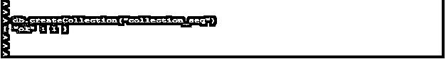
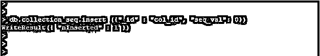
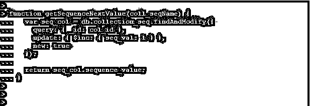
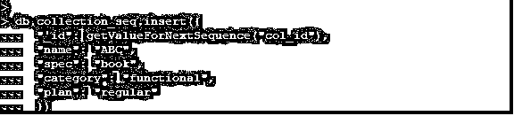
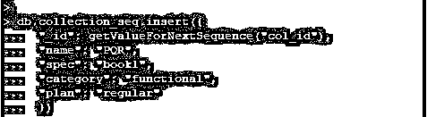
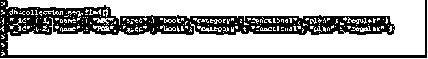

# MongoDB 自动增量

> 原文：<https://www.educba.com/mongodb-auto-increment/>

## MongoDB 自动增量简介

MongoDB Auto Increment 不具备 MySQL、MSSQL 和 ORACLE 等 SQL 数据库所具备的功能。通常，MongoDB 默认使用 _id 字段的 12 字节对象 id 作为主键来惟一地标识 MongoDB 中的集合文档。在 MongoDB 中，有一个使用 _id 字段的场景，它有一些除 object _id 之外的自动增量值。MongoDB 自动增量并不默认 MongoDB 特性；我们将以编程方式使用计数器集合来实现同样的目的。

### 句法

下面是自动递增的语法:

<small>Hadoop、数据科学、统计学&其他</small>

**1。创建生成自动递增序列的函数:**

`function getValueForNextSequence(auto_increment_sequence_name){
var sequenceDoc = db.collection_name. FindAndModify ({
query:{_id: auto_increment_sequence_name },
update: {$inc:{sequence_value:1}},
new: true });
return sequenceDoc.sequence_value; }`

**2。使用自动递增序列:**

`db.collection_name.insert (“field_name”: getValueForNextSequence (“field_name”), “field_name”: value_of_field)`

#### 因素

下面是自动递增的参数描述语法:

*   **集合名称:**集合名称定义为我们在 MongoDB 中使用自动递增序列插入数据时使用的集合名称。在使用自动递增序列时，我们需要定义集合名称。
*   **函数名:**函数名定义至于使用自动递增序列，我们需要先定义它。在使用序列将文档插入集合时，函数名非常重要。
*   **查找和修改:**查找和修改是我们在使用查找和修改方法将文档插入集合时使用的方法。
*   **字段名:**我们必须在将文档插入字段时定义字段名。使用自动递增序列时，字段名是一个重要的参数。
*   **查询:**查询定义为我们在自动递增序列中使用的查询。
*   **Update:** 定义为使用自动递增序列从集合中更新的文档。

### MongoDB 中的自动增量是如何工作的？

下面是自动增量的工作原理。我们已经通过在 MongoDB 中创建自动增量序列生成了自动增量。数据库序列被定义为通过获得自动增量来创建唯一值的数据库产品。自动递增序列非常重要，因为事务 id 与 MongoDB 中的序列相关联。我们已经为多线程应用程序使用了自动递增序列，对于多线程应用程序，我们必须使用自动递增序列。

通常，MongoDB 默认使用 _id 字段的 12 字节对象 id 作为主键来惟一地标识 MongoDB 中的集合文档。在 MongoDB 中，有一个使用 _id 字段的场景，它有一些除 object _id 之外的自动增量值。MongoDB 自动增量不具备 MySQL、MSSQL 和 ORACLE 等 SQL 数据库所具备的功能。

自动增量是非常有用和重要的。MongoDB 自动增量不默认 MongoDB 的特性；我们将以编程方式使用计数器集合来实现同样的目的。这七个步骤用于在 MongoDB 中生成自动递增函数或序列如下。在 MongoDB 中，有七个步骤用于生成自动递增函数或序列。为了生成自动递增函数，我们需要生成第一个集合，我们已经在 MongoDB 中创建了一个自动递增序列。第二步是将文档插入到集合中。在向集合中插入一个值后，我们检查了文档。

第三步是向集合中插入记录。将记录插入集合后，我们检查了文档。第四步是创建一个数据库序列。数据库序列用于自动增加值。这用于自动递增序列。第五步用于创建一个 javascript 函数，在 MongoDB 中创建序列。我们在 javascript 中定义了一个函数，并在插入记录时调用。第六步，我们要用 javascript 定义一个函数，在 MongoDB 中插入记录时调用。第七步用于查看创建的序列是否被正确使用。我们必须检查创建自动递增序列的最后一步是否正常工作。

### 实现 MongoDB 自动增量的示例

下面是提到的例子:

#### 示例#1

创建集合以使用自动递增序列

在下面的示例中，我们创建了一个名为“collection_seq”的集合，以生成自动增量值:

**代码:**

`db.createCollection("collection_seq")`

**输出:**

#### 实施例 2

将文档插入集合

我们已将以下文档插入到集合中，以检查自动递增序列:

**代码:**

`({"_id" : "col_id", "seq_val": 0})`

#### 实施例 3

将记录插入集合

我们已经将记录插入到集合中，以检查自动递增序列。下面是将记录插入集合的示例:

**代码:**

`db.collection_seq.insert ({"_id" : "col_id", "seq_val": 0})`

**输出:**

#### 实施例 4

创建一个 javascript 函数

下面是创建一个 javascript 函数的例子如下。我们将函数名创建为 getSequenceNextValue:

**代码:**

`function getSequenceNextValue(coll_seqName) {
var seq_col = db.collection_seq.findAndModify({
query: { _id: col_id },
update: { $inc: { seq_val: 1 } },
new: true
});
return seq_col.sequence_value;
}`

**输出:**

#### 实施例 5

使用 javascript 函数

下面的例子显示了我们已经使用上面创建的 javascript 函数在集合名称中作为 collection_seq:

**插入第一条记录:**

**代码:**

`db.collection_seq.insert({
"_id": getValueForNextSequence("col_id"),
"name": "ABC",
"spec": "book",
"category": "functional",
"plan": "regular"
})`

**输出:**

**插入第二条记录:**

**代码:**

`db.collection_seq.insert({
"_id": getValueForNextSequence("col_id"),
"name": "PQR",
"spec": "book1",
"category": "funct`

**输出:**

#### 实施例 6

使用 javascript 函数

下面的例子显示了使用 javascript 函数:

**代码:**

`db.collection_seq.find()`

**输出:**

### 推荐文章

这是一个 MongoDB 自动增量的指南。这里我们讨论 MongoDB 自动增量的介绍，语法，它是如何工作的，以及相应的例子。您也可以浏览我们的其他相关文章，了解更多信息——

1.  [MongoDB 管理](https://www.educba.com/mongodb-administration/)
2.  [MongoDB 收藏](https://www.educba.com/mongodb-collection/)
3.  [MongoDB 中的 order by](https://www.educba.com/order-by-in-mongodb/)
4.  [在 MongoDB 中查找](https://www.educba.com/lookup-in-mongodb/)

