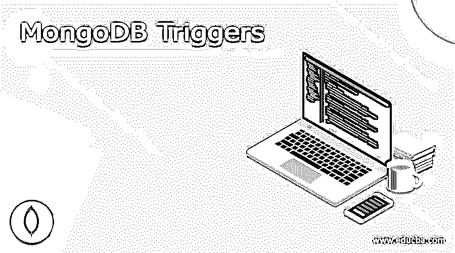
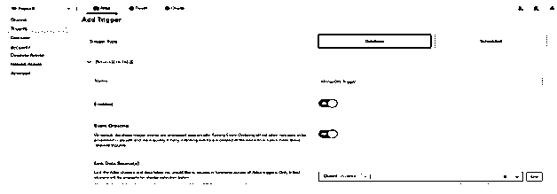
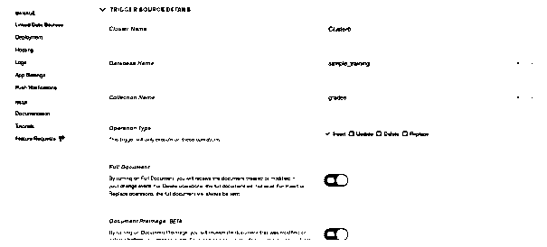
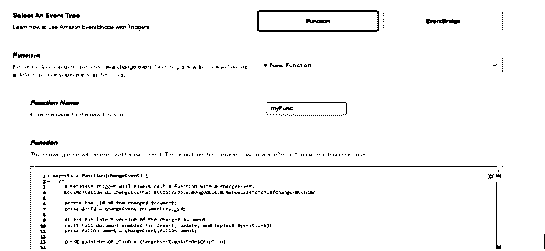
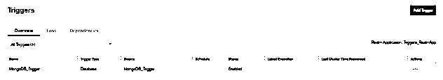
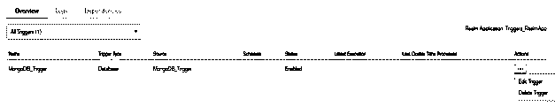
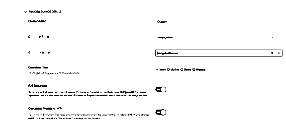
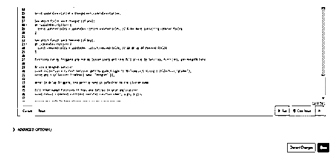
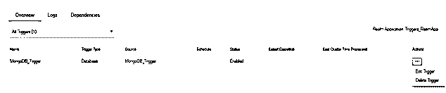
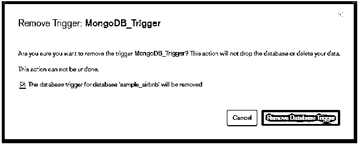

# MongoDB 触发器

> 原文：<https://www.educba.com/mongodb-triggers/>

## MongoDB 触发器的定义

Mongodb 触发器允许我们按照计划执行逻辑；MongoDB 提供了三种类型的触发器，即数据库触发器、认证触发器和调度触发器。数据库触发器用于自动响应任何文档更新、插入和删除；身份验证触发器用于在新用户创建、删除和身份验证时执行，而预定触发器将在预定义的时间执行。MongoDB 数据库触发器用于监听来自文档集合的更改，还会将数据库触发器的事件传递给触发器的函数。

**语法:**

<small>Hadoop、数据科学、统计学&其他</small>

下面是创建触发器时使用的参数。

`{
“Trigger_type”: Name of type of trigger,
“Trigger_name”: Name of trigger,
“Name_of_function”: function name,
“Config”: {
“Name_of_service”: service name,
“database_name”: name of database,
“collection_name”: name of collection,
“database_operations_types”: types of database operations,
“full_document” : <Type is Boolean>,
“Unordered” : <optional>,
“Match expression” : <optional>,
}`

MongoDB 触发器的参数描述。

1)触发器类型–这被定义为我们在创建触发器时使用的触发器类型。
2)触发器名称–该参数在创建触发器时是必需的。它被定义为触发器的名称。
3)函数名——这在 MongoDB 中被定义为 stitch 函数的名称。创建新触发器时，这是一个必需的参数。
4)数据库名称–这是我们从中选择创建触发器集合的数据库名称。
5)集合名称——这是用于在 MongoDB 中创建新触发器的集合的名称。创建触发器时，集合名称是必需的参数。
6)服务名——这个参数被定义为我们在 MongoDB 中创建触发器时使用的服务名。
7)操作类型–这被定义为我们在创建新触发器时使用的操作名称。插入、更新和删除等数据库操作的名称。在 MongoDB 中创建触发器时，这也是一个必需的参数。Unordered——这是 MongoDB 触发器中的可选参数。此参数的默认值为 false。要启用该参数的值，我们需要将其设置为 true。
10)匹配表达式–在 MongoDB 中使用触发器时，这也是一个可选参数。匹配表达式用于配置触发器在发生指定事件时执行。

### Mongodb 中的触发器是如何工作的？

MongoDB 数据库触发器允许我们在数据库集合中添加、删除或更新任何文档时执行服务器端的逻辑。

MongoDB 数据库触发器的主要用途是实现复杂的数据交互和更新信息。

MongoDB 数据库触发器基本上使用更改流来监听数据库集合中的更改。

基本上，MongoDB 中有三种类型的触发器可用。我们可以通过使用 MongoDB Atlas 集群来创建触发器。

在使用数据浏览器执行更新时，MongoDB Atlas 用于替换命令而不是更新命令。MongoDB 中的调度触发器将允许我们定期或通过使用 cron 表达式来执行服务器端逻辑。

我们可以使用调度触发器来运行报告，以特定的时间间隔更新文档，或者发送自动电子邮件。

在使用 MongoDB atlas 创建新的触发器时，我们可以看到一个函数编辑器，我们可以在其中编写由触发器执行的 javascript 代码。

在 MongoDB atlas 集群上创建之后，我们可以重启或恢复我们的触发器。

MongoDB 触发器仅在 MongoDB Atlas 集群上可用，该集群运行在版本 3.6 或更高版本上。

MongoDB 触发器用于自动执行数据库和应用程序逻辑。它通过创建事件或预定义的时间表自动执行。

在 MongoDB 中创建新触发器时，MongoDB 触发器使用以下操作类型。

1)插入
2)更新
3)删除
4)替换

*   插入操作类型被定义为当事件发生时在集合中添加新文档。
*   更新操作被定义为更新或改变集合中的现有文档。
*   删除操作被定义为当特定事件发生时从集合中删除现有文档。
*   替换操作被定义为替换集合中的文档。

### 例子

下面的例子显示了 MongoDB 中的 create triggers 如下。在下面的例子中，我们必须将数据库触发器名称创建为 MongoDB_Trigger。

#### 1)在 MongoDB 中创建一个触发器

首先，我们必须定义触发器类型、触发器名称、启用的事件顺序和链接数据源。

`Trigger type – Database
Trigger name - MongoDB_Trigger
Enables – ON
Event ordering – ON
Link data source – Cluster`

**图–定义触发器类型、触发器名称、启用的事件顺序和链接数据源。**

其次，我们必须定义集群名称、操作类型、完整文档和文档前像。

`Cluster name – Cluster0
Database name – sample_training
Collection name – grades
Operation type – Insert
Full document – ON
Document preimage – ON`

**图–定义集群名称、操作类型、完整文档和文档前像。**

在下图中，我们必须定义事件类型和函数名。

**代码:**

`Function name – myFunc
Function –
exports = function (changeEvent) {
db.grades.insert ({name: “MongoDB", grades: "A"})
}`

**图–定义事件类型和功能名称。**

在下面的例子中，我们可以看到 MongoDB_Trigger 是在 MongoDB Atlas 集群中创建的。

图 4-触发器是在 MongoDB Atlas 集群中创建的。

#### 2)在 MongoDB 中编辑触发器

如果假设我们想要编辑已经创建的触发器，我们可以使用以下步骤进行编辑。我们必须将触发器名称编辑为 MongoDB_Trigger。

首先，选择我们想要编辑的触发器，然后单击编辑触发器按钮。

**图–编辑已经在 MongoDB 中创建的触发器。**

我们必须将数据库名称从 sample_training 编辑为 sample_airbnb，将收藏名称从 grades 编辑为 listings 和 reviews。

**图–从 MongoDB 触发器中编辑数据库和集合名称。**

单击保存按钮保存所有更改。

**图–保存所有编辑过的触发器更改。**

#### 3)在 MongoDB 中删除触发器

我们可以删除 MongoDB 中未使用的触发器。我们必须删除 MongoDB_Trigger。首先，选择要删除的触发器，然后单击删除触发器按钮。

**图–删除 MongoDB 中的触发器。**

点击确认按钮，然后点击删除数据库触发器按钮。

**图–在 MongoDB 中删除触发器。**

### 结论

MongoDB 触发器用于在数据库集合中添加、删除或移除集合文档时执行服务器端的逻辑。数据库触发器、身份验证触发器和预定触发器是 MongoDB 中的触发器类型。触发器在 MongoDB 中非常有用和重要。

### 推荐文章

这是 MongoDB 触发器指南。在这里我们讨论触发器的定义、语法以及如何在 Mongodb 中工作？示例和代码实现。您也可以看看以下文章，了解更多信息–

1.  [MongoDB 加入](https://www.educba.com/mongodb-join/)
2.  [MongoDB findOne()](https://www.educba.com/mongodb-findone/)
3.  [MongoDB 分组依据](https://www.educba.com/mongodb-group-by/)
4.  [MongoDB 数据库](https://www.educba.com/mongodb-database/)

